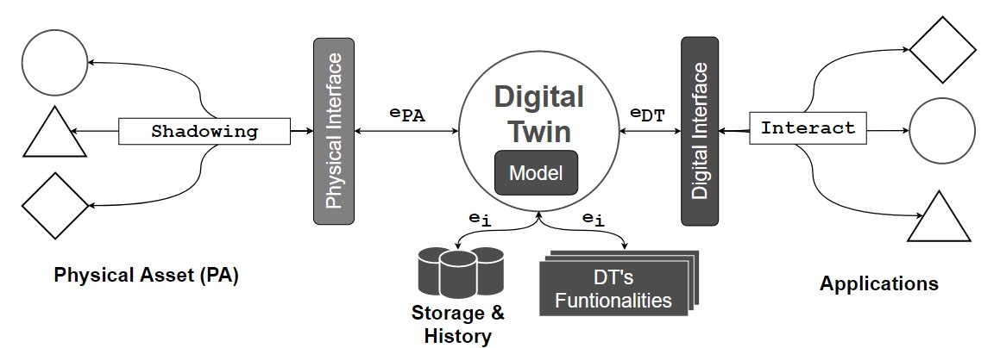
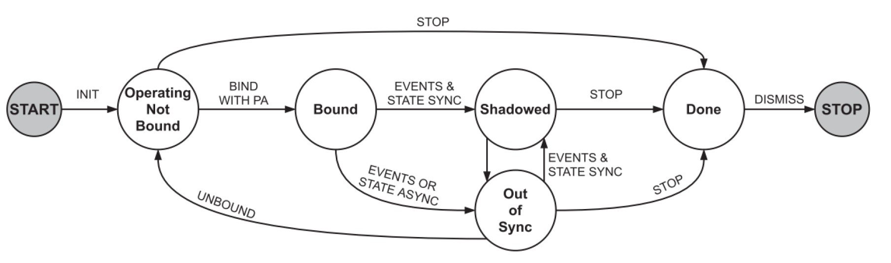
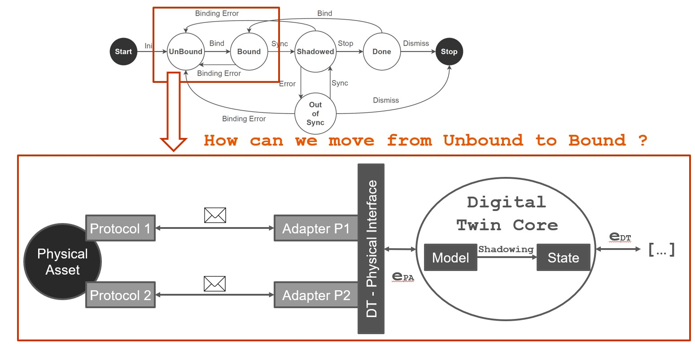
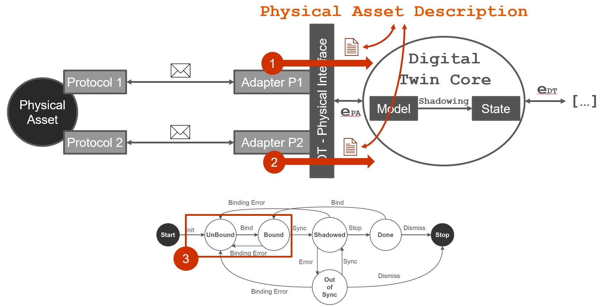
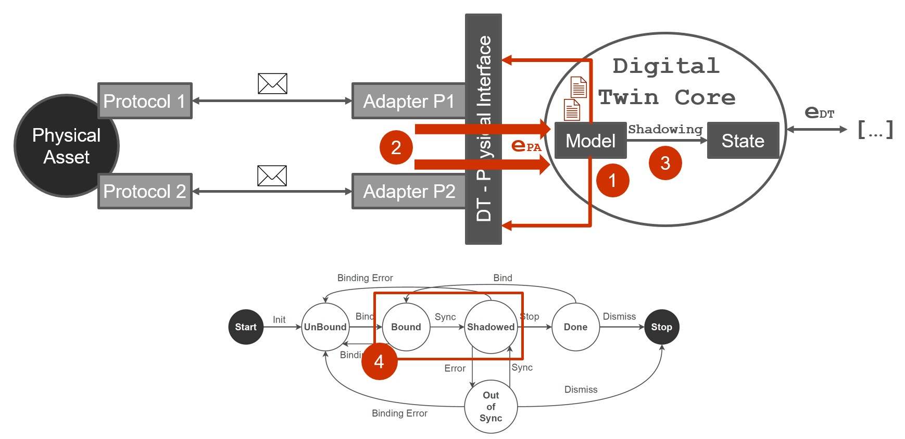
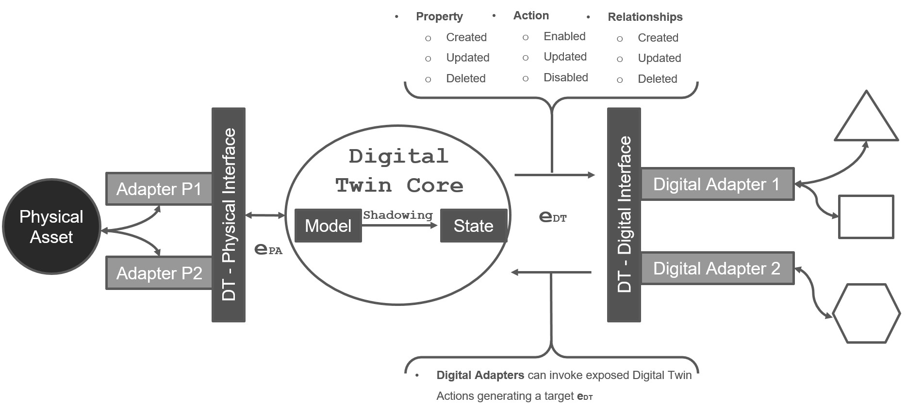
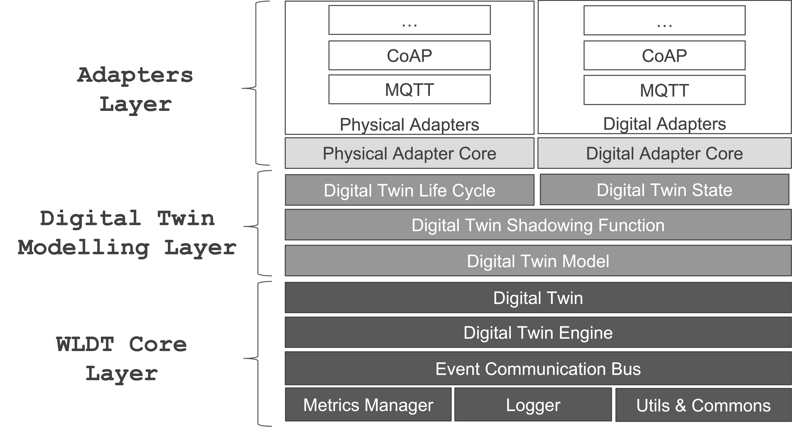

# WhiteLabel Digital Twin Framework

The White Label Digital Twin (WLDT) library aims to support the design, development, and deployment of Digital Twins within the Internet of Things (IoT) ecosystems.
The library has been designed following the latest DT definitions coming from both Industrial and Scientific domains and identifying DTs as active, flexible and scalable software components.

The complete Documentation of the Library is available at the following link: [https://wldt.github.io/](https://wldt.github.io/)

## Library Dependency Import

The official library repository is available at the following link [https://central.sonatype.com/artifact/io.github.wldt/wldt-core/](https://central.sonatype.com/artifact/io.github.wldt/wldt-core/)

For Maven projects you can import the WLDT Library into your ``<dependencies></dependencies>`` tag using the following snippet:

```xml
<dependency>
    <groupId>io.github.wldt</groupId>
    <artifactId>wldt-core</artifactId>
    <version>0.5.0</version>
</dependency>
```

If you are using Gradle use instead the following: 

```groovy
implementation group: 'io.github.wldt', name: 'wldt-core', version: '0.5.0'
```

## Scientitic Citation & Reference 

If you use the WLDT Library in a Scientific Paper please use this reference: 

```
@article{PICONE2021100661,
    title = {WLDT: A general purpose library to build IoT digital twins},
    journal = {SoftwareX},
    volume = {13},
    pages = {100661},
    year = {2021},
    issn = {2352-7110},
    doi = {https://doi.org/10.1016/j.softx.2021.100661},
    url = {https://www.sciencedirect.com/science/article/pii/S2352711021000066},
    author = {Marco Picone and Marco Mamei and Franco Zambonelli},
    keywords = {Internet of Things, Digital twin, Library, Software agent}
}
```

TODO ... ADD DCOSS Paper

```
@article{PICONE2025DCOSS,
  ...
}
```

## Documentation & References

With the aim to support redability of the documentation and to provide a better understanding of the library's functionalities,
the documentation is structured in the following sections through independent pages:

- [Resources & Management Interface](docs/resources_management_interface.md): Provides the details about 
he management interface of the WLDT library and how to use it to handle the manageable DT's resource through its life cycle.

## Digital Twin "Definition" & Main Concepts

The White Label Digital Twin (WLDT) library aims to support the design, development and deployment of Digital Twins (DTs) 
within the Internet of Thing (IoT) ecosystems. The library has been designed following the latest DT definitions 
coming from both Industrial and Scientific domains and identifying DTs as active software components. 
The Digital Twin definition that we use as reference for the upcoming definitions and library's architecture and main 
modules is the following:

```text
A Digital Twin (DT) is a comprehensive software representation of an individual physical asset (PA). 
It includes the properties, conditions, relationships and behavior(s) of the real-life object through models and data. 
A Digital Twin is a set of realistic models that can digitalize an object’s behavior in the deployed environment. 
The Digital Twin represents and reflects its physical twin and remains its virtual counterpart across the object’s entire lifecycle.
```

### Digital Twin Abstraction & Model 

With respect to the element present in the real world, 
it is defined as a physical asset (PA) with the intention of referring to any entity 
that has a manifestation or relevance in the physical world and a well-defined lifespan.

<div align="center">
  
</div>

The previous Figure schematically illustrates the main component of an abstract Digital Twin and clarifies its 
responsibility to be a bridge between the cyber and the physical world. 
The blueprint components (then mapped into the WLDT Library) are:

- **Physical Interface** The entity in charge of both the initial *digitalization* o *shadowing* process and the perpetual responsibility
to keep the DT and PA in synch during its life cycle. It can execute multiple **Physical Asset Adapters** to interact with the PA and detect and
digitalize the physical event coming from the physical entity according to its nature and the supported protocols and data formats (e.g., through HTTP and JSON).
- **Digital Interface** The component complementary to the Physical Interface and in charge of handling DT's internal variations and events 
towards external digital entities and consumers.  It executes multiple and reusable **Digital Adapters** in charge of handling digital interactions and events 
and responsible for making the DT interoperable with external applications.
- **DT's Model** The module defining the DT's behaviour and its augmented functionalities. It supports the execution of different configurable
and reusable modules and functionalities handling both physical and digial events according to the implemented behaviour.
Furthermore, the Model is the component responsible to handle and keep updated the Digital Twin State as described in the following sections.

The Digital Twin ``Model``(M) allows capturing and representing the PA at an appropriate level of abstraction, 
i.e., avoiding irrelevant aspects for its purpose and modeling only domain-level information rather than technological ones. 
Finally, the link between the physical and digital copy is defined as shadowing. Specifically, 
the term defines the process that enables continuous and (almost) real-time updating of the internal state of the DT in relation to changes 
that occur in the PA.

Each DT is thus equipped with an internal model, which defines how the PA is represented in the digital level. 
The DT's representation denoted as **Digital Twin State** supported and defined through M is defined in terms of:

- **Properties**: represent the observable attributes of the corresponding PA as labeled data 
whose values can dynamically change over time, in accordance with the evolution of the PA's state.
- **Events**: represent the domain-level events that can be observed in the PA.
- **Relationships**: represent the links that exist between the modeled PA and other physical
assets of the organizations through links to their corresponding Digital Twins. 
Like properties, relationships can be observed, dynamically created, and change over time, 
but unlike properties, they are not properly part of the PA's state but of its operational context 
(e.g., a DT of a robot within a production line).
- **Actions**: represent the actions that can be invoked on the PA through interaction with the DT or directly 
on the DT if they are not directly available on the PA (the DT is augmenting the physical capabilities).

Once the model M is defined, the dynamic state of the DT (SDT) can be defined by through the combination of 
its *properties*, *events*, *relationships* and *actions* associated to the DT *timestamp* that represents the current time of
synchronization between the physical and digital counterparts.

### The Shadowing Process

The *shadowing* process (also known as replication of digitalization) allows to keep the 
Digital Twin State synchronized with that of the corresponding physical resource 
according to what is defined by the model M. Specifically, each relevant update of the PA state (SPA) 
is translated into a sequence of 3 main steps:

- each relevant change in physical asset state is modeled by a ``physical_event`` (``e_pa``);
- the event is propagated to the DT;
- given the new ``physical_event``, the DT's is updated through the application of a *shadowing function*, 
which depends on the model M

The shadowing process allows also the DT to reflect and invoke possible actions of the PA.
The DT receives an action request (denoted as ``digital_action``) on its digital interface, applies the shadowing function to validate it and then 
propagates the request through its physical interface. 
An important aspect to emphasize is that the request for a ``digital_action`` does not 
directly change the state of the DT since any changes can only occur as a result of the 
shadowing function from the PA to the DT, as described earlier.

### Digital Twin Life Cycle

<p align="center">
  
</p>

The modeling of the concept of DT includes also the definition and characterization of its life cycle. 
Based on the scientific literature, we model (and then map into the library) a life cycle with 5 states 
through which the DT goes from when it is executed to when it is stopped. 
The previous Figure shows a graphical representation of the life cycle with the following steps:

- **Operating & Not Bound**: this is the state in which the DT is located following the initialization phase, 
indicating that all internal modules of the DT are active but there is no association yet with the corresponding PA.
- **Bound**: this is the state in which the DT transitions following the correct execution of the binding procedure. 
The binding procedure allows to connect the two parts and enables bidirectional flow of events.
- **Shadowed**: this is the state reached by the DT when the shadowing process begins and its state 
is correctly synchronized with that of the PA.
- **Out of Sync**: this is the state that determines the presence of errors in the shadowing process.
When in this state, the DT is not able to handle either state alignment events or those generated 
by the application layer.
- **Done**: this is the state that the DT reaches when the shadowing process is stopped, 
but the DT continues to be active to handle requests coming from external applications.

#### From Unbound to Bound

Taking into account the target reference Life Cycle the first point to address is how we can move from an `UnBound` state
to a `Bound` condition with respect to the relationship with the Physical Layer. 

<p align="center">
  
</p>

The previous Figure illustrates a simple scenario where a Physical Asset uses two protocols (P1 and P2) to communicate and it is 
connected to the Digital Twin through a DT's Physical Interface enabled with two dedicated Adapters for protocol P1 and P2.
In order to move from the Unbound to Bound state the DT should be aware of the description of the target asset with respect to
the two protocols. For example through P1 the asset exposes telemetry data (e.g., light bulb status and energy consumption) 
while on P2 allows incoming action requests (e.g., turn on/off the light). The Digital Twin can start the shadowing process 
only when it is bound and has a description of the properties and capabilities of the associated physical counterpart.
The schematic procedure is illustrated in the following Figure: 

<p align="center">
  
</p>

Involved steps are: 

1. The Adapter P1 communicates with the PA through Protocol 1 and provides a ``Physical Asset Description`` from its perspective
2. The Adapter P2 communicates with the PA through Protocol 2 and provides a ``Physical Asset Description`` from its perspective
3. Only when all Physical Adapters have been correctly bound (it may require time) to the Physical Asset and the associated ``Physical Asset Descriptions`` 
have been generated, the DT can move from UnBound to Bound

Main core aspects associated to the concept of Physical Asset Description (PAD) are the following: 

- It is used to describe the list of **properties**, **actions** and **relationships** of a Physical Asset
- Each Physical Adapter generates a dedicated PAD associated to its perspective on the Physical Assets 
and its capabilities to read data and execute actions
- It is a responsibility of the DT to handle multiple descriptions in order to build the digital replica
- It will be used by the DT to handle the shadowing process and keep the digital replica synchronized with the physical counterpart

#### From Bound to Shadowed

Following the same approach described in the previous step we need to define a procedure to allow the DT to move from  a `Bound` state
to a `Shadowed` condition where the twin identified the interesting capabilities of the Physical Asset that has to be 
digitalized and according to the received Physical Asset Descriptions start the shadowing procedure to be synchronized with the physical world.

<p align="center">
  
</p>

As schematically illustrated in the previous Figure, involved steps are:

1. The Model defines which properties should be monitored on the Physical Asset and start observing 
them through the target adapters
2. Involved Physical Adapters communicate with the Physical Asset, receive data and generate Events (ePA) 
to notify about physical property changes
3. Received ePA will be used by the Digital Twin Model in order to run the
Shadowing function and compute the new DT State
4. The DT can move from the Bound to Shadowed phase until it is able to maintain a proper synchronization 
with the physical asset over time through its shadowing process and the generation and maintenance of the DT's State

The Digital Twin State is structured and characterized by the following elements:

- A list of properties
- A list of actions
- A list of relationships

Listed elements can be directly associated to the corresponding element of the Physical Asset or generated by DT Model 
combining multiple physical properties, actions or relationships at the same time. The Digital Twin State can be managed
through the Shadowing Function and exposes a set of methods for its manipulated. When there is a change in the DT State an event (eDT) will be generated

The manipulation of DT's State generates a set of DT's events (eDT) associated to each specific variation and evolution of the 
twin during its life cyle. These events are used by the Digital Interface and in particular by its Digital Adapters to 
expose the DT's State, its properties and capabilities to the external digital world. At the same time, eDT can be used by
Digital Adapters to trigger action on the DT and consequently to propagate (if acceptable and/or needed) 
the incoming request to the physical assets bound with the target DT. Supported events are illustrated in the following 
schema. 

<p align="center">
  
</p>


## Library Structure & Basic Concepts

The WLDT framework intends to maximize modularity, re-usability and flexibility in order to effectively mirror
physical smart objects in their digital counterparts.  The proposed library focuses on the simplification of twins
design and development aiming to provide a set of core features and functionalities for the widespread
adoption of Internet of Things DTs applications.

A WLDT instance is a general purpose software entity
implementing all the features and functionalities of a Digital Twin running
in cloud or on the edge. It has the peculiar characteristic
to be generic and ``attachable'' to any physical thing in order to
impersonate and maintain its digital replica and extend the provided functionalities
for example through the support of additional protocols or a specific translation
or normalization for data and formats.

Hereafter, the requirements that led the design and development of the WLDT framework are:
- i) Simplicity - with WLDT developers must have the possibility to easily create a new instance by using
  existing modules or customizing the behavior according the need of their application scenario;
- ii) Extensibility - while WLDT must be as simple and light as possible,
  the API should be also easily extendible in order to let programmers to personalize
  the configuration and/or to add new features loading and executing multiple modules at the same times;
- iii) Portability & Micorservice Readiness - a digital twin implemented through WLDT must
  be able to run on any platform without changes and customization. Our goal is to have a simple and light core engine
  with a strategic set of IoT-oriented features allowing the developer to easily create DT applications modeled
  as independent software agents and packed as microservices.

In the following Figure, the main components that make up the architecture of WLDT are represented, 
and thus through which the individual Digital Twin is implemented. 
Specifically, from the image it is possible to identify the three levels on which the 
architecture is developed: the one related to the ``core`` of the library, the one that ``models`` the DT, 
and finally, that of the ``adapters``.

<p align="center">
  
</p>

Each of this core components has the following main characteristics:

- **Metrics Manager**: Provides the functionalities for managing and tracking various metrics 
within DT instances combining both internal and custom metrics through a flexible and extensible approach.
- **Logger**: Is designed to facilitate efficient and customizable logging within implemented and deployed DTs with 
configurable log levels and versatile output options.
- **Utils & Commons**: Hold a collection of utility classes and common functionalities that can be readily employed 
across DT implementations ranging from handling common data structures to providing helpful tools for string manipulation.
- **Event Communication Bus**: Represents the internal Event Bus, designed to support communication between
the different components of the DT's instance. It allows defining customized events to model
both physical and digital input and outputs. Each WLDT's component can publish on the shared Event Bus and define
an Event Filter to specify which types of events it is interested in managing,
associating a specific callback to each one to process the different messages.
- **Digital Twin Engine**: Defines the multi-thread engine of the library allowing the execution and monitoring of 
multiple DTs (and their core components) simultaneously. Therefore, it is also responsible for orchestrating 
the different internal modules of the architecture while keeping track of each one, and it can be 
considered the core of the platform itself allowing the execution and control of the deployed DTs. Currently, it supports
the execution of twins on the same Java process, however the same engine abstraction might be used to extend the framework to 
support distributed execution for example through different processes or microservices.
- **Digital Twin**: Models a modular DT structure built through the combination of core functionalities together with physical
and digital adapter capabilities. This Layer includes the `Digital Twin State`  responsible to structure the state of the DT by defining the list of properties, events, and actions. 
The different instances included in the lists can correspond directly to elements of the physical asset 
or can derive from their combination, in any case, it is the `Shadowing Function (SF)` that defines 
the mapping, following the model defined by the designer. 
This component also exposes a set of methods to allow SF manipulation. 
Every time the Digital Twin State is modified, the latter generates the corresponding DT's event to notify all the components 
about the variation. 
- **Shadowing Function**: It is the library component responsible for defining the behavior of 
the Digital Twin by interacting with the Digital Twin State. 
Specifically, it implements the shadowing process that allows keeping the 
DT synchronized with its physical entity. 
This component is based on a specific implementation of a WLDT Worker called Model Engine,
in order to be executed by the WLDT Engine.
The Shadowing Model Function is the fundamental component that must be extended by the DT designer 
to concretize its model. 
The shadowing function observes the life cycle of the Digital Twin to be notified of the different state changes. 
For example, it is informed when the DT enters the Bound state, i.e. when its Physical Adapters
have completed the binding procedure with the physical asset. This component also allows the designer
 to define the behavior of the DT in case a property is modified, an event is triggered, or an action is invoked.
- **Physical Adapter**: It defines the essential functionalities that the individual extensions, 
related to specific protocols, must implement. 
As provided by the DT definition, a DT can be equipped with multiple Physical Adapters 
in order to manage communication with the corresponding physical entity. 
Each will produce a `Physical Asset Description (PAD)`, 
i.e., a description of the properties, events, actions, and relationships 
 that the physical asset exposes through the specific protocol. 
The DT transitions from the Unbound to the Bound state when all its Physical Adapters 
have produced their respective PADs. 
The Shadowing Function, following the DT model, 
selects the components of the various PADs that it is interested in managing.
- **Digital Adapter**: It provides the set of callbacks that each specific implementation can use
to be notified of changes in the DT state. 
Symmetrically to what happens with Physical Adapters, a Digital Twin can define 
multiple Digital Adapters to expose its state and functionality through different protocols.

Therefore, to create a Digital Twin using WLDT, it is necessary to define and instantiate a DT with its Shadowing Function and 
at least one Physical Adapter and one Digital Adapter, in order to enable connection with the physical 
entity and allow the DT to be used by external applications. Once the 3 components are defined, 
it is possible to instantiate the WLDT Engine and, subsequently, start the lifecycle of the DT. 
In the following sections we will go through the fundamental steps to start working with the library and creating all 
the basic modules to design, develop and execute our first Java Digital Twin.

## Getting started

The steps that we have to follow in order to create our first (and super simple) Digital Twin are the following: 

- Physical Adapter
- Shadowing Function
- Digital Adapter
- Digital Twin
- Digital Twin & Digital Twin Engine

### Physical Adapter

The developer can use an existing Physical Adapter or create a new one to handle the communication with a specific physical twin. 
In this documentation we focus on the creation of a new Physical Adapter in order to explain library core functionalities. 
However, existing Physical Adapters can be found on the official repository and linked in the core documentation and webpage ([WLDT-GitHub](https://github.com/wldt)). 

In general WLDT Physical Adapter extends the class ``PhysicalAdapter`` and it is responsible to talk with the physical world and handling the following main tasks:
  - Generate a PAD describing the properties, events, actions and relationships available on the physical twin using the class ``PhysicalAssetDescription``
  - Generate Physical Event using the class ``PhysicalAssetEventWldtEvent`` associated to the variation of any aspect of the physical state (properties, events, and relationships)
  - Handle action request coming from the Digital World through the DT Shadowing Function by implementing the method ``onIncomingPhysicalAction`` and processing events modeled through the class ``PhysicalAssetActionWldtEvent``

Create a new class called ``TestPhysicalAdapter`` extending the library class ``PhysicalAdapter`` and implement the following methods: 
- ``onAdapterStart``: A callback method used to notify when the adapter has been effectively started withing the DT's life cycle
- ``onAdapterStop``: A call method invoked when the adapter has been stopped and will be dismissed by the core
- ``onIncomingPhysicalAction``: The callback method called when a new ``PhysicalAssetActionWldtEvent`` is sent by the Shadowing Function upon the receiving of a valid Digital Action through a Digital Adapter

Then you have to create a constructor for your Physical Adapter with a single String parameter representing the id of the adapter. 
This id will be used internally by the library to handle and coordinate multiple adapters, adapts logs and execute functions upon the arrival of a new event. 
The resulting empty class will the following: 

```java
public class TestPhysicalAdapter extends PhysicalAdapter {

    public TestPhysicalAdapter(String id) {
        super(id);
    }

    @Override
    public void onIncomingPhysicalAction(PhysicalAssetActionWldtEvent<?> physicalAssetActionWldtEvent) {
        
    }

    @Override
    public void onAdapterStart() {

    }

    @Override
    public void onAdapterStop() {

    }
}
```
In our test Physical Adapter example we are going to emulate the communication with an Internet of Things device with the following sensing and actuation characteristics: 

- A Temperature Sensor generating data about new measurements
- The possibility to generate OVER-HEATING events
- An action to set the target desired temperature resource

The first step will be to generate and publish the ``PhysicalAssetDescription`` (PAD) to describe the capabilities and the characteristics of our object allowing 
the Shadowing Function to decide how to digitalize its physical counterpart.
***Of course in our case the PAD is generated manually but according to the nature of the 
connected physical twin it can be automatically generated starting from a discovery or a configuration passed to the adapter.***

The generation of the PAD for each active Physical Adapter is the fundamental DT process to handle the binding procedure 
and to allow the Shadowing Function and consequently the core of the twin to be aware of what is available in the physical world and 
consequently decide what to observe and digitalize.

In order to publish the PAD we can update the onAdapterStart method with the following lines of code: 

```java
private final static String TEMPERATURE_PROPERTY_KEY = "temperature-property-key";
private final static String OVERHEATING_EVENT_KEY = "overheating-event-key";
private final static String SET_TEMPERATURE_ACTION_KEY = "set-temperatura-action-key";

@Override
public void onAdapterStart() {
    try {
        //Create an empty PAD
        PhysicalAssetDescription pad = new PhysicalAssetDescription();
        
        //Add a new Property associated to the target PAD with a key and a default resource
        PhysicalAssetProperty<Double> temperatureProperty = new PhysicalAssetProperty<Double>(TEMPERATURE_PROPERTY_KEY, 0.0);
        pad.getProperties().add(temperatureProperty);
        
        //Add the declaration of a new type of generated event associated to a event key
        // and the content type of the generated payload
        PhysicalAssetEvent overheatingEvent = new PhysicalAssetEvent(OVERHEATING_EVENT_KEY, "text/plain");
        pad.getEvents().add(overheatingEvent);
        
        //Declare the availability of a target action characterized by a Key, an action type
        // and the expected content type and the request body
        PhysicalAssetAction setTemperatureAction = new PhysicalAssetAction(SET_TEMPERATURE_ACTION_KEY, "temperature.actuation", "text/plain");
        pad.getActions().add(setTemperatureAction);
        
        //Notify the new PAD to the DT's Shadowing Function
        this.notifyPhysicalAdapterBound(pad);
        
        //TODO add here the Device Emulatio method 
        
    } catch (PhysicalAdapterException | EventBusException e) {
        e.printStackTrace();
    }
}
```

Now we need a simple code to emulate the generation of new temperature measurements and over-heating events.
In a real Physical Adapter implementation we have to implement the real communication with the physical twin in
order to read its state variation over time according to the supported protocols. 
In our simplified Physical Adapter we can the following function:

```java
private final static int MESSAGE_UPDATE_TIME = 1000;
private final static int MESSAGE_UPDATE_NUMBER = 10;
private final static double TEMPERATURE_MIN_VALUE = 20;
private final static double TEMPERATURE_MAX_VALUE = 30;

private Runnable deviceEmulation(){
    return () -> {
        try {

            //Sleep 5 seconds to emulate device startup
            Thread.sleep(5000);
            
            //Create a new random object to emulate temperature variations
            Random r = new Random();
            
            //Publish an initial Event for a normal condition
            publishPhysicalAssetEventWldtEvent(new PhysicalAssetEventWldtEvent<>(OVERHEATING_EVENT_KEY, "normal"));
            
            //Emulate the generation on 'n' temperature measurements
            for(int i = 0; i < MESSAGE_UPDATE_NUMBER; i++){

                //Sleep to emulate sensor measurement
                Thread.sleep(MESSAGE_UPDATE_TIME);
                
                //Update the 
                double randomTemperature = TEMPERATURE_MIN_VALUE + (TEMPERATURE_MAX_VALUE - TEMPERATURE_MIN_VALUE) * r.nextDouble(); 
                
                //Create a new event to notify the variation of a Physical Property
                PhysicalAssetPropertyWldtEvent<Double> newPhysicalPropertyEvent = new PhysicalAssetPropertyWldtEvent<>(TEMPERATURE_PROPERTY_KEY, randomTemperature);
                
                //Publish the WLDTEvent associated to the Physical Property Variation
                publishPhysicalAssetPropertyWldtEvent(newPhysicalPropertyEvent);
            }
            
            //Publish a demo Physical Event associated to a 'critical' overheating condition
            publishPhysicalAssetEventWldtEvent(new PhysicalAssetEventWldtEvent<>(OVERHEATING_EVENT_KEY, "critical"));

        } catch (EventBusException | InterruptedException e) {
            e.printStackTrace();
        }
    };
}
```

Now we have to call the ``deviceEmulationFunction()`` inside the ``onAdapterStart()`` triggering its execution and emulating the physical counterpart of our DT.
To do that add the following line at the end of the ``onAdapterStart()`` method after the ``this.notifyPhysicalAdapterBound(pad);``.

The last step will be to handle an incoming action trying to set a new temperature on the device by implementing the method ``onIncomingPhysicalAction()``.
This method will receive a ``PhysicalAssetActionWldtEvent<?> physicalAssetActionWldtEvent`` associated to the action request generated by the shadowing function. 
Since a Physical Adapter can handle multiple action we have to check both ``action-key`` and ``body`` type in order to properly process the action (in our case just logging the request).
The new update method will result like this:

```java
@Override
public void onIncomingPhysicalAction(PhysicalAssetActionWldtEvent<?> physicalAssetActionWldtEvent) {
    try{

        if(physicalAssetActionWldtEvent != null
                && physicalAssetActionWldtEvent.getActionKey().equals(SET_TEMPERATURE_ACTION_KEY)
                && physicalAssetActionWldtEvent.getBody() instanceof String) {
            System.out.println("Received Action Request: " + physicalAssetActionWldtEvent.getActionKey()
                    + " with Body: " + physicalAssetActionWldtEvent.getBody());
        }
        else
            System.err.println("Wrong Action Received !");

    }catch (Exception e){
        e.printStackTrace();
    }
}
```

The overall class will result as following: 

```java
import it.wldt.adapter.physical.*;
import it.wldt.adapter.physical.event.PhysicalAssetActionWldtEvent;
import it.wldt.adapter.physical.event.PhysicalAssetEventWldtEvent;
import it.wldt.adapter.physical.event.PhysicalAssetPropertyWldtEvent;
import it.wldt.exception.EventBusException;
import it.wldt.exception.PhysicalAdapterException;

import java.util.Random;

public class TestPhysicalAdapter extends PhysicalAdapter {

    private final static String TEMPERATURE_PROPERTY_KEY = "temperature-property-key";
    private final static String OVERHEATING_EVENT_KEY = "overheating-event-key";
    private final static String SET_TEMPERATURE_ACTION_KEY = "set-temperature-action-key";

    private final static int MESSAGE_UPDATE_TIME = 1000;
    private final static int MESSAGE_UPDATE_NUMBER = 10;
    private final static double TEMPERATURE_MIN_VALUE = 20;
    private final static double TEMPERATURE_MAX_VALUE = 30;

    public TestPhysicalAdapter(String id) {
        super(id);
    }

    @Override
    public void onIncomingPhysicalAction(PhysicalAssetActionWldtEvent<?> physicalAssetActionWldtEvent) {
        try{

            if(physicalAssetActionWldtEvent != null
                    && physicalAssetActionWldtEvent.getActionKey().equals(SET_TEMPERATURE_ACTION_KEY)
                    && physicalAssetActionWldtEvent.getBody() instanceof Double) {
                System.out.println("Received Action Request: " + physicalAssetActionWldtEvent.getActionKey()
                        + " with Body: " + physicalAssetActionWldtEvent.getBody());
            }
            else
                System.err.println("Wrong Action Received !");

        }catch (Exception e){
            e.printStackTrace();
        }
    }

    @Override
    public void onAdapterStart() {
        try {
            //Create an empty PAD
            PhysicalAssetDescription pad = new PhysicalAssetDescription();

            //Add a new Property associated to the target PAD with a key and a default resource
            PhysicalAssetProperty<Double> temperatureProperty = new PhysicalAssetProperty<Double>(TEMPERATURE_PROPERTY_KEY, 0.0);
            pad.getProperties().add(temperatureProperty);

            //Add the declaration of a new type of generated event associated to a event key
            // and the content type of the generated payload
            PhysicalAssetEvent overheatingEvent = new PhysicalAssetEvent(OVERHEATING_EVENT_KEY, "text/plain");
            pad.getEvents().add(overheatingEvent);

            //Declare the availability of a target action characterized by a Key, an action type
            // and the expected content type and the request body
            PhysicalAssetAction setTemperatureAction = new PhysicalAssetAction(SET_TEMPERATURE_ACTION_KEY, "temperature.actuation", "text/plain");
            pad.getActions().add(setTemperatureAction);

            //Notify the new PAD to the DT's Shadowing Function
            this.notifyPhysicalAdapterBound(pad);

            //Start Device Emulation
            new Thread(deviceEmulation()).start();

        } catch (PhysicalAdapterException | EventBusException e) {
            e.printStackTrace();
        }
    }

    @Override
    public void onAdapterStop() {

    }

    private Runnable deviceEmulation(){
        return () -> {
            try {

                //Sleep 5 seconds to emulate device startup
                Thread.sleep(5000);

                //Create a new random object to emulate temperature variations
                Random r = new Random();

                //Publish an initial Event for a normal condition
                publishPhysicalAssetEventWldtEvent(new PhysicalAssetEventWldtEvent<>(OVERHEATING_EVENT_KEY, "normal"));

                //Emulate the generation on 'n' temperature measurements
                for(int i = 0; i < MESSAGE_UPDATE_NUMBER; i++){

                    //Sleep to emulate sensor measurement
                    Thread.sleep(MESSAGE_UPDATE_TIME);

                    //Update the
                    double randomTemperature = TEMPERATURE_MIN_VALUE + (TEMPERATURE_MAX_VALUE - TEMPERATURE_MIN_VALUE) * r.nextDouble();

                    //Create a new event to notify the variation of a Physical Property
                    PhysicalAssetPropertyWldtEvent<Double> newPhysicalPropertyEvent = new PhysicalAssetPropertyWldtEvent<>(TEMPERATURE_PROPERTY_KEY, randomTemperature);

                    //Publish the WLDTEvent associated to the Physical Property Variation
                    publishPhysicalAssetPropertyWldtEvent(newPhysicalPropertyEvent);
                }

                //Publish a demo Physical Event associated to a 'critical' overheating condition
                publishPhysicalAssetEventWldtEvent(new PhysicalAssetEventWldtEvent<>(OVERHEATING_EVENT_KEY, "critical"));

            } catch (EventBusException | InterruptedException e) {
                e.printStackTrace();
            }
        };
    }
}
```

Both Physical Adapters and Digital Adapters can be defined natively with a custom configuration provided by the developer
as illustrated in the dedicated Section: [Configurable Physical & Digital Adapters](#configurable-physical-and-digital-adapters).

### Shadowing Function

After the definition of the Physical Adapter it is time to start implementing the core of our DT through the definition of 
its shadowing function in charge of: 

- Handle received PAD from Physical Adapters in order to device which properties, events, relationships or actions available on connected physical twins should be mapped and managed into the DT State
- Manage incoming notifications/callbacks associated to the variation of physical properties (e.g, temperature variation) or the generation of physical event (e.g., overheating) 
- Process action requests from the digital world that should be validated and forward to the correct Physical Adapter in order to trigger the associated actions on the physical world 

The Shadowing Function has the responsibility to build and maintain the updated state of the Digital Twin.
The Interface used to do that is ```IDigitalTwinState``` and the operational implementation is called ```DefaultDigitalTwinState```.
The Shadowing Function has direct access (reading and writing) to the Digital Twin State through the variable called: ```digitalTwinState```.
Available main methods on that class instance are: 

- Properties: 
  - ```getProperty(String propertyKey)```: Retrieves if present the target DigitalTwinStateProperty by Key
  - ```containsProperty(String propertyKey)```: Checks if a target Property Key is already available in the current Digital Twin's State
  - ```getPropertyList()```: Loads the list of available Properties (described by the class DigitalTwinStateProperty) available on the Digital Twin's State
  - ```createProperty(DigitalTwinStateProperty<?> dtStateProperty)```: Allows the creation of a new Property on the Digital Twin's State through the class DigitalTwinStateProperty
  - ```readProperty(String propertyKey)```: Retrieves if present the target DigitalTwinStateProperty by Key
  - ```updateProperty(DigitalTwinStateProperty<?> dtStateProperty)```: Updates the target property using the DigitalTwinStateProperty and the associated Property Key field
  - ```deleteProperty(String propertyKey)```: Deletes the target property identified by the specified key
- Actions: 
  - ```containsAction(String actionKey)```: Checks if a Digital Twin State Action with the specified key is correctly registered
  - ```getAction(String actionKey)```: Loads the target DigitalTwinStateAction by key
  - ```getActionList()```: Gets the list of available Actions registered on the Digital Twin's State
  - ```enableAction(DigitalTwinStateAction digitalTwinStateAction)```: Enables and registers the target Action described through an instance of the DigitalTwinStateAction class
  - ```updateAction(DigitalTwinStateAction digitalTwinStateAction)```: Update the already registered target Action described through an instance of the DigitalTwinStateAction class
  - ```disableAction(String actionKey)```: Disables and unregisters the target Action described through an instance of the DigitalTwinStateAction class
- Events:
  - ```containsEvent(String eventKey)```: Check if a Digital Twin State Event with the specified key is correctly registered
  - ```getEvent(String eventKey)```: Return the description of a registered Digital Twin State Event according to its Key
  - ```getEventList()```: Return the list of existing and registered Digital Twin State Events
  - ```registerEvent(DigitalTwinStateEvent digitalTwinStateEvent)```: Register a new Digital Twin State Event
  - ```updateRegisteredEvent(DigitalTwinStateEvent digitalTwinStateEvent)```: Update the registration and signature of an existing Digital Twin State Event
  - ```unRegisterEvent(String eventKey)```: Un-register a Digital Twin State Event
  - ```notifyDigitalTwinStateEvent(DigitalTwinStateEventNotification<?> digitalTwinStateEventNotification)```: Method to notify the occurrence of the target Digital Twin State Event
- Relationships:
  - ```containsRelationship(String relationshipName)```: Checks if a Relationship Name is already available in the current Digital Twin's State
  - ```createRelationship(DigitalTwinStateRelationship<?> relationship)```: Creates a new Relationships (described by the class DigitalTwinStateRelationship) in the Digital Twin's State
  - ```addRelationshipInstance(String name, DigitalTwinStateRelationshipInstance<?> instance)```: Adds a new Relationship instance described through the class DigitalTwinStateRelationshipInstance and identified through its name
  - ```getRelationshipList()```: Loads the list of existing relationships on the Digital Twin's State through a list of DigitalTwinStateRelationship
  - ```getRelationship(String name)```: Gets a target Relationship identified through its name and described through the class DigitalTwinStateRelationship
  - ```deleteRelationship(String name)```: Deletes a target Relationship identified through its name
  - ```deleteRelationshipInstance(String relationshipName, String instanceKey)```: Deletes the target Relationship Instance using relationship name and instance Key

The basic library class that we are going to extend is called ```ShadowingModelFunction``` and creating a new class named ```TestShadowingFunction``` the resulting 
code is the same after implementing required methods the basic constructor with the id String parameter. 

```java
import it.wldt.adapter.digital.event.DigitalActionWldtEvent;
import it.wldt.adapter.physical.PhysicalAssetDescription;
import it.wldt.adapter.physical.event.PhysicalAssetEventWldtEvent;
import it.wldt.adapter.physical.event.PhysicalAssetPropertyWldtEvent;
import it.wldt.adapter.physical.event.PhysicalAssetRelationshipInstanceCreatedWldtEvent;
import it.wldt.adapter.physical.event.PhysicalAssetRelationshipInstanceDeletedWldtEvent;
import it.wldt.core.model.ShadowingFunction;
import java.util.Map;

public class TestShadowingFunction extends ShadowingModelFunction {

    public TestShadowingFunction(String id) {
        super(id);
    }

    //// Shadowing Function Management Callbacks ////

    @Override
    protected void onCreate() {

    }

    @Override
    protected void onStart() {

    }

    @Override
    protected void onStop() {

    }

    //// Bound LifeCycle State Management Callbacks ////

    @Override
    protected void onDigitalTwinBound(Map<String, PhysicalAssetDescription> adaptersPhysicalAssetDescriptionMap) {

    }

    @Override
    protected void onDigitalTwinUnBound(Map<String, PhysicalAssetDescription> map, String s) {

    }

    @Override
    protected void onPhysicalAdapterBidingUpdate(String s, PhysicalAssetDescription physicalAssetDescription) {

    }

    //// Physical Property Variation Callback ////

    @Override
    protected void onPhysicalAssetPropertyVariation(PhysicalAssetPropertyWldtEvent<?> physicalAssetPropertyWldtEvent) {

    }

    //// Physical Event Notification Callback ////

    @Override
    protected void onPhysicalAssetEventNotification(PhysicalAssetEventWldtEvent<?> physicalAssetEventWldtEvent) {

    }

    //// Physical Relationships Notification Callbacks ////

    @Override
    protected void onPhysicalAssetRelationshipEstablished(PhysicalAssetRelationshipInstanceCreatedWldtEvent<?> physicalAssetRelationshipInstanceCreatedWldtEvent) {

    }

    @Override
    protected void onPhysicalAssetRelationshipDeleted(PhysicalAssetRelationshipInstanceDeletedWldtEvent<?> physicalAssetRelationshipInstanceDeletedWldtEvent) {

    }

    //// Digital Action Received Callbacks ////

    @Override
    protected void onDigitalActionEvent(DigitalActionWldtEvent<?> digitalActionWldtEvent) {

    }
}
```

The methods ```onCreate()```, ```onStart()``` and ```onStop()``` are used to receive callbacks from the DT's core when the Shadowing Function has been effectively created within the twin, is started or stopped 
according to the evolution of its life cycle. In our initial implementation we are not implementing any of them but they can be useful to trigger specific behaviours according to the different phases.

The first method that we have to implement in order to analyze received PAD and build the Digital Twin State in terms of properties, events, relationships and available actions is 
the ```onDigitalTwinBound(Map<String, PhysicalAssetDescription> map)``` method. In our initial implementation we just pass through all the received characteristics recevied from each connected 
Physical Adapter mapping every physical entity into the DT's state without any change or adaptation (Of course complex behaviour can be implemented to customized the digitalization process). 

Through the following method we implement the following behaviour:

- Analyze each received PAD from each connected and active Physical Adapter (in our case we will have just 1 Physical Adapter)
- Iterate over all the received Properties for each PAD and create the same Property on the Digital Twin State
- Start observing target Physical Properties in order to receive notification callback about physical variation through the method ```observePhysicalAssetProperty(property);```
- Analyze received PAD's Events declaration and recreates them also on the DT's State
- Start observing target Physical Event in order to receive notification callback about physical event generation through the method ```observePhysicalAssetEvent(event);```
- Check available Physical Action and enable them on the DT's State. Enabled Digital Action are automatically observed by the Shadowing Function in order to receive action requests from active Digital Adapters

The possibility to manually observe Physical Properties and Event has been introduced to allow the Shadowing Function to decide what 
to do according to the nature of the property or of the target event. For example in some cases with static properties it will not be necessary 
to observe any variation and it will be enough to read the initial resource to build the digital replica of that specific property.

```java
@Override
protected void onDigitalTwinBound(Map<String, PhysicalAssetDescription> adaptersPhysicalAssetDescriptionMap) {

    try{

        //Iterate over all the received PAD from connected Physical Adapters
        adaptersPhysicalAssetDescriptionMap.values().forEach(pad -> {

            //Iterate over all the received PAD from connected Physical Adapters
            adaptersPhysicalAssetDescriptionMap.values().forEach(pad -> {
                pad.getProperties().forEach(property -> {
                try {
                    
                    //Create and write the property on the DT's State
                    this.digitalTwinState.createProperty(new DigitalTwinStateProperty<>(property.getKey(),(Double) property.getInitialValue()));
            
                    //Start observing the variation of the physical property in order to receive notifications
                    //Without this call the Shadowing Function will not receive any notifications or callback about
                    //incoming physical property of the target type and with the target key
                    this.observePhysicalAssetProperty(property);
        
                } catch (Exception e) {
                    e.printStackTrace();
                }
            });

            //Iterate over available declared Physical Events for the target Physical Adapter's PAD
            pad.getEvents().forEach(event -> {
                try {

                    //Instantiate a new DT State Event with the same key and type
                    DigitalTwinStateEvent dtStateEvent = new DigitalTwinStateEvent(event.getKey(), event.getType());

                    //Create and write the event on the DT's State
                    this.digitalTwinState.registerEvent(dtStateEvent);

                    //Start observing the variation of the physical event in order to receive notifications
                    //Without this call the Shadowing Function will not receive any notifications or callback about
                    //incoming physical events of the target type and with the target key
                    this.observePhysicalAssetEvent(event);

                } catch (Exception e) {
                    e.printStackTrace();
                }
            });

            //Iterate over available declared Physical Actions for the target Physical Adapter's PAD
            pad.getActions().forEach(action -> {
                try {

                    //Instantiate a new DT State Action with the same key and type
                    DigitalTwinStateAction dtStateAction = new DigitalTwinStateAction(action.getKey(), action.getType(), action.getContentType());

                    //Enable the action on the DT's State
                    this.digitalTwinState.enableAction(dtStateAction);

                } catch (Exception e) {
                    e.printStackTrace();
                }
            });

        });

        //Start observation to receive all incoming Digital Action through active Digital Adapter
        //Without this call the Shadowing Function will not receive any notifications or callback about
        //incoming request to execute an exposed DT's Action
        observeDigitalActionEvents();

        //Notify the DT Core that the Bounding phase has been correctly completed and the DT has evaluated its
        //internal status according to what is available and declared through the Physical Adapters
        notifyShadowingSync();

    }catch (Exception e){
        e.printStackTrace();
    }
}
```

In particular the method ```observeDigitalActionEvents()``` should be called start the observation of digital actions and 
to receive all incoming Digital Action through active Digital Adapters. 
Without this call the Shadowing Function will not receive any notifications or callback about 
incoming request to execute an exposed DT's Action. Of course, we have to call this method if we are mapping any digital 
action in our DT. 

Another fundamental method is ```notifyShadowingSync()``` used to notify the DT Core that 
the Bounding phase has been correctly completed and the DT has evaluated its  internal status according 
to what is available and declared through the Physical Adapters.

As mentioned, in the previous example the Shadowing Function does not apply any control or check on the nature of declared 
physical property. Of course in order to have a more granular control, it will be possible to use property ``Key`` or any other field or even
the type of the instance through an ```instanceof``` check to implement different controls and behaviours.

A variation (only for the property management code) to the previous method can be the following:

```java
//Iterate over available declared Physical Property for the target Physical Adapter's PAD 
pad.getProperties().forEach(property -> {
    try {

        //Check property Key and Instance of to validate that is a Double
        if(property.getKey().equals("temperature-property-key")
                && property.getInitialValue() != null
                &&  property.getInitialValue() instanceof Double) {

            //Instantiate a new DT State Property of the right type, the same key and initial resource
            DigitalTwinStateProperty<Double> dtStateProperty = new DigitalTwinStateProperty<Double>(property.getKey(),(Double) property.getInitialValue());

            //Create and write the property on the DT's State
            this.digitalTwinState.createProperty(dtStateProperty);

            //Start observing the variation of the physical property in order to receive notifications
            //Without this call the Shadowing Function will not receive any notifications or callback about
            //incoming physical property of the target type and with the target key
            this.observePhysicalAssetProperty(property);
        }

    } catch (Exception e) {
        e.printStackTrace();
    }
});
```

The next method that we have to implement in order to properly define and implement the behaviour of our DT through its
ShadowingModelFunction are: 

- ```onPhysicalAssetPropertyVariation```: Method called when a new variation for a specific Physical Property has been detected
by the associated Physical Adapter. The method receive as parameter a specific WLDT Event called ```PhysicalAssetPropertyWldtEvent<?> physicalPropertyEventMessage``` 
containing all the information generated by the Physical Adapter upon the variation of the monitored physical counterpart.
- ```onPhysicalAssetEventNotification```: Callback method used to be notified by a PhysicalAdapter about the generation of a Physical Event.
As for the previous method, also this function receive a WLDT Event parameter of type ```onPhysicalAssetEventNotification(PhysicalAssetEventWldtEvent<?> physicalAssetEventWldtEvent)```)
containing all the field of the generated physical event.
- ```onDigitalActionEvent```: On the opposite this method is triggered from one of the active Digital Adapter when an Action request has been received on the Digital Interface. 
The method receive as parameter an instance of the WLDT Event class ```DigitalActionWldtEvent<?> digitalActionWldtEvent``` describing the target digital action request and the associated
body.

For the ```onPhysicalAssetPropertyVariation``` a simple implementation in charge ONLY of mapping the new Physical Property resource 
into the corresponding DT'State property can be implemented as follows: 

```java
@Override
protected void onPhysicalAssetPropertyVariation(PhysicalAssetPropertyWldtEvent<?> physicalPropertyEventMessage) {
    try {
        this.digitalTwinState.updateProperty(new DigitalTwinStateProperty<>(physicalPropertyEventMessage.getPhysicalPropertyId(), physicalPropertyEventMessage.getBody()));
    } catch (WldtDigitalTwinStatePropertyException | WldtDigitalTwinStatePropertyBadRequestException | WldtDigitalTwinStatePropertyNotFoundException | WldtDigitalTwinStateException e) {
        e.printStackTrace();
    }
}
```

In this case as reported in the code, we call the method ```this.digitalTwinState.updateProperty``` on the Shadowing Function 
in order to update an existing DT'State property (previously created in the ```onDigitalTwinBound``` method). 
To update the resource we directly use the received data on the ```PhysicalAssetPropertyWldtEvent``` without any additional check 
or change that might be instead needed in advanced examples.

Following the same principle, a simplified digital mapping between physical and digital state upon the receving of a physical event variation can be the following: 

```java
@Override
protected void onPhysicalAssetEventNotification(PhysicalAssetEventWldtEvent<?> physicalAssetEventWldtEvent) {
    try {
        this.digitalTwinState.notifyDigitalTwinStateEvent(new DigitalTwinStateEventNotification<>(physicalAssetEventWldtEvent.getPhysicalEventKey(), physicalAssetEventWldtEvent.getBody(), physicalAssetEventWldtEvent.getCreationTimestamp()));
    } catch (WldtDigitalTwinStateEventNotificationException | EventBusException e) {
        e.printStackTrace();
    }
}
```

With respect to events management, we use the Shadowint Function method ```this.digitalTwinState.notifyDigitalTwinStateEvent``` to notify
the other DT Components (e.g., Digital Adapters) the incoming Physical Event by creating a new instance of a ```DigitalTwinStateEventNotification``` class
containing all the information associated to the event. Of course, additional controls and checks can be introduced in this
method validating and processing the incoming physical message to define complex behaviours.

The last method that we are going to implement is the ```onDigitalActionEvent``` one where we have to handle an incoming
Digital Action request associated to an Action declared on the DT's State in the ```onDigitalTwinBound``` method.
In that case the Digital Action should be forwarded to the Physical Interface in order to be sent to the physical counterpart
for the effective execution. 

```java
@Override
protected void onDigitalActionEvent(DigitalActionWldtEvent<?> digitalActionWldtEvent) {
    try {
        this.publishPhysicalAssetActionWldtEvent(digitalActionWldtEvent.getActionKey(), digitalActionWldtEvent.getBody());
    } catch (EventBusException e) {
        e.printStackTrace();
    }
}
```

Also in that case we are forwarding the incoming Digital Action request described through the class ```DigitalActionWldtEvent```
to the Physical Adapter with the method of the Shadowing Function denoted as ```this.publishPhysicalAssetActionWldtEvent``` and
passing directly the action key and the target Body. No additional processing or validation have been introduced here, but they might
be required in advanced scenario in order to properly adapt incoming digital action request to what is effectively expected on the 
physical counterpart.

### Digital Adapter 

The las component that we have to implement to complete our first simple Digital Twin definition through the WLDT library is a
Digital Adapter in charge of: 

- Receiving event from the DT's Core related to the variation of properties, events, available actions and relationships
- Expose received information to the external world according to its implementation and the supported protocol
- Handle incoming digital action and forward them to the Core in order to be validated and processed by the Shadowing Function

The basic library class that we are going to extend is called ```DigitalAdapter``` and creating a new class 
named ```TestDigitalAdapter```. The DigitalTwinAdapter class can take as Generic Type the type of Configuration used to configure its behaviours.
In this simplified example we are defining a DigitalAdapter without any Configuration.

A Digital Adapter has direct access to the current DT's State through callbacks or directly in a synchronous way using the 
internal variable called: ```digitalTwinState```. Through it is possibile to navigate all the fields currently composing the state of our Digital Twin.

The Digital Adapter class has e long list of callback and notification method to allow 
the adapter to be updated about all the variation and changes on the twin.
Available callbacks can be summarized as follows:

- Digital Adapter Start/Stop:
    - ```onAdapterStart()```: Feedback when the Digital Adapter correctly starts 
    - ```onAdapterStop()```: Feedback when the Digital Adapter has been stopped
- Digital Twin Life Cycle Notifications:
    - ```onDigitalTwinCreate()```: The DT has been created
    - ```onDigitalTwinStart()```: The DT started
    - ```onDigitalTwinSync(IDigitalTwinState digitalTwinState)```: The DT is Synchronized with its physical counterpart. 
    The current DigitalTwinState is passed as parameter to allow the Digital Adapter to know the current state and consequently
    implement its behaviour
    - ```onDigitalTwinUnSync(IDigitalTwinState digitalTwinState)```: The DT is not synchronized anymore with its physical counterpart.
      The last current DigitalTwinState is passed as parameter to allow the Digital Adapter to know the last state and consequently
      implement its behaviour
    - ```onDigitalTwinStop()```: The DT is stopped
    - ```onDigitalTwinDestroy()```: The DT has been destroyed and the application stopped
- Digital Twin State Description Variation
    - ```onStateChangePropertyCreated(DigitalTwinStateProperty digitalTwinStateProperty)```: A Property has been created on the DT's State. The property is passed as parameter to the method.
    - ```onStateChangePropertyUpdated(DigitalTwinStateProperty digitalTwinStateProperty)```: A Property has been updated on the DT's State. The property is passed as parameter to the method.
    - ```onStateChangePropertyDeleted(DigitalTwinStateProperty digitalTwinStateProperty)```: A Property has been deleted on the DT's State. The last resource of the property is passed as parameter to the method.
    - ```onStateChangeActionEnabled(DigitalTwinStateAction digitalTwinStateAction)```: An Action has been enabled on the DT's State. The action is passed as parameter to the method.
    - ```onStateChangeActionUpdated(DigitalTwinStateAction digitalTwinStateAction)```: An Action has been updated on the DT's State. The action is passed as parameter to the method.
    - ```onStateChangeActionDisabled(DigitalTwinStateAction digitalTwinStateAction)```: An Action has been disabled on the DT's State. The action is passed as parameter to the method.
    - ```onStateChangeEventRegistered(DigitalTwinStateEvent digitalTwinStateEvent)```: An Event has been registered on the DT's State. The event description is passed as parameter to the method.
    - ```onStateChangeEventRegistrationUpdated(DigitalTwinStateEvent digitalTwinStateEvent)```: An Event registration has been updated on the DT's State. The event description is passed as parameter to the method.
    - ```onStateChangeEventUnregistered(DigitalTwinStateEvent digitalTwinStateEvent) ```: An Event has been unregistered from the DT's State. The last event description is passed as parameter to the method.
    - ```onStateChangeRelationshipCreated(DigitalTwinStateRelationship digitalTwinStateRelationship)```: A Relationship description has been added to the DT's State. The Relationship is passed to the method.
    - ```onStateChangeRelationshipInstanceCreated(DigitalTwinStateRelationshipInstance digitalTwinStateRelationshipInstance)```: A Relationship Instance has been added to the DT's State. The Relationship Instance is passed to the method.
    - ```onStateChangeRelationshipDeleted(DigitalTwinStateRelationship digitalTwinStateRelationship)```: A Relationship has been removed from the DT's State. The last Relationship is passed to the method.
    - ```onStateChangeRelationshipInstanceDeleted(DigitalTwinStateRelationshipInstance digitalTwinStateRelationshipInstance)```: A Relationship Instance has been removed from the DT's State. The last Relationship Instance is passed to the method.
- Single Property Variation
    - ```onStatePropertyUpdated(DigitalTwinStateProperty digitalTwinStateProperty)```: Callback to receive a notification when a Property changes. The new property resource is passed as parameter.
    - ```onStatePropertyDeleted(DigitalTwinStateProperty digitalTwinStateProperty)```: Callback to receive a notification when a Property has been deleted. The last property resource is passed as parameter.
- Single Event Notification
    - ```onDigitalTwinStateEventNotificationReceived(DigitalTwinStateEventNotification digitalTwinStateEventNotification)``` 


The core method where a Digital Adapter receive the description of the DT'State is ```onDigitalTwinSync(IDigitalTwinState digitalTwinState)```. 
The Adapter using the parameter ```digitalTwinState``` can analyze available properties, actions, events and relationships and decide how to implement its internal behaviour with the methods presented in [ShadowingFunction](#shadowing-function).
For Properties, Events, Relationships, and Actions a Digital Adapter has the following method to trigger their observation management: 

- Properties:
  - ```observeDigitalTwinStateProperties()```: Enable the observation of all the Digital Twin State properties, when they are created, updated and deleted. 
  With respect to properties an update contains the new resource and no additional observations are required.
  - ```unObserveDigitalTwinStateProperties()```: Cancel the observation of all the Digital Twin State properties, when they are created, updated and deleted.
  - ```observeTargetDigitalTwinProperties(List<String> propertyList)```: Enable the observation of a specific list of Digital Twin State properties, when they are updated and/or deleted. With respect to properties an update contains the new resource and no additional observations are required
  - ```unObserveTargetDigitalTwinProperties(List<String> propertyList)```: Cancel the observation of a target list of properties
  - ```observeDigitalTwinProperty(String propertyKe)```: Enable the observation of a single Digital Twin State properties, when it is updated and/or deleted. With respect to properties an update contains the new resource and no additional observations are required
  - ```unObserveDigitalTwinProperty(String propertyKey)```: Cancel the observation of a single target property
- Actions:
  - ```observeDigitalTwinStateActionsAvailability() ```: Enable the observation of available Digital Twin State Actions.
  Callbacks will be received when an action is enabled, updated or disable.
  The update of an action is associated to the variation of its signature and declaration and it is not associated
  to any attached payload or resource.
  - ```unObserveDigitalTwinStateActionsAvailability()```: Cancel the observation of Digital Twin State Actions
- Events:
  - ```observeDigitalTwinStateEventsAvailability()```: Enable the observation of available Digital Twin State Events.
  Callbacks will be received when an event is registered, updated or unregistered.
  The update of an event is associated to the variation of its signature and declaration and it is not associated
  to any attached payload or resource.
  - ```unObserveDigitalTwinStateEventsAvailability()```: Cancel the observation of Digital Twin State Events
  - ```observeDigitalTwinEventsNotifications(List<String> eventsList)```: Enable the observation of the notification associated to a specific list of Digital Twin State events.
  With respect to event a notification contains the new associated resource
  - ```unObserveDigitalTwinEventsNotifications(List<String> eventsList)```: Cancel the observation of a target list of properties
  - ```observeDigitalTwinEventNotification(String eventKey)```: Enable the observation of the notification associated to a single Digital Twin State event.
  With respect to event a notification contains the new associated resource
  - ```unObserveDigitalTwinEventNotification(String eventKey)```: Cancel the observation of a single target event.
- Relationships:
  - ```observeDigitalTwinRelationshipsAvailability() ```: Enable the observation of available Digital Twin State Relationships.
    Callbacks will be received when a relationship is registered or unregistered.
    The update of a relationship is associated to the variation of its signature and declaration, and it is not associated
    to any attached payload or resource.
  - ```unObserveDigitalTwinRelationshipsAvailability()```: Cancel the observation of a single target relationship.
  - ```observeDigitalTwinRelationship(String relationshipName)```: Enable the observation of a single relationship. The update of a relationship is associated to the variation of its signature and declaration, and it is not associated
    to any attached payload or resource.
  - ```unObserveDigitalTwinRelationship(String relationshipName)```: Cancel the observation of a single target relationship.
  - ```observeDigitalTwinRelationships(List<String> relationshipList)```: Enable the observation of a list of relationship. 
  - The update of a relationship is associated to the variation of its signature and declaration, and it is not associated
    to any attached payload or resource.
  - ```unObserveDigitalTwinRelationships(List<String> relationshipList)```: Cancel the observation of a list of relationship.

The resulting code will be the following after adding the required
methods (still empty) and the basic constructor with the id String parameter is the following:

```java
import it.wldt.adapter.digital.DigitalAdapter;
import it.wldt.core.state.*;

public class TestDigitalAdapter extends DigitalAdapter<Void> {

    public TestDigitalAdapter(String id) {
        super(id, null);
    }

    /**
     * Callback to notify the adapter on its correct startup
     */
    @Override
    public void onAdapterStart() {

    }

    /**
     * Callback to notify the adapter that has been stopped
     */
    @Override
    public void onAdapterStop() {

    }

    /**
     * Notification about a variation on the DT State with a new Property Created (passed as Parameter)
     * @param digitalTwinStateProperty
     */
    @Override
    protected void onStateChangePropertyCreated(DigitalTwinStateProperty digitalTwinStateProperty) {

    }

    /**
     * Notification about a variation on the DT State with an existing Property updated in terms of description (passed as Parameter)
     * @param digitalTwinStateProperty
     */
    @Override
    protected void onStateChangePropertyUpdated(DigitalTwinStateProperty digitalTwinStateProperty) {

    }

    /**
     * Notification about a variation on the DT State with an existing Property Deleted (passed as Parameter)
     * @param digitalTwinStateProperty
     */
    @Override
    protected void onStateChangePropertyDeleted(DigitalTwinStateProperty digitalTwinStateProperty) {

    }

    /**
     * Notification about a variation on the DT State with an existing Property's resource updated (passed as Parameter)
     * @param digitalTwinStateProperty
     */
    @Override
    protected void onStatePropertyUpdated(DigitalTwinStateProperty digitalTwinStateProperty) {

    }

    /**
     * Notification about a variation on the DT State with an existing Property Deleted (passed as Parameter)
     * @param digitalTwinStateProperty
     */
    @Override
    protected void onStatePropertyDeleted(DigitalTwinStateProperty digitalTwinStateProperty) {

    }

    /**
     * Notification of a new Action Enabled on the DT State
     * @param digitalTwinStateAction
     */
    @Override
    protected void onStateChangeActionEnabled(DigitalTwinStateAction digitalTwinStateAction) {

    }

    /**
     * Notification of an update associated to an existing Digital Action
     * @param digitalTwinStateAction
     */
    @Override
    protected void onStateChangeActionUpdated(DigitalTwinStateAction digitalTwinStateAction) {

    }

    /**
     * Notification of Digital Action that has been disabled
     * @param digitalTwinStateAction
     */
    @Override
    protected void onStateChangeActionDisabled(DigitalTwinStateAction digitalTwinStateAction) {

    }

    /**
     * Notification that a new Event has been registered of the DT State
     * @param digitalTwinStateEvent
     */
    @Override
    protected void onStateChangeEventRegistered(DigitalTwinStateEvent digitalTwinStateEvent) {

    }

    /**
     * Notification that an existing Event has been updated of the DT State in terms of description
     * @param digitalTwinStateEvent
     */
    @Override
    protected void onStateChangeEventRegistrationUpdated(DigitalTwinStateEvent digitalTwinStateEvent) {

    }

    /**
     * Notification that an existing Event has been removed from the DT State
     * @param digitalTwinStateEvent
     */
    @Override
    protected void onStateChangeEventUnregistered(DigitalTwinStateEvent digitalTwinStateEvent) {

    }

    /**
     * DT Life Cycle notification that the DT is correctly on Sync
     * @param iDigitalTwinState
     */
    @Override
    public void onDigitalTwinSync(IDigitalTwinState iDigitalTwinState) {

    }

    /**
     * DT Life Cycle notification that the DT is currently Not Sync
     * @param iDigitalTwinState
     */
    @Override
    public void onDigitalTwinUnSync(IDigitalTwinState iDigitalTwinState) {

    }

    /**
     * DT Life Cycle notification that the DT has been created
     */
    @Override
    public void onDigitalTwinCreate() {

    }

    /**
     * DT Life Cycle Notification that the DT has correctly Started
     */
    @Override
    public void onDigitalTwinStart() {

    }

    /**
     * DT Life Cycle Notification that the DT has been stopped
     */
    @Override
    public void onDigitalTwinStop() {

    }

    /**
     * DT Life Cycle Notification that the DT has destroyed
     */
    @Override
    public void onDigitalTwinDestroy() {

    }

    /**
     * Notification that an existing Relationships Instance has been removed
     * @param digitalTwinStateRelationshipInstance
     */
    @Override
    protected void onStateChangeRelationshipInstanceDeleted(DigitalTwinStateRelationshipInstance digitalTwinStateRelationshipInstance) {

    }

    /**
     * Notification that an existing Relationship has been removed from the DT State
     * @param digitalTwinStateRelationship
     */
    @Override
    protected void onStateChangeRelationshipDeleted(DigitalTwinStateRelationship digitalTwinStateRelationship) {

    }

    /**
     * Notification that a new Relationship Instance has been created on the DT State
     * @param digitalTwinStateRelationshipInstance
     */
    @Override
    protected void onStateChangeRelationshipInstanceCreated(DigitalTwinStateRelationshipInstance digitalTwinStateRelationshipInstance) {

    }

    /**
     * Notification that a new Relationship has been created on the DT State
     * @param digitalTwinStateRelationship
     */
    @Override
    protected void onStateChangeRelationshipCreated(DigitalTwinStateRelationship digitalTwinStateRelationship) {

    }

    /**
     * Notification that a Notification for ta specific Event has been received
     * @param digitalTwinStateEventNotification
     */
    @Override
    protected void onDigitalTwinStateEventNotificationReceived(DigitalTwinStateEventNotification digitalTwinStateEventNotification) {

    }
}
```

By default, a Digital Adapter observes all the variation on the DT's State in terms of Properties, Relationships, Actions and Events.
As previously mentioned the observation of DT's State Properties allows to receive also properties variation on the method ```onStateChangePropertyUpdated``` since a property is natively composed by its description (e.g., type) and its 
current resource. On the opposite the observation on DT's State Action, Relationships and Events allow ONLY to receive callbacks when a new entity is added or an update is occurred without receiving updates on values variation. 
To be notified for events and relationships resource variations we should directly call ```observeDigitalTwinEventsNotifications(List<String> eventsList)``` and ```observeDigitalTwinRelationships(List<String> relationshipList)``` (or their version with a single target).

Using this default observation we obtain: 

- Automatic observation of all state variation in terms of the description of Properties, Events, Relationships and Actions
- Automatic callbacks for Properties values updates on the callback method: ```onStateChangePropertyCreated(DigitalTwinStateProperty digitalTwinStateProperty) ```

The only thing that we should add in the ```onDigitalTwinSync(IDigitalTwinState startDigitalTwinState)``` callback is the direct observation for Events and Relationships values.
(We will talk about relationships management in the next Section)

Following this approach we can change our Digital Adapter in the following methods: 

In ```onDigitalTwinSync``` we observe in this first simple implementation only the incoming values for declared Events in the DT'State.
As previously mentioned the observation of any variation of the State structure together with Properties Values are by default observed by any Digital Adapter.
In this method we use the internal variable ```digitalTwinState``` to access the DT's state and find available Events declaration that we would like to observe.

````java
public void onDigitalTwinSync(IDigitalTwinState startDigitalTwinState) {

      try {
          
          //Retrieve the list of available events and observe all variations
          digitalTwinState.getEventList()
                  .map(eventList -> eventList.stream()
                          .map(DigitalTwinStateEvent::getKey)
                          .collect(Collectors.toList()))
                  .ifPresent(eventKeys -> {
                      try {
                          observeDigitalTwinEventsNotifications(eventKeys);
                      } catch (EventBusException e) {
                          e.printStackTrace();
                      }
                  });

      } catch (Exception e) {
          e.printStackTrace();
      }

  }
````

Since the observation of the state if active by default, we can implement the following method to receive variation on DT'State Properties. 
In this simple case our implementation is just a Log on the console, but of course it can be changed to enable to communication of the Digital Twin 
with the external world for example sending the received data on a specific protocol and with a target data format.

```java
@Override
protected void onStateChangePropertyUpdated(DigitalTwinStateProperty digitalTwinStateProperty) {
    System.out.println("[TestDigitalAdapter] -> onStateChangePropertyUpdated(): " + digitalTwinStateProperty);
}
```

Following the same approach we implement the following method to be notified about incoming Events from the DT's Core.

```java
@Override
protected void onDigitalTwinStateEventNotificationReceived(DigitalTwinStateEventNotification<?> digitalTwinStateEventNotification) {
    System.out.println("Event notification received - Event: " + digitalTwinStateEventNotification.getDigitalEventKey() + " body: " + digitalTwinStateEventNotification.getBody());
}
```

Both Physical Adapters and Digital Adapters can be defined natively with a custom configuration provided by the developer
as illustrated in the dedicated Section: [Configurable Physical & Digital Adapters](#configurable-physical-and-digital-adapters).

## Digital Twin Process

Now that we have created the main fundamental element of a DT (Physical Adapter, Shadowing Function and Digital Adapter) we can create Class file with a main to create the WLDT Engine
with the created components and start the DT. 

Create a new Java file called ```TestDigitalTwin``` adding the following code: 
 
```java
import it.wldt.core.engine.DigitalTwin;

public class TestDigitalTwin {

    public static void main(String[] args)  {
        try{

            WldtEngine digitalTwinEngine = new WldtEngine(new TestShadowingFunction("test-shadowing-function"), "test-digital-twin");
            digitalTwinEngine.addPhysicalAdapter(new TestPhysicalAdapter("test-physical-adapter"));
            digitalTwinEngine.addDigitalAdapter(new TestDigitalAdapter("test-digital-adapter"));
            digitalTwinEngine.startLifeCycle();

        }catch (Exception e){
            e.printStackTrace();
        }
    }
}
```

As a first step we create an instance of the ```WldtEngine``` passing our ```TestShadowingFunction``` and the Id of our DT (e.g., test-digital-twin).
Then we can use the created ```digitalTwinEngine``` variable to call the following methods: 

- ```addPhysicalAdapter(...)```: To add a new Physical Adapter to the engine. In our case, we use the class ```TestPhysicalAdapter``` previously created 
- ```addDigitalAdapter(...)```: To add a new Digital Adapter to the engine. In our case, we use the class ```TestDigitalAdapter``` previously created

At the end we are ready to start the DT and we can call the method ```digitalTwinEngine.startLifeCycle()``` to start the engine together with all the defined and configured components.

## Digital Action Management

In this demo implementation, we are going to emulate an incoming Digital Action on the Digital Adapter in order to show how it can be handled by the adapter and 
properly forwarded to the Shadowing Function for validation and the consequent interaction with the Physical Adapter and then with the physical twin.

In order to add a demo Digital Action trigger on the Digital Adapter we add the following method to the ```TestDigitalAdapter``` class:

```java
private Runnable emulateIncomingDigitalAction(){
    return () -> {
        try {

            System.out.println("Sleeping before Emulating Incoming Digital Action ...");
            Thread.sleep(5000);
            Random random = new Random();

            //Emulate the generation on 'n' temperature measurements
            for(int i = 0; i < 10; i++){

                //Sleep to emulate sensor measurement
                Thread.sleep(1000);

                double randomTemperature = 25.0 + (30.0 - 25.0) * random.nextDouble();
                publishDigitalActionWldtEvent("set-temperature-action-key", randomTemperature);

            }

        } catch (Exception e) {
            e.printStackTrace();
        }
    };
}
```

This method uses the Digital Adapter internal function denoted as ```publishDigitalActionWldtEvent(String actionKey, T body)``` allowing the adapter 
to send a notification to the DT's Core (and consequently the Shadowing Function) about the arrival of a Digital Action with a specific ```key``` and ```body```.
In our case the ```key``` is ```set-temperature-action-key``` as declared in the Physical Adapter and in the PAD and the resource is a simple Double with the new temperature resource. 

Then we call this method in the following way at the end ot the ```onDigitalTwinSync(IDigitalTwinState startDigitalTwinState)``` method.

```java
//Start Digital Action Emulation
new Thread(emulateIncomingDigitalAction()).start();
```

Now the Shadowing Function should be updated in order to handle the incoming Action request from the Digital Adapter.
In our case the shadowing function does not apply any validation or check and just forward to action to the Physical Adapter
in order to be then forwarded to the physical twin. Of course advanced implementation can be introduced for example to 
validate action, adapt payload and data-formats or to augment functionalities (e.g., trigger multiple physical actions from a single digital request).

In our simple demo implementation the updated Shadowing Function method ```onDigitalActionEvent(DigitalActionWldtEvent<?> digitalActionWldtEvent)``` results as follows:

```java
@Override
protected void onDigitalActionEvent(DigitalActionWldtEvent<?> digitalActionWldtEvent) {
    try {
        this.publishPhysicalAssetActionWldtEvent(digitalActionWldtEvent.getActionKey(), digitalActionWldtEvent.getBody());
    } catch (Exception e) {
        e.printStackTrace();
    }
}
```

This forwarding of the action triggers the corresponding Physical Adapter method ```onIncomingPhysicalAction(PhysicalAssetActionWldtEvent<?> physicalAssetActionWldtEvent)```
that in our case is emulated just with a Log on the console. Also in that case advanced Physical Adapter implementation can be introduced
for example to adapt the request from a high-level (and potentially standard) DT action description to the custom requirements of the 
specific physical twin managed by the adapter.

```java
@Override
public void onIncomingPhysicalAction(PhysicalAssetActionWldtEvent<?> physicalAssetActionWldtEvent) {
    try{

        if(physicalAssetActionWldtEvent != null
                && physicalAssetActionWldtEvent.getActionKey().equals(SET_TEMPERATURE_ACTION_KEY)
                && physicalAssetActionWldtEvent.getBody() instanceof Double) {
            System.out.println("Received Action Request: " + physicalAssetActionWldtEvent.getActionKey()
                    + " with Body: " + physicalAssetActionWldtEvent.getBody());
        }
        else
            System.err.println("Wrong Action Received !");

    }catch (Exception e){
        e.printStackTrace();
    }
}
```

## Handling Physical & Digital Relationships

The same management that we have illustrated for Properties, Events and Action can be applied also to Digital Twin Relationships.
Relationships represent the links that exist between the modeled physical assets and other physical entity 
of the organizations through links to their corresponding Digital Twins. 
Like properties, relationships can be observed, dynamically created, and change over time, 
but unlike properties, they are not properly part of the PA's state but of its operational context 
(e.g., a DT of a robot within a production line).

It is necessary to distinguish between two concepts: i) ```Relationship```; and ii) ```Relationship Instance```. 
The first one models the relationship from a semantic point of view, 
defining its ```name``` and target ```type```. 
The second one represents an instantiation of the concept in reality. 
For example, in the context of a Smart Home, 
the Home Digital Twin (DT) will define a Relationship called ```has_room``` 
which has possible targets represented by DTs that represent different rooms of the house. 
The actual link between the Home DT and the Bedroom DT 
will be modeled by a specific Relationship Instance of the ```has_room``` relationship.

Within the state of the DT, it is necessary to 
differentiate between the concept of a relationship and that of an instance of a relationship. 
In the first case, we refer to a semantic concept where each relationship, 
through its ```name``` and the semantic ```type``` of its target, 
determines the different type of link that the DT can establish. 
On the other hand, an ```instanc``` of a relationship represents the concrete 
link present between the DT that establishes it and the target DT. 
For instance, in the case of a Smart Home, 
the Bedroom DT may have two relationships in its model: one named ```is_room_of``` and another called ```has_device```. 
An instance of the first type of relationship could, for example, 
have the Home DT as its target, while the ```has_device``` relationship could have 
multiple instances, one for each device present in the room. 
An example of a possible instance is one targeting the Air Conditioner DT.

From an implementation perspective, in the Physical Adapter and in particular where we handle the definition of the PAD we can also 
specify the existing relationships. In our case, since the Relationship is useful also to define its future instance we 
keep a reference of the relationship as in internal variable called ```insideInRelationship```.

Then we can update the code as follows:

```java
private PhysicalAssetRelationship<String> insideInRelationship = null;

@Override
public void onIncomingPhysicalAction(PhysicalAssetActionWldtEvent<?> physicalAssetActionWldtEvent) {
    try{
        
        [...]
        
        //Create Test Relationship to describe that the Physical Device is inside a building
        this.insideInRelationship=new PhysicalAssetRelationship<>("insideId");
        pad.getRelationships().add(insideInRelationship);
        
        [...]
        
    } catch (Exception e){
        e.printStackTrace();
    }
}
```

Of course always in the Physical Adapter we need to publish an effective instance of the definite Relationship.
To do that, we have defined a dedicated method that we can call inside the adapter to notify the DT's Core and in 
particular the Shadowing Function on the presence of a new Relationship. 

The following method can be added for example at the beginning of the Device Emulation: 

```java
private void publishPhysicalRelationshipInstance() {
    try{

        String relationshipTarget = "building-hq";

        Map<String, Object> relationshipMetadata = new HashMap<>();
        relationshipMetadata.put("floor", "f0");
        relationshipMetadata.put("room", "r0");

        PhysicalAssetRelationshipInstance<String> relInstance = this.insideInRelationship.createRelationshipInstance(relationshipTarget, relationshipMetadata);

        PhysicalAssetRelationshipInstanceCreatedWldtEvent<String> relInstanceEvent = new PhysicalAssetRelationshipInstanceCreatedWldtEvent<>(relInstance);
        publishPhysicalAssetRelationshipCreatedWldtEvent(relInstanceEvent);

    }catch (Exception e){
        e.printStackTrace();
    }
}
```

On the other hand, as already done for all the other Properties, Actions and Events we have to handle them on the
Shadowing Function and in particular updating the ```onDigitalTwinBound(...)``` method managing Relationship declaration.
Also for the Relationships there is the method denoted as ```observePhysicalAssetRelationship(relationship)``` to observe the variation
of the target entity.

```java
@Override
protected void onDigitalTwinBound(Map<String, PhysicalAssetDescription> adaptersPhysicalAssetDescriptionMap) {

    try{

        //Iterate over all the received PAD from connected Physical Adapters
        adaptersPhysicalAssetDescriptionMap.values().forEach(pad -> {
            
            [...]

            //Iterate over Physical Relationships
            pad.getRelationships().forEach(relationship -> {
                try{
                    if(relationship != null && relationship.getName().equals("insideIn")){
                        DigitalTwinStateRelationship<String> insideInDtStateRelationship = new DigitalTwinStateRelationship<>(relationship.getName(), relationship.getName());
                        this.digitalTwinState.createRelationship(insideInDtStateRelationship);
                        observePhysicalAssetRelationship(relationship);
                    }
                }catch (Exception e){
                    e.printStackTrace();
                }
            });

        });

        [...]

    }catch (Exception e){
        e.printStackTrace();
    }
}
```

When an Instance for a target observed Relationship has been notified by the Physical Adapter, we will receive a call back on the 
Shadowing Function method called: ```onPhysicalAssetRelationshipEstablished(PhysicalAssetRelationshipInstanceCreatedWldtEvent<?> physicalAssetRelationshipInstanceCreatedWldtEvent)```.
The object ```PhysicalAssetRelationshipInstanceCreatedWldtEvent``` describes the events and contains an object ```PhysicalAssetRelationshipInstance``` 
with all the information about the new Relationship Instance.

The Shadowing Function analyzes the instance and create the corresponding Digital Relationship instance on the DT'State
through the class ```DigitalTwinStateRelationshipInstance``` and the method ```this.digitalTwinState.addRelationshipInstance(relName, instance);```.
The resulting implemented method is the following: 

```java
//// Physical Relationships Notification Callbacks ////
@Override
protected void onPhysicalAssetRelationshipEstablished(PhysicalAssetRelationshipInstanceCreatedWldtEvent<?> physicalAssetRelationshipInstanceCreatedWldtEvent) {
    try{

        if(physicalAssetRelationshipInstanceCreatedWldtEvent != null
        && physicalAssetRelationshipInstanceCreatedWldtEvent.getBody() != null){
    
            PhysicalAssetRelationshipInstance<?> paRelInstance = physicalAssetRelationshipInstanceCreatedWldtEvent.getBody();
        
            if(paRelInstance.getTargetId() instanceof String){
        
                String relName = paRelInstance.getRelationship().getName();
                String relKey = paRelInstance.getKey();
                String relTargetId = (String)paRelInstance.getTargetId();
            
                DigitalTwinStateRelationshipInstance<String> instance = new DigitalTwinStateRelationshipInstance<String>(relName, relTargetId, relKey);
            
                this.digitalTwinState.addRelationshipInstance(relName, instance);
            }
        }
    }catch (Exception e){
        e.printStackTrace();
    }
}

@Override
protected void onPhysicalAssetRelationshipDeleted(PhysicalAssetRelationshipInstanceDeletedWldtEvent<?> physicalAssetRelationshipInstanceDeletedWldtEvent) {

}
```

At the end the new DT's Relationships and the associated instances can be managed on a Digital Adapter using the ```onDigitalTwinSync(IDigitalTwinState startDigitalTwinState)``` method and 
the following callback methods:

- ```onStateChangeRelationshipCreated(DigitalTwinStateRelationship digitalTwinStateRelationship)```: A Relationship description has been added to the DT's State. The Relationship is passed to the method.
- ```onStateChangeRelationshipInstanceCreated(DigitalTwinStateRelationshipInstance digitalTwinStateRelationshipInstance)```: A Relationship Instance has been added to the DT's State. The Relationship Instance is passed to the method.
- ```onStateChangeRelationshipDeleted(DigitalTwinStateRelationship digitalTwinStateRelationship)```: A Relationship has been removed from the DT's State. The last Relationship is passed to the method.
- ```onStateChangeRelationshipInstanceDeleted(DigitalTwinStateRelationshipInstance digitalTwinStateRelationshipInstance)```: A Relationship Instance has been removed from the DT's State. The last Relationship Instance is passed to the method.

For example a simple implementation logging on the console can be:

```java
/**
 * Notification that a new Relationship has been created on the DT State
 * @param digitalTwinStateRelationship
 */
@Override
protected void onStateChangeRelationshipCreated(DigitalTwinStateRelationship digitalTwinStateRelationship) {
    System.out.println("[TestDigitalAdapter] -> onStateChangeRelationshipCreated(): " + digitalTwinStateRelationship);
}

/**
 * Notification that a new Relationship Instance has been created on the DT State
 * @param digitalTwinStateRelationshipInstance
 */
@Override
protected void onStateChangeRelationshipInstanceCreated(DigitalTwinStateRelationshipInstance digitalTwinStateRelationshipInstance) {
    System.out.println("[TestDigitalAdapter] -> onStateChangeRelationshipInstanceCreated(): " + digitalTwinStateRelationshipInstance);
}

/**
 * Notification that an existing Relationship has been removed from the DT State
 * @param digitalTwinStateRelationship
 */
@Override
protected void onStateChangeRelationshipDeleted(DigitalTwinStateRelationship digitalTwinStateRelationship) {
    System.out.println("[TestDigitalAdapter] -> onStateChangeRelationshipDeleted(): " + digitalTwinStateRelationship);
}

/**
 * Notification that an existing Relationships Instance has been removed
 * @param digitalTwinStateRelationshipInstance
 */
@Override
protected void onStateChangeRelationshipInstanceDeleted(DigitalTwinStateRelationshipInstance digitalTwinStateRelationshipInstance) {
    System.out.println("[TestDigitalAdapter] -> onStateChangeRelationshipInstanceDeleted(): " + digitalTwinStateRelationshipInstance);
}
```

## Configurable Physical and Digital Adapters

The WLDT library provides a native method to define Configurable Physical ad Digital Adapters specifying a 
custom configuration class passed as parameter in the constructor. 

Starting with the Physical Adapter created in the previous example ```TestPhysicalAdapter ``` instead of extending the
base class ```PhysicalAdapter``` we can extend now ```ConfigurablePhysicalAdapter<C>``` where ```C``` is the name of the 
that we would like to use as configuration. 

In our example we can create a simple configuration class called ```TestPhysicalAdapterConfiguration``` where we move 
the constant variable used to implement the behaviour of our demo physical adapter. The resulting class will be the
following: 

```java
public class TestPhysicalAdapterConfiguration {

    private final static int MESSAGE_UPDATE_TIME = 1000;
    private final static int MESSAGE_UPDATE_NUMBER = 10;
    private final static double TEMPERATURE_MIN_VALUE = 20;
    private final static double TEMPERATURE_MAX_VALUE = 30;

    private int messageUpdateTime = MESSAGE_UPDATE_TIME;

    private int messageUpdateNumber = MESSAGE_UPDATE_NUMBER;

    private double temperatureMinValue = TEMPERATURE_MIN_VALUE;

    private double temperatureMaxValue = TEMPERATURE_MAX_VALUE;

    public TestPhysicalAdapterConfiguration() {
    }

    public TestPhysicalAdapterConfiguration(int messageUpdateTime, int messageUpdateNumber, double temperatureMinValue, double temperatureMaxValue) {
        this.messageUpdateTime = messageUpdateTime;
        this.messageUpdateNumber = messageUpdateNumber;
        this.temperatureMinValue = temperatureMinValue;
        this.temperatureMaxValue = temperatureMaxValue;
    }

    public int getMessageUpdateTime() {
        return messageUpdateTime;
    }

    public void setMessageUpdateTime(int messageUpdateTime) {
        this.messageUpdateTime = messageUpdateTime;
    }

    public int getMessageUpdateNumber() {
        return messageUpdateNumber;
    }

    public void setMessageUpdateNumber(int messageUpdateNumber) {
        this.messageUpdateNumber = messageUpdateNumber;
    }

    public double getTemperatureMinValue() {
        return temperatureMinValue;
    }

    public void setTemperatureMinValue(double temperatureMinValue) {
        this.temperatureMinValue = temperatureMinValue;
    }

    public double getTemperatureMaxValue() {
        return temperatureMaxValue;
    }

    public void setTemperatureMaxValue(double temperatureMaxValue) {
        this.temperatureMaxValue = temperatureMaxValue;
    }
}
```

Now we can create or update our Physical Adapter extending ```ConfigurablePhysicalAdapter<DemoPhysicalAdapterConfiguration>```
as illustrated in the following snippet:

```java
public class TestPhysicalAdapter extends ConfigurablePhysicalAdapter<DemoPhysicalAdapterConfiguration> { 
  [...]
}
```

Extending this class also the constructor should be updated getting as a parameter the expected configuration instance.
Our constructor will be the following: 

```java
public TestConfPhysicalAdapter(String id, DemoPhysicalAdapterConfiguration configuration) {
    super(id, configuration);
}
```

After that change since we removed and moved the used constant values into the new Configuration class we have also to
update the ```deviceEmulation()``` method having access to the configuration through the method ```getConfiguration()``` or ```this.getConfiguration()```
directly on the adapter.

```java
private Runnable deviceEmulation(){
    return () -> {
        try {


            System.out.println("[DemoPhysicalAdapter] -> Sleeping before Starting Physical Device Emulation ...");

            //Sleep 5 seconds to emulate device startup
            Thread.sleep(10000);

            System.out.println("[DemoPhysicalAdapter] -> Starting Physical Device Emulation ...");

            //Create a new random object to emulate temperature variations
            Random r = new Random();

            //Publish an initial Event for a normal condition
            publishPhysicalAssetEventWldtEvent(new PhysicalAssetEventWldtEvent<>(OVERHEATING_EVENT_KEY, "normal"));

            //Emulate the generation on 'n' temperature measurements
            for(int i = 0; i < getConfiguration().getMessageUpdateNumber(); i++){

                //Sleep to emulate sensor measurement
                Thread.sleep(getConfiguration().getMessageUpdateTime());

                //Update the
                double randomTemperature = getConfiguration().getTemperatureMinValue() + (getConfiguration().getTemperatureMaxValue() - getConfiguration().getTemperatureMinValue()) * r.nextDouble();

                //Create a new event to notify the variation of a Physical Property
                PhysicalAssetPropertyWldtEvent<Double> newPhysicalPropertyEvent = new PhysicalAssetPropertyWldtEvent<>(TEMPERATURE_PROPERTY_KEY, randomTemperature);

                //Publish the WLDTEvent associated to the Physical Property Variation
                publishPhysicalAssetPropertyWldtEvent(newPhysicalPropertyEvent);
            }

            //Publish a demo Physical Event associated to a 'critical' overheating condition
            publishPhysicalAssetEventWldtEvent(new PhysicalAssetEventWldtEvent<>(OVERHEATING_EVENT_KEY, "critical"));

        } catch (EventBusException | InterruptedException e) {
            e.printStackTrace();
        }
    };
}
```

A similar approach can be adopted also for the Digital Adapter with the small difference that the base class
```DigitalAdapter``` already allow the possibility to specify a configuration. For this reason in the previous example 
we extended ```DigitalAdapter<Void>``` avoiding to specifying a configuration.

In this updated version we can create a new ```TestDigitalAdapterConfiguration``` class containing the parameter association
to the emulation of the action and then update our adapter to support the new configuration. Our new configuration class will be: 

```java
public class TestDigitalAdapterConfiguration {

  private static final int SLEEP_TIME_MS = 1000;

  private static final int EMULATED_ACTION_COUNT = 5;

  private final static double TEMPERATURE_MIN_VALUE = 20;

  private final static double TEMPERATURE_MAX_VALUE = 30;

  private int sleepTimeMs = SLEEP_TIME_MS;

  private int emulatedActionCount = EMULATED_ACTION_COUNT;

  private double temperatureMinValue = TEMPERATURE_MIN_VALUE;

  private double temperatureMaxValue = TEMPERATURE_MAX_VALUE;

  public TestDigitalAdapterConfiguration() {
  }

  public TestDigitalAdapterConfiguration(int sleepTimeMs, int emulatedActionCount, double temperatureMinValue, double temperatureMaxValue) {
    this.sleepTimeMs = sleepTimeMs;
    this.emulatedActionCount = emulatedActionCount;
    this.temperatureMinValue = temperatureMinValue;
    this.temperatureMaxValue = temperatureMaxValue;
  }

  public int getSleepTimeMs() {
    return sleepTimeMs;
  }

  public void setSleepTimeMs(int sleepTimeMs) {
    this.sleepTimeMs = sleepTimeMs;
  }

  public int getEmulatedActionCount() {
    return emulatedActionCount;
  }

  public void setEmulatedActionCount(int emulatedActionCount) {
    this.emulatedActionCount = emulatedActionCount;
  }

  public double getTemperatureMinValue() {
    return temperatureMinValue;
  }

  public void setTemperatureMinValue(double temperatureMinValue) {
    this.temperatureMinValue = temperatureMinValue;
  }

  public double getTemperatureMaxValue() {
    return temperatureMaxValue;
  }

  public void setTemperatureMaxValue(double temperatureMaxValue) {
    this.temperatureMaxValue = temperatureMaxValue;
  }
}
```

After that we can update the declaration of our Digital Adapter and modify its constructor to accept the configuration. 
The resulting class will be: 

```java
public class TestDigitalAdapter extends DigitalAdapter<TestDigitalAdapterConfiguration> { 
  
  public TestDigitalAdapter(String id, TestDigitalAdapterConfiguration configuration) {
    super(id, configuration);
  }
  
  [...]
}
```

Of course the possibility to have this configuration will allow us to improve the ```emulateIncomingDigitalAction``` method 
in the following way having access to the configuration through the method ```getConfiguration()``` or ```this.getConfiguration()```
directly on the adapter: 

```java
private Runnable emulateIncomingDigitalAction(){
    return () -> {
        try {

            System.out.println("[DemoDigitalAdapter] -> Sleeping before Emulating Incoming Digital Action ...");
            Thread.sleep(5000);
            Random random = new Random();

            //Emulate the generation on 'n' temperature measurements
            for(int i = 0; i < getConfiguration().getEmulatedActionCount(); i++){

                //Sleep to emulate sensor measurement
                Thread.sleep(getConfiguration().getSleepTimeMs());

                double randomTemperature = getConfiguration().getTemperatureMinValue() + (getConfiguration().getTemperatureMaxValue() - getConfiguration().getTemperatureMinValue()) * random.nextDouble();
                publishDigitalActionWldtEvent("set-temperature-action-key", randomTemperature);

            }

        } catch (Exception e) {
            e.printStackTrace();
        }
    };
}
```

When we have updated both adapters making them configurable we can update our ```main``` function in the process
that we have previouly device using the updated adapters and passing the configurations:

````java
public class TestDigitalTwin {

    public static void main(String[] args)  {
        try{

            WldtEngine digitalTwinEngine = new WldtEngine(new DemoShadowingFunction("test-shadowing-function"), "test-digital-twin");

            //Default Physical and Digital Adapter
            //digitalTwinEngine.addPhysicalAdapter(new TestPhysicalAdapter("test-physical-adapter"));
            //digitalTwinEngine.addDigitalAdapter(new TestDigitalAdapter("test-digital-adapter"));

            //Physical and Digital Adapters with Configuration
            digitalTwinEngine.addPhysicalAdapter(new TestConfPhysicalAdapter("test-physical-adapter", new TestPhysicalAdapterConfiguration()));
            digitalTwinEngine.addDigitalAdapter(new TestConfDigitalAdapter("test-digital-adapter", new TestDigitalAdapterConfiguration()));

            digitalTwinEngine.startLifeCycle();

        }catch (Exception e){
            e.printStackTrace();
        }
    }
}
````

## Storage Layer

A new storage layer has been integrated into the core WLDT library, enabling Digital Twins (DTs) to store data related to the evolution of their state, generated events, and any variations involving properties, events, actions, relationships, and life cycle. The Storage Layer consists of two main components:

- **Storage Manager**: This is the central component of the storage system, facilitating the structured and modular storage and retrieval of information. It allows developers to create and utilize various storage systems (e.g., in-memory, file-based, or DBMS) simultaneously. The Storage Layer is accessible in both read and write modes internally by the DT's Model, and in read-only mode via the Query System by Digital Adapters.
- **Query System**: To delegate and encapsulate the responsibility of data storage within the DT's model, a query system has been integrated. This system enables Digital Adapters to retrieve stored data and expose it according to their specific logic and implementation.

The storage layer is designed for easy extension, allowing developers to create and share new storage layers (e.g., using Redis, MySQL, or MongoDB). The provided in-memory implementation serves _only_ for basic development and testing purposes. Similarly, the Query Manager can be extended and customized by developers to implement additional query management features or to enhance the default functionalities provided by the library.

### Storage Manager

The main module of the Storage Layer is the one associated to Storage Capabilities and it is composed by two main classes: `StorageManager` and `WldStorage` with the following characteristics and main methods:

- `StorageManager`: The StorageManager class is a class that represents the storage manager for a DigitalTwin.  It is responsible for managing the storage of the data related to the DigitalTwin. It is an observer of the `WldtEventBus`, and it is able to save the data in the available storages. The class extends a `DigitalTwinWorker`, in order to allow the component to work in a structure and integrated way on a different thread that the core of a DT can coordinate starting and stopping it when required. The manager allow the usage of different storage systems at the same time in order to allow the developers to memorize the information accordingly to their need in the right storage system at the same time (e.g., REDIS for quick cached information and MongDB for historical data). Main associated methods are:
  - `putStorage(WldtStorage storage)`: Add a new WldtStorage to the StorageManager
  - `getStorageIdList()`: Returns the list of id of the WldtStorage in the StorageManager
  - `isStorageAvailable(String storageId)`: Checks if a target Storage Id is available in the Storage Manager
  - `getStorage(String storageId)`: Get the target WldtStorage by id from the Storage Manager
  - `removeStorage(String storageId)`: Remove an existing WldtStorage by id from the StorageManager
- `WldtStorage`: Defines an abstract class allowing the Digital Twin developer to implement its internal storage system for the Digital Twin instance.
  - The class defines methods for the management of:
    - Digital Twin State storage and retrieval with the associated change list;
    * Generated State Digital Events;
    * Life Cycle State storage and retrieval;
    * Physical Asset Description storage and retrieval;
    * Physical Asset Property Variation storage and retrieval;
    * Physical Asset Relationship Instance storage and retrieval;
    * Digital Action Request storage and retrieval;
    * Physical Asset Action Request storage and retrieval;
    * Physical Asset Event Notification storage and retrieval;
  * Each WldtStorage instance can be configured (using the right constructor method) to:
    * Observe all Wldt events (`stateEvents`,  `physicalAssetEvents`,  `physicalAssetActionEvents`,  `physicalAssetDescriptionEvents`,  `digitalActionEvents`,  `lifeCycleEvents`)
    * Filter only for specific class of events
    * Once the WldtStorage has been properly configured to receive target events the `StorageManager` automatically save information of interest for that specific storage. For example we can have a `StorageA` (e.g, REDIS) configured to receive all the generated events and a `StorageB` (e.g., MongoDB) in charge of saving only DT's state variation over time.
  * The default implementation of the `WldtStorage` is the class `DefaultWldtStorage`. This class provides a simple storage solution for digital twin states,  digital twin state changes, physical asset events, and digital twin events. The class provides **ONLY** a memory based  approach for storage using ArrayLists and HashMaps and more advanced solution should be implemented for production oriented Digital Twins for examples using external storage and memorization solutions.
  * Methods available and implemented by WldtStorage implementations are the following grouped by categories:
    * **Digital Twin State**:
      * `saveDigitalTwinState(DigitalTwinState digitalTwinState, List<DigitalTwinStateChange> digitalTwinStateChangeList)`: Save a new computed instance of the DT State in the Storage together with the list of the changes with respect  to the previous state
      * `getLastDigitalTwinState()`: Returns the latest computed Digital Twin State of the target Digital Twin instance
      * `getDigitalTwinStateCount()`: Returns the number of computed and stored Digital Twin States
      * `getDigitalTwinStateInTimeRange(long startTimestampMs, long endTimestampMs)`: Retrieves a list of DigitalTwinState objects within the specified time range
      * `getDigitalTwinStateInRange(int startIndex, int endIndex)`: Retrieves a list of Digital Twin states within the specified range of indices
    * **Digital Twin State Event Notification**:
      * `saveDigitalTwinStateEventNotification(DigitalTwinStateEventNotification<?> digitalTwinStateEventNotification)`: Save the Digital Twin State Event Notification
      * `getDigitalTwinStateEventNotificationCount()`: Get the number of Digital Twin State Event Notification
      * `getDigitalTwinStateEventNotificationInTimeRange(long startTimestampMs, long endTimestampMs)`: Get the Digital Twin State Event Notification in the specified time range
      * `getDigitalTwinStateEventNotificationInRange(int startIndex, int endIndex)`: Get the Digital Twin State Event Notification in the specified range of indices
    * **Life Cycle State Variation**:
      * `saveLifeCycleState(LifeCycleStateVariation lifeCycleStateVariation)`: Save the LifeCycleState of the Digital Twin
      * `getLastLifeCycleState()`:  Get the last LifeCycleState of the Digital Twin
      * `getLifeCycleStateCount()`: Get the number of LifeCycleState of the Digital Twin
      * `getLifeCycleStateInTimeRange(long startTimestampMs, long endTimestampMs)`: Get the last LifeCycleState of the Digital Twin
      * `getLifeCycleStateInRange(int startIndex, int endIndex)`: Get the LifeCycleState of the Digital Twin in the specified range of indices
    * **Physical Asset Event Notification**:
      * `savePhysicalAssetEventNotification(PhysicalAssetEventNotification physicalAssetEventNotification)`: Save the Physical Asset Event Notification
      * `getPhysicalAssetEventNotificationCount()`: Get the number of Physical Asset Event Notification
      * `getPhysicalAssetEventNotificationInTimeRange(long startTimestampMs, long endTimestampMs)`: Get the Physical Asset Event Notification in the specified time range
      * `getPhysicalAssetEventNotificationInRange(int startIndex, int endIndex)`: Get the Physical Asset Event Notification in the specified range of indices
    * **Physical Action Request**:
      * `savePhysicalAssetActionRequest(PhysicalAssetActionRequest physicalAssetActionRequest)`: Save Physical Asset Action Request
      * `getPhysicalAssetActionRequestCount()`: Get the number of Physical Asset Action Request
      * `getPhysicalAssetActionRequestInTimeRange(long startTimestampMs, long endTimestampMs)`: Get the Physical Asset Action Request in the specified time range
      * `getPhysicalAssetActionRequestInRange(int startIndex, int endIndex)`: Get the Physical Asset Action Request in the specified range of indices
    * **Digital Action Request**:
      * `saveDigitalActionRequest(DigitalActionRequest digitalActionRequest)`: Save a Digital Action Request
      * `getDigitalActionRequestCount()`: Get the number of Digital Action Request Stored
      * `getDigitalActionRequestInTimeRange(long startTimestampMs, long endTimestampMs)`: Get the Digital Action Request in the specified time range
      * `getDigitalActionRequestInRange(int startIndex, int endIndex)`: Get the Digital Action Request in the specified range of indices
    * **Physical Asset Description (PAD) Notification**
      * New PAD Notification
        * `saveNewPhysicalAssetDescriptionNotification(PhysicalAssetDescriptionNotification physicalAssetDescriptionNotification)`: Save a new Physical Asset Description Available
        * `getNewPhysicalAssetDescriptionNotificationCount()`: Get the number of New Physical Asset Description Notifications available
        * `getNewPhysicalAssetDescriptionNotificationInTimeRange(long startTimestampMs, long endTimestampMs)`: Get the New Physical Asset Description Available in the specified time range
        * `getNewPhysicalAssetDescriptionNotificationInRange(int startIndex, int endIndex)`: Get the New Physical Asset Description Available in the specified range of indices
      * Updated PAD Notification
        * `saveUpdatedPhysicalAssetDescriptionNotification(PhysicalAssetDescriptionNotification physicalAssetDescriptionNotification)`: Save the updated Physical Asset Description Notification
        * `getUpdatedPhysicalAssetDescriptionNotificationCount()`: Get the number of Updated Physical Asset Description
        * `getUpdatedPhysicalAssetDescriptionNotificationInTimeRange(long startTimestampMs, long endTimestampMs)`: Get the Updated Physical Asset Description in the specified time range
        * `getUpdatedPhysicalAssetDescriptionNotificationInRange(int startIndex, int endIndex)`: Get the Updated Physical Asset Description in the specified range of indices
    * **Physical Asset Property Variation**:
      * `savePhysicalAssetPropertyVariation(PhysicalAssetPropertyVariation physicalAssetPropertyVariation)`: Save the Physical Asset Property Variation
      * `getPhysicalAssetPropertyVariationCount()`: Get the number of Physical Asset Property Variation
      * `getPhysicalAssetPropertyVariationInTimeRange(long startTimestampMs, long endTimestampMs)`: Get the Physical Asset Property Variation in the specified time range
      * `getPhysicalAssetPropertyVariationInRange(int startIndex, int endIndex)`: Get the Physical Asset Property Variation in the specified range of indices
    * **Physical Asset Relationship Instance Notification**
      * Created Relationship Instance
        * `savePhysicalAssetRelationshipInstanceCreatedNotification(PhysicalRelationshipInstanceVariation physicalRelationshipInstanceVariation)`: Save the Physical Asset Relationship Instance Created Event
        * `getPhysicalAssetRelationshipInstanceCreatedNotificationCount()`: Get the number of Physical Asset Relationship Instance Created Event
        * `getPhysicalAssetRelationshipInstanceCreatedNotificationInTimeRange(long startTimestampMs, long endTimestampMs)`: Get the Physical Asset Relationship Instance Created Event in the specified time range
        * `getPhysicalAssetRelationshipInstanceCreatedNotificationInRange(int startIndex, int endIndex)`: Get the Physical Asset Relationship Instance Created Event in the specified range of indices
      * Deleted Relationship Instance
        * `savePhysicalAssetRelationshipInstanceDeletedNotification(PhysicalRelationshipInstanceVariation physicalRelationshipInstanceVariation)`: Save the Physical Asset Relationship Instance Updated Event
        * `getPhysicalAssetRelationshipInstanceDeletedNotificationCount()`: Get the number of Physical Asset Relationship Instance Updated Event
        * `getPhysicalAssetRelationshipInstanceDeletedNotificationInTimeRange(long startTimestampMs, long endTimestampMs)`: Get the Physical Asset Relationship Instance Updated Event in the specified time range
        * `getPhysicalAssetRelationshipInstanceDeletedNotificationInRange(int startIndex, int endIndex)`: Get the Physical Asset Relationship Instance Updated Event in the specified range of indices

Some examples of usage for the Storage Layer are the following:

Lets' create a new Digital Twin with a single Storage in charge of *automatically* observe and store all the event generated and going through the target DT instance

```java
// Create the Digital Twin Engine
DigitalTwinEngine digitalTwinEngine = new DigitalTwinEngine();  

// Create a new Digital Twin with a Demo Shadowing Function
DigitalTwin digitalTwin = new DigitalTwin(TEST_DIGITAL_TWIN_ID, new DemoShadowingFunction());

// Physical Adapter Configuration  
DemoPhysicalAdapter physicalAdapter = new DemoPhysicalAdapter(...);  
digitalTwin.addPhysicalAdapter(physicalAdapter);

// Digital Adapter Configuration
digitalAdapter = new DemoDigitalAdapter(...);  
digitalTwin.addDigitalAdapter(digitalAdapter);

// Create a new WldtStorage instance using the default implementation and observing all the events  
DefaultWldtStorage myStorage = new DefaultWldtStorage("test_storage", true)

// Add the new Default Storage Instance to the Digital Twin Storage Manager 
digitalTwin.getStorageManager().putStorage(myStorage);

// Add the Twin to the Engine  
digitalTwinEngine.addDigitalTwin(digitalTwin);  
  
// Start the Digital Twin  
digitalTwinEngine.startDigitalTwin(TEST_DIGITAL_TWIN_ID);
```

Now let's **suppose** to have two additional implementation of the WldtStorage class supporting Redis and MongDB and called `RedisWldtStorage` and `MongoDbWldtStorage`.
We would like to use Redis to *automatically* observe all the events and MongoDb only to store DT's state and life cycle variations.

```java
[...]

// Create a new RedisWldtStorage instance using the default implementation and observing all the events  
RedisWldtStorage myRedisStorage = new RedisWldtStorage("redis_storage", true);
myRedisStorage.setRedisConfiguration(myRedisConfiguration);

// Add the new Redis Storage Instance to the Digital Twin Storage Manager 
digitalTwin.getStorageManager().putStorage(myRedisStorage);

// Create a new MongoDbWldtStorage instance using the default implementation and observing only State and LifeCycle Events
MongoDbWldtStorage myMongoDbStorage = new MongoDbWldtStorage("mongo_db_storage", true, false, false, false, false, true);
myMongoDbStorage.setMongoDbConfiguration(myMongoDbConfiguration);

// Add the new MongoDb Storage Instance to the Digital Twin Storage Manager 
digitalTwin.getStorageManager().putStorage(myRedisStorage);

[...]
```

Within the `ShadowingFunction` it is possible to have the reference to the `StorageManager` in order to access available Storage in both reading and writing mode.
This is an example of how to retrieve an available WldtStorage through its id and the use it to read Properties values in a time range of the last 5 minutes:

```java
String TARGET_STORAGE_ID = "test_storage";  
  
if(this.storageManager.isStorageAvailable(TARGET_STORAGE_ID)){  
  
    // Access the Storage Manager to store the last value of the property  
    WldtStorage targetStorage = this.storageManager.getStorage(TARGET_STORAGE_ID);  
  
    // Get the current time in milliseconds  
    long endTime = System.currentTimeMillis();  
  
    // Get the Time in the last 5 minutes  
    long startTime = endTime - (5 * 60 * 1000);  
  
    // Get the last Physical Asset Action Request in the last 5 minutes  
    List<PhysicalAssetPropertyVariationRecord> propertyVariationRecords = targetStorage.getPhysicalAssetPropertyVariationInTimeRange(startTime, endTime);  
        for(PhysicalAssetPropertyVariationRecord propertyVariationRecord : propertyVariationRecords){  
        logger.info("Property Variation Record: {}", propertyVariationRecord);  
        [...]  
    }  
}
```

**Note**: The `StorageManager`, as previously described, can automatically store DT-related events based on the configuration and setup of each `WldtStorage` instance added to the manager. However, since the `ShadowingFunction` has direct access to the `StorageManager` in both read and write modes, manual handling of data storage is also possible. To achieve this, you can disable automatic storage by setting it to `false` for specific event types or for all event types. This allows you to manually manage the storage of information within the `ShadowingFunction`.

### Query System

Given the library's goal of maximizing modularity and decoupling responsibilities among the available components, the **Query System** has been introduced. This system allows components external to the core responsibilities of the Digital Twin (e.g., Digital Adapters and Augmentation Functions) to retrieve stored data and use or expose it according to their specific logic and implementation. For instance, an HTTP Digital Adapter could expose stored information about a DT's state variations over time, or a Monitoring Adapter could use available storage instances to retrieve events for a deeper understanding of the target DT instance's behavior. The query system has been implemented entirely through dedicated events in order to maximize the decoupling of the solution and and supports at the same time both **synchronous** and **asynchronous** queries.

The main classes associated to the Query System are the following:

- `QueryManager`: This class represents the Query Manager responsible to handle the query request and manage the query execution and has been designed to be extended by the user to implement the desired query management logic (e.g., as with the `DefaultQueryManager`).
- `QueryRequest`: The class contains all the information needed to perform a query on the storage system
- `QueryRequestType`: This Enum represents the Query Request Type used to specify the type of query to be performed on the storage system supporting:
  - TIME_RANGE
  - SAMPLE_RANGE
  - LAST_VALUE
  - COUNT
- `QueryResourceType`: This Enum represents the Query Resource Type used to specify the type of resource to be queried  on the storage system supporting the following resource types mapping those available and managed by the storage manager:
  - PHYSICAL_ASSET_PROPERTY_VARIATION
  - PHYSICAL_ASSET_EVENT_NOTIFICATION
  - PHYSICAL_ACTION_REQUEST
  - DIGITAL_ACTION_REQUEST
  - DIGITAL_TWIN_STATE
  - NEW_PAD_NOTIFICATION
  - UPDATED_PAD_NOTIFICATION
  - PHYSICAL_RELATIONSHIP_INSTANCE_CREATED_NOTIFICATION
  - PHYSICAL_RELATIONSHIP_INSTANCE_DELETED_NOTIFICATION
  - LIFE_CYCLE_EVENT
- `QueryExecutor`: This class represents the Query Executor used to execute queries on the storage system supporting both synchronous and asynchronous query execution. Internally is implemented through an event-based mechanism to handle the query request and response
- `QueryResult`: This class represents the Query Result returned by the Query Executor containing the query results and the query status (successful or not) and error message (if any) together with also the original request
- `IQueryResultListener`: This interface represents the Query Result Listener used to receive the query results

An example of Synchronous query is:

```java
QueryExecutor queryExecutor = new QueryExecutor(TEST_DIGITAL_TWIN_ID, "query-executor");  
  
// Create Query Request to the Storage Manager for the Last Digital Twin State  
QueryRequest queryRequest = new QueryRequest();  
queryRequest.setResourceType(QueryResourceType.DIGITAL_TWIN_STATE);  
queryRequest.setRequestType(QueryRequestType.LAST_VALUE);  
  
// Send the Query Request to the Storage Manager for the target DT  
QueryResult<?> queryResult = queryExecutor.syncQueryExecute(queryRequest);
```

Following the same approach an Asynchrounouse query can be executed as follows:

```java
QueryExecutor queryExecutor = new QueryExecutor(TEST_DIGITAL_TWIN_ID, "query-executor");  
  
// Create Query Request to the Storage Manager for the Last Digital Twin State  
QueryRequest queryRequest = new QueryRequest();  
queryRequest.setResourceType(QueryResourceType.DIGITAL_TWIN_STATE);  
queryRequest.setRequestType(QueryRequestType.LAST_VALUE);  
    
// Send the Query Request to the Storage Manager for the target DT  
queryExecutor.asyncQueryExecute(queryRequest, new IQueryResultListener() {  
    @Override  
    public void onQueryResult(QueryResult<?> queryResult) {  
        [...]  
    }  
});
```

The class `DigitalAdapter` has been updated adding also an internal reference to a `QueryExecutor` in order to simplify the interaction with the query system directly from an adapter like in the following example where we use the query Executor of the Digital Adapter `invokeAction` callback through its internal variable accessible through `this.queryExecutor` without creating a new executor:

```java
public <T> void invokeAction(String actionKey, T body){  
    try {  
          
        // Create Query Request to the Storage Manager for the Last Digital Twin State  
        QueryRequest queryRequest = new QueryRequest();  
        queryRequest.setResourceType(QueryResourceType.DIGITAL_TWIN_STATE);  
        queryRequest.setRequestType(QueryRequestType.LAST_VALUE);  
  
        // Send the Query Request to the Storage Manager for the target DT  
        QueryResult<?> queryResult = this.queryExecutor.syncQueryExecute(queryRequest);  
        
        // Do Something with the Query Result  
        for(Object result : queryResult.getResults()){  
	        // Check the type of the Resulting class accordingly to the query
		    if(result instanceof DigitalTwinState)  
		        logger.info("LAST DT STATE: {}", result);  
		    else
			    logger.error("INVALID RESULT TYPE: {}", result.getClass().getName());  
		}
          
        logger.info("INVOKING ACTION: {} BODY: {}", actionKey, body);  
        publishDigitalActionWldtEvent(actionKey, body);  
    } catch (EventBusException e) {  
        e.printStackTrace();  
    }  
}
```