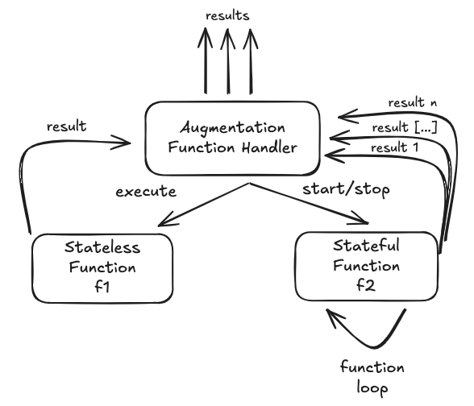
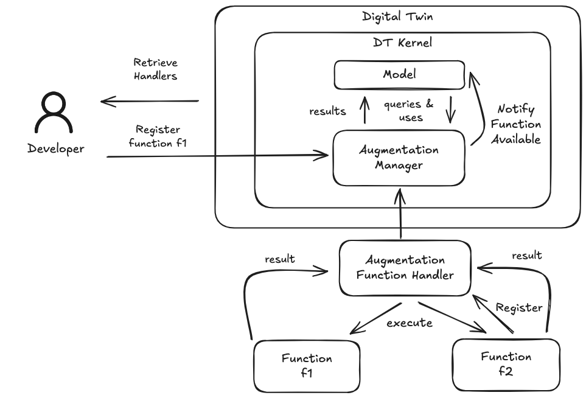

# Augmentation Function

In this page, we provide a comprehensive overview of the Augmentation Function framework in WLDT, covering its
architecture, implementation, and operational aspects.

The documentation explores the hierarchical structure of the augmentation system, detailing how the Digital Twin Kernel,
Augmentation Manager, Function Handlers, and individual Augmentation Functions interact to extend Digital Twin
capabilities beyond basic shadowing functions. We examine the two main categories of
Augmentation Functions—**Stateless** and **Stateful**—explaining their characteristics,
lifecycle management, state handling, and typical use cases.

The invocation mechanisms are covered in detail, including direct execution for stateless
functions and continuous operation modes (push and polling) for stateful functions, showing how
the Digital Twin Model triggers function execution through the Augmentation Manager. We describe
how augmentation results are structured using Augmentation Result
and how the Digital Twin Model processes these results.

Practical guidance is provided for implementing custom Augmentation Functions, including the base abstract class
structure, context handling, result production, and lifecycle callbacks.
Finally, we cover the technical details of implementing Augmentation Function Handlers,
which manage execution, lifecycle, and result publication, including handler registration,
context provisioning, and coordination with the Augmentation Manager.

The documentation is structured in the following subsections:

- [Architecture & Components](#augmentation-function---architecture--components): Overview of the hierarchical augmentation architecture, including DT Kernel, Augmentation Manager, Function Handlers, and data flow patterns
- [Function Types](#augmentation-function-types): Detailed comparison of Stateless and Stateful augmentation functions, their characteristics, execution models, and use cases
- [Handler & Manager](#augmentation-function-handler): `AugmentationFunctionHandler` abstract class, `DefaultAugmentationFunctionHandler`, listener interfaces (`AugmentationLifeCycleListener`, `StatefulAugmentationListener`), and `AugmentationManager`
- [Lifecycle & Registration Flow](#registering-and-unregistering-augmentation-functions): Event-driven registration and unregistration lifecycle, synchronization phases, and DTM discovery callbacks
- [Registration API](#augmentation-function-registration-api): Programmatic API for obtaining the `AugmentationManager`, unregistering functions and handlers, and querying registered components
- [Context & Context Request](#augmentation-function-context--context-request): Description of `AugmentationFunctionContext`, `AugmentationFunctionContextRequest`, `AugmentationFunctionRequest`, and `AugmentationFunctionRequestType`
- [Discovery Callbacks](#augmentation-function-discovery): DTM callbacks for tracking function availability (`onAugmentationNewFunctionAvailable`, `onAugmentationFunctionUnAvailable`, `onAugmentationFunctionListAvailable`) and synchronization-state dependency
- [Function Invocation](#augmentation-function-invocation): Methods for executing stateless functions and starting/stopping stateful functions from the Digital Twin Model, including all method overloads
- [Result Structure](#augmentation-function-results): Format and types of augmentation function results, including `AugmentationFunctionResult`, `AugmentationFunctionResultType`, and `AugmentationFunctionResultMetrics`
- [Error Handling](#augmentation-function-error-handling): How augmentation functions report errors using `AugmentationFunctionError` and `AugmentationFunctionErrorType`
- [Implementation Guide](#augmentation-function-implementation): Base classes (`AugmentationFunction`, `AugmentationFunctionType`), abstract implementations, and practical examples for both stateless and stateful augmentation functions
- [WLDT Event Bus Integration](#wldt-event-bus-integration): Internal event classes used by the framework for communication between the DTM, Augmentation Manager, and Handlers

## Augmentation Function - Architecture & Components

The WLDT augmentation architecture is organized in a hierarchical structure that enables scalable and
modular management of augmentation functions within the Digital Twin Kernel.


### DT Kernel Layer

The **DT Kernel** contains the core components of the Digital Twin:

- **Model**: The Digital Twin Model component that implements the shadowing function and manages the DT state
- **Augmentation Manager**: Central coordinator for all augmentation capabilities

The **Model** and **Augmentation Manager** interact bidirectionally:
- **Model → Augmentation Manager**: Sends queries and uses augmentation functions
- **Augmentation Manager → Model**: Returns results from augmentation functions

### Augmentation Manager

The **Augmentation Manager** acts as the central orchestrator, providing:

- **Function Handler Management**: Manages multiple Augmentation Function Handlers (`[1]`, `[...]`, `[n]`)
- **Result Aggregation**: Collects results from all handlers and forwards them to the Model
- **Lifecycle Control**: Coordinates the lifecycle of all registered augmentation functions

**Interactions**:
- **Manages**: Controls multiple Augmentation Function Handlers
- **Results**: Receives results from handlers and publishes them to the Model

### Augmentation Function Handler Layer

Multiple **Augmentation Function Handlers** (`[1]`, `[...]`, `[n]`) exist, 
each responsible for managing one or more augmentation functions.

Each handler:
- **Manages**: Controls the execution and lifecycle of its assigned functions (both stateless and stateful)
- **Handles**: Coordinates execution requests and context provisioning
- **Results**: Collects and forwards results to the Augmentation Manager

### Function Layer

The bottom layer contains the actual **Augmentation Functions** (`f1`, `f2`, etc.):

- **Function f1**: Represents stateless or stateful augmentation functions
- **Function f2**: Represents stateful augmentation functions with internal loops
- Multiple instances of the same function type can exist across different handlers

**Interactions**:
- **Results**: Functions produce results that flow upward through their handler
- **Handles**: Functions are controlled and invoked by their respective handlers

---

### Data Flow

#### Downward Flow (Control & Context)

1. **Model** sends queries and invocation requests to **Augmentation Manager**
2. **Augmentation Manager** delegates to appropriate **Function Handlers**
3. **Function Handlers** invoke and manage **Functions** with context provisioning

#### Upward Flow (Results)

1. **Functions** produce results and send them to their **Function Handler**
2. **Function Handlers** forward results to the **Augmentation Manager**
3. **Augmentation Manager** aggregates and delivers results to the **Model**

---

## Augmentation Function Types

Augmentation Functions in WLDT are distinguished into two main types based on internal state management: 
**Stateless** and **Stateful**. Both types interact with the **Augmentation Function Handler** 
(implemented by the Augmentation Manager), which coordinates execution, lifecycle management, and result publication.



### Stateless Function

**Stateless Functions** (e.g., `f1`) are functions that do not maintain memory between successive executions. 
Each invocation is completely independent from previous ones.

**Characteristics**:
- **Execution**: Invoked via `execute` call from the Digital Twin Model through the Handler
- **Lifecycle**: No `start/stop` management required
- **State**: No persistent internal state
- **Output**: Produce a single list of `results` per execution
- **Use Cases**: Ideal for instantaneous calculations, validations, threshold checking

**Flow**:

1. The Digital Twin Model sends an execution request for the target Augmentation Function
2. The associated Handler receives the request and invokes `execute` on the stateless function with the target context
3. The function computes the result based only on the received context
4. The result is immediately returned to the Handler
5. The Handler publishes the result (`results` upward)
6. The result is received by the Digital Twin Model

### Stateful Function

**Stateful Functions** (e.g., `f2`) maintain internal state between 
successive executions, accumulating a history of results (`result 1`, `result [...]`, `result n`).

**Characteristics**:

- **Execution**: Managed via `start/stop` triggered from the model and managed by the Handler
- **Lifecycle**: Continuous lifecycle with explicit initialization and termination
- **State**: Maintain history of results and/or internal state
- **Output**: Produce results asynchronously and continuously
- **Update**: Receives automatic updates from the Digital Twin core associated to new State and/or Notification 
events in order to be used for its internal computation
- **Use Cases**: Ideal for pattern recognition, trend analysis, adaptive AI models

**Flow**:

1. The Digital Twin Model sends a start request for the target Augmentation Function
2. The Handler receives the request and invokes `start` on the stateful function
3. The function initializes its internal state and starts the **function loop**
4. The function will receive:
    - New Digital Twin State
    - Digital Twin Event Notifications
5. The function can also send requests for a context computation update
6. Results are produced according to the function logic (`result 1`, `result [...]`, `result n`)
7. The Handler receives and publishes results as they are generated
8. When necessary, the Model through the Handler can invoke `stop` to terminate the function

**Important Note**: Result production is not necessarily synchronized with 
the reception of new contexts or notifications. 
The function autonomously decides when and how to generate output based on its internal logic.

---

## Augmentation Function Handler

The **Augmentation Function Handler** acts as a central coordinator for all augmentation functions, providing:

- **Execution Management**: Invocation of `execute` for stateless, management of `start/stop` for stateful
- **Context Provisioning**: Construction and provision of `AugmentationContext` to functions
- **Result Management**: Collection and publication of results to the Digital Twin Model
- **Lifecycle Management**: Control of the lifecycle of stateful functions

The Handler abstracts the complexity of managing different function types, 
offering a uniform interface to the Digital Twin Model.

---

### AugmentationFunctionHandler

`AugmentationFunctionHandler` is the **abstract base class** for all augmentation function handlers.
It extends `DigitalTwinWorker` and implements `StatefulAugmentationListener`,
`WldtEventListener`, and `AugmentationLifeCycleListener`,
providing the common infrastructure for function registration, event subscription, and result publication.

#### Public Registration Methods

```java
// Register an augmentation function in this handler
public void registerAugmentationFunction(AugmentationFunction augmentationFunction)
    throws AugmentationFunctionException

// Unregister a registered function by its id
public void unRegisterAugmentationFunction(String augmentationFunctionId)
    throws AugmentationFunctionException

// Retrieve a single registered function by its id
public Optional<AugmentationFunction> getAugmentationFunction(String augmentationFunctionId)

// Retrieve all registered functions
public List<AugmentationFunction> getAllAugmentationFunctions()
```

#### Abstract Methods

When creating a **custom handler** by extending `AugmentationFunctionHandler`, the following
abstract methods must be implemented:

```java
// Called after a function is added to the handler's internal map
protected abstract void handleAugmentationFunctionRegistration(AugmentationFunction function)
    throws AugmentationFunctionException;

// Called after a function is removed from the handler's internal map
protected abstract void handleAugmentationFunctionUnRegistration(String augmentationFunctionId)
    throws AugmentationFunctionException;

// Called to start a stateful function — should invoke function.start(request)
protected abstract void handleAugmentationFunctionStart(StatefulAugmentationFunction function,
                                                        AugmentationFunctionRequest request)
    throws AugmentationFunctionException;

// Called to stop a running stateful function — should invoke function.stop(request)
protected abstract void handleAugmentationFunctionStop(StatefulAugmentationFunction function,
                                                       AugmentationFunctionRequest request)
    throws AugmentationFunctionException;

// Called to execute a stateless function — should invoke function.run(request) and return results
protected abstract AugmentationFunctionResultList handleAugmentationFunctionExecution(
    StatelessAugmentationFunction function, AugmentationFunctionRequest request)
    throws AugmentationFunctionException;

// Called to deliver a refreshed query result to a running stateful function
protected abstract void handleAugmentationFunctionQueryResultRefresh(
    StatefulAugmentationFunction function, QueryRequest queryRequest, QueryResult<?> queryResult)
    throws AugmentationFunctionException;
```

> **Note**: For most use cases, `DefaultAugmentationFunctionHandler` is sufficient.
> Extend `AugmentationFunctionHandler` only when you need custom execution logic,
> instrumentation, filtering, or specialized lifecycle management.

---

### DefaultAugmentationFunctionHandler

`DefaultAugmentationFunctionHandler` is the **ready-to-use concrete implementation** of
`AugmentationFunctionHandler`. It provides standard handling for all lifecycle operations—registration,
unregistration, stateless execution, and stateful start/stop—and automatically forwards DT state updates
and event notifications to all running stateful functions.

Developers can use it directly **without writing any custom handler code**:

```java
// Create a handler with a unique ID
DefaultAugmentationFunctionHandler handler = new DefaultAugmentationFunctionHandler("my-handler-id");

// Register one or more augmentation functions
handler.registerAugmentationFunction(new MyStatelessFunction());
handler.registerAugmentationFunction(new MyStatefulFunction());

// Add the handler to the AugmentationManager
augmentationManager.addAugmentationFunctionHandler(handler);
```

For more advanced scenarios—custom execution logic, filtering, instrumentation, or specialized
lifecycle management—extend `AugmentationFunctionHandler` directly and override only the abstract
methods needed.

---

### Handler Listener Interfaces

The augmentation framework defines three listener interfaces that decouple augmentation functions from
their handlers, enabling a clean publish-subscribe communication pattern.

#### AugmentationLifeCycleListener

`AugmentationLifeCycleListener` is a focused subset of the WLDT `LifeCycleListener` tailored
for augmentation components. `AugmentationFunctionHandler` implements this interface and receives
relevant DT lifecycle events from the `AugmentationManager`, without handling the full granularity
of the core DT lifecycle.

```java
public interface AugmentationLifeCycleListener {
    void onCreate();
    void onStart();
    void onDigitalTwinBound();
    void onDigitalTwinUnBound();
    void onSync(DigitalTwinState digitalTwinState);
    void onUnSync(DigitalTwinState digitalTwinState);
    void onStop();
    void onDestroy();
}
```

| Callback | When it is invoked |
|----------|--------------------|
| `onCreate()` | The Digital Twin instance is created |
| `onStart()` | The Digital Twin starts its lifecycle |
| `onDigitalTwinBound()` | The DT has successfully bound to all Physical Adapters |
| `onDigitalTwinUnBound()` | The DT has unbound from Physical Adapters |
| `onSync(state)` | The DT reaches the Synchronized state (state snapshot provided) |
| `onUnSync(state)` | The DT exits the Synchronized state |
| `onStop()` | The Digital Twin stops |
| `onDestroy()` | The Digital Twin instance is destroyed |

---

#### StatefulAugmentationListener

`StatefulAugmentationListener` is implemented by `AugmentationFunctionHandler` and is automatically
set on each registered stateful function. It receives **results** (including embedded errors) and
**query refresh requests** from stateful functions.

```java
public interface StatefulAugmentationListener {

    // Called when the stateful function produces new results (or reports an error)
    void onStatefulAugmentationFunctionResult(String augmentationFunctionId,
                                              AugmentationFunctionResultList augmentationFunctionResultList);

    // Called when the stateful function requests a query result refresh from DT storage
    void onStatefulAugmentationFunctionQueryResultRefresh(String augmentationFunctionId,
                                                         QueryRequest queryRequest);
}
```

> **Note**: Since v0.7.1, errors are embedded directly in `AugmentationFunctionResultList` rather than
> delivered through a separate error callback. After receiving results, check `resultList.hasError()`
> to detect error conditions. This interface is part of the internal communication channel between
> functions and their handlers — implemented by `AugmentationFunctionHandler` and set
> automatically; developers do not typically implement it directly.

---

### AugmentationManager

`AugmentationManager` is the **top-level coordinator** for all augmentation capabilities within a
Digital Twin instance. It manages a collection of `AugmentationFunctionHandler` instances, propagates
DT lifecycle events to each handler, and runs each handler in its own thread via an internal `ExecutorService`.

The `AugmentationManager` is created automatically by the WLDT engine for each Digital Twin
and is accessible via `DigitalTwin.getAugmentationManager()`.

#### Key Methods

```java
// Add a handler (before or after the DT is started)
public void addAugmentationFunctionHandler(AugmentationFunctionHandler handler)
    throws AugmentationFunctionException, WldtWorkerException

// Remove a handler by its id
public void removeAugmentationFunctionHandler(String handlerId)
    throws AugmentationFunctionException

// Retrieve the map of all registered handlers (id → handler)
public Map<String, AugmentationFunctionHandler> getAugmentationFunctionHandlerMap()
```

#### Thread Pool Limit

> **⚠️ Warning**: The `AugmentationManager` caps the number of concurrently registered handlers at **5**.
> Attempting to add more throws an `AugmentationFunctionException`. Design your handler topology accordingly.

For a complete setup example, see [Augmentation Function Registration API](#augmentation-function-registration-api).

---

## Registering and Unregistering Augmentation Functions



This section describes the interaction procedure between a Digital Twin and its Augmentation Functions, covering registration,
lifecycle synchronization, and dynamic updates with augmentation functions registered and unregistered at runtime as
illustrated in the following sequence diagram:


The procedure is designed around **loose coupling** and **event-driven reactivity**. 
The Digital Twin Model never polls for changes; instead, it subscribes once to the Event Bus and reacts to 
events as they occur. The catch-up mechanism at synchronization time guarantees consistency between the 
DTM state and any registrations that happened before the Digital Twin was active.

The main involved phases are:

### Phase 1 — Pre-Start Registration

Before the Digital Twin is started, the Developer retrieves an `AugmentationFunctionHandler` from the `AugmentationManager` and 
registers the first Augmentation Function. The handler publishes a `RegistrationEvent` on the Event Bus, 
but since no subscribers are active yet, the event is silently ignored.

### Phase 2 — Digital Twin Initialization and Synchronization

The Developer starts the Digital Twin, which initializes the `Digital Twin Model`. 
During initialization, the DTM subscribes to `RegistrationEvent` and `UnregistrationEvent` 
notifications on the Event Bus, making it ready to react to future changes.

The DTM then evolves through its lifecycle until it reaches the **Synchronized** state. 
At this point it performs a catch-up procedure: it queries the Augmentation Manager to 
retrieve all registered handlers, then fetches the list of already-registered Augmentation Functions from each handler, 
generating an internal notification for each one. This ensures that any functions registered before the 
Digital Twin started are properly acknowledged.

### Phase 3 — Dynamic Registration by the Developer

Once the system is running, the Developer can register additional Augmentation Functions at any time. 
When a new function is registered on the handler, a `RegistrationEvent` is published on the Event Bus and the 
DTM receives it immediately, keeping its internal state up to date without requiring a restart.

### Phase 4 — Dynamic Unregistration by the Developer

Augmentation Functions can also be removed at runtime. When the Developer unregisters a function, 
the handler publishes an `UnregistrationEvent` on the Event Bus. The DTM receives the notification and 
updates its internal state, ensuring it no longer references the removed function.

<!--### Phase 5 — Self-Registration by an External Augmentation Function (NOT YET IMPLEMENTED)

An External Augmentation Function can autonomously register itself by communicating directly with its
designated `AugmentationFunctionHandler`. The registration flow is identical to the developer-driven case:
the handler publishes a `RegistrationEvent` on the Event Bus, and the DTM is notified and updates its state accordingly.

### Phase 6 — Dynamic Unregistration by an External Augmentation Function (NOT YET IMPLEMENTED)

Augmentation Functions can also be removed at runtime. When the Developer unregisters a function,
the handler publishes an `UnregistrationEvent` on the Event Bus. The DTM receives the notification and
updates its internal state, ensuring it no longer references the removed function.-->

## Augmentation Function Registration API

The registration API allows developers to add, remove, and retrieve augmentation functions and handlers
at any point during the Digital Twin lifecycle. For the basic setup pattern (create handler → register
functions → add to manager) see [DefaultAugmentationFunctionHandler](#defaultaugmentationfunctionhandler).

---

### Obtaining the AugmentationManager

The `AugmentationManager` is created automatically by the WLDT engine for each `DigitalTwin` instance
and is exposed via `getAugmentationManager()`:

```java
DigitalTwin digitalTwin = new DigitalTwin("my-dt-id", new MyDigitalTwinModel());

AugmentationManager augmentationManager = digitalTwin.getAugmentationManager();
```

---

### Unregistering Functions and Handlers

Individual functions can be removed from a handler at runtime without stopping the handler:

```java
// Remove a specific function from its handler
handler.unRegisterAugmentationFunction(MyStatelessFunction.FUNCTION_ID);
```

An entire handler can be removed from the manager:

```java
// Remove a handler and all its functions
augmentationManager.removeAugmentationFunctionHandler("sensor-handler");
```

---

### Querying Registered Handlers and Functions

```java
// Retrieve a specific handler by id
Optional<AugmentationFunctionHandler> h =
    augmentationManager.getAugmentationFunctionHandler("sensor-handler");

// Retrieve all registered handlers
List<AugmentationFunctionHandler> allHandlers =
    augmentationManager.getAllAugmentationFunctionHandlers();

// Find a function by id across all handlers (returns a map handlerId → function)
Map<String, AugmentationFunction> found =
    augmentationManager.getAugmentationFunctionWithId(MyStatelessFunction.FUNCTION_ID);

// Retrieve a function from a specific handler
Optional<AugmentationFunction> fn =
    handler.getAugmentationFunction(MyStatelessFunction.FUNCTION_ID);

// Retrieve all functions registered on a handler
List<AugmentationFunction> allFunctions = handler.getAllAugmentationFunctions();
```

## Augmentation Function Context & Context Request

The Augmentation Function framework provides two key classes for managing 
the data and configuration that augmentation functions need during execution: 
`AugmentationFunctionContext` and `AugmentationFunctionContextRequest`.

---

### AugmentationFunctionContext

The `AugmentationFunctionContext` encapsulates the runtime data 
provided to an augmentation function during execution. 
It contains the current Digital Twin state and optional query results from the DT storage.

#### Structure

```java
public class AugmentationFunctionContext {
    private DigitalTwinState digitalTwinState;
    private QueryResult<?> queryResult;
}
```

#### Fields

| Field | Type | Description |
|-------|------|-------------|
| `digitalTwinState` | `DigitalTwinState` | The current Digital Twin State at the time of execution |
| `queryResult` | `QueryResult<?>` | Results from storage queries defined in the `AugmentationFunctionContextRequest` (optional) |

#### Constructors

```java
// Default constructor
public AugmentationFunctionContext()

// Constructor with state only
public AugmentationFunctionContext(DigitalTwinState digitalTwinState)

// Constructor with state and query results
public AugmentationFunctionContext(DigitalTwinState digitalTwinState, QueryResult<?> queryResult)
```

#### Usage in Functions

The context is provided to augmentation functions automatically:

- **Stateless Functions**: Received as a parameter in the `run()` method
- **Stateful Functions**: Received during `start()` initialization and can be requested for updates during execution

---

### AugmentationFunctionContextRequest

The `AugmentationFunctionContextRequest` defines what data and notifications an 
augmentation function wants to receive during its lifecycle. 
It acts as a configuration that the Augmentation Manager and the associated Handler use 
to prepare the appropriate context.

#### Structure

```java
public class AugmentationFunctionContextRequest {
    private boolean observeState;
    private boolean observeEventNotifications;
    private List<String> propertyNameFilter;
    private List<String> eventNameFilter;
    private List<String> relationshipNameFilter;
    private QueryRequest queryRequest;
}
```

#### Fields

| Field | Type | Default | Description |
|-------|------|---------|-------------|
| `observeState` | `boolean` | `true` | Whether the function wants to observe DT state changes |
| `observeEventNotifications` | `boolean` | `true` | Whether the function wants to observe DT event notifications |
| `propertyNameFilter` | `List<String>` | `null` | Filter for specific property names (null = observe all) |
| `eventNameFilter` | `List<String>` | `null` | Filter for specific event names (null = observe all) |
| `relationshipNameFilter` | `List<String>` | `null` | Filter for specific relationship names (null = observe all) |
| `queryRequest` | `QueryRequest` | `null` | Query to execute on DT storage for historical data |

> **⚠️ Warning**: `propertyNameFilter`, `eventNameFilter`, and `relationshipNameFilter` are declared in the
> class but are **currently not read by the framework** — configuring them has no effect.
> Use `observeState: false` or `observeEventNotifications: false` to suppress the corresponding
> notifications entirely.

#### Constructors

```java
// Default constructor: observes state and events, no query
public AugmentationFunctionContextRequest()

// Constructor with query only
public AugmentationFunctionContextRequest(QueryRequest queryRequest)

// Constructor with observation flags and query
public AugmentationFunctionContextRequest(boolean observeState,
                                         boolean observeEventNotifications,
                                         QueryRequest queryRequest)
```

#### Usage in Function Constructors

The context request is typically configured once in the function's constructor and tells the
framework what data to provide at runtime.

```java
// Stateless function that needs the last 10 minutes of DT state history
public class HistoryAwareStatelessFunction extends StatelessAugmentationFunction {

    public HistoryAwareStatelessFunction() {
        // ⚠️ Warning: timestamps are computed once at construction time and stay fixed.
        // For a truly sliding "last 10 minutes" window, build the QueryRequest inside run()
        // and pass it to refreshQueryResult(QueryRequest) at each invocation instead.
        super("history-fn", "History Function", "Uses DT state history", "1.0.0",
              new AugmentationFunctionContextRequest(
                  new QueryRequest()
                      .setResourceType(QueryResourceType.DIGITAL_TWIN_STATE)
                      .setRequestType(QueryRequestType.TIME_RANGE)
                      .setStartTimestampMs(System.currentTimeMillis() - 600_000)
                      .setEndTimestampMs(System.currentTimeMillis())
              ));
    }

    @Override
    protected AugmentationFunctionResultList run(AugmentationFunctionRequest request)
            throws AugmentationFunctionException {
        QueryResult<?> history = request.getContext().getQueryResult();
        // use history ...
        return new AugmentationFunctionResultList();
    }
}

// Stateful function that only observes state changes (no event notifications needed)
public class StateOnlyStatefulFunction extends StatefulAugmentationFunction {

    public StateOnlyStatefulFunction() {
        super("state-only-fn", "State Only Function", "Observes state only", "1.0.0",
              new AugmentationFunctionContextRequest(true, false, null));
    }
    // ...
}
```

---

### AugmentationFunctionRequest

`AugmentationFunctionRequest` is the **runtime request object** passed to every augmentation function lifecycle method (`run()`, `start()`, `stop()`). It bundles an `AugmentationFunctionContext` with metadata identifying the specific invocation.

#### Structure

```java
public class AugmentationFunctionRequest {
    private final String requestId;
    private final AugmentationFunctionContext context;
    private final AugmentationFunctionRequestType type;
    private final Long timestamp;
}
```

#### Fields

| Field | Type | Description |
|-------|------|-------------|
| `requestId` | `String` | Auto-generated UUID uniquely identifying this request |
| `context` | `AugmentationFunctionContext` | Runtime context (current DT state + optional query results) |
| `type` | `AugmentationFunctionRequestType` | The type of operation requested (`EXECUTE`, `START`, or `STOP`) |
| `timestamp` | `Long` | Milliseconds since epoch when the request was created |

#### Constructors

```java
// Full constructor with explicit timestamp
public AugmentationFunctionRequest(String requestId,
                                   AugmentationFunctionContext context,
                                   AugmentationFunctionRequestType requestType,
                                   Long timestamp)

// Constructor with automatic timestamp (timestamp = now)
public AugmentationFunctionRequest(String requestId,
                                   AugmentationFunctionContext context,
                                   AugmentationFunctionRequestType requestType)
```

#### Accessing Request Data Inside a Function

```java
@Override
public AugmentationFunctionResultList run(AugmentationFunctionRequest request)
        throws AugmentationFunctionException {

    // Retrieve the request type
    AugmentationFunctionRequestType type = request.getType(); // EXECUTE

    // Retrieve the context from the request
    AugmentationFunctionContext context = request.getContext();

    // Access the current DT state
    DigitalTwinState state = context.getDigitalTwinState();

    // Access optional query results from DT storage
    QueryResult<?> queryResult = context.getQueryResult();

    // ...
}
```

---

### AugmentationFunctionRequestType

`AugmentationFunctionRequestType` is an enum that identifies which operation triggered the invocation of an augmentation function.

```java
public enum AugmentationFunctionRequestType {
    EXECUTE,   // Stateless function execution request
    START,     // Stateful function start request
    STOP       // Stateful function stop request
}
```

| Value | Triggered by | Target |
|-------|-------------|--------|
| `EXECUTE` | `executeAugmentationFunction()` called from the Digital Twin Model | Stateless functions |
| `START` | `startAugmentationFunction()` called from the Digital Twin Model | Stateful functions |
| `STOP` | `stopAugmentationFunction()` called from the Digital Twin Model | Stateful functions |

---

### Context Lifecycle: Stateless vs Stateful

The behavior of context and context request differs significantly between 
stateless and stateful augmentation functions.

#### Stateless Functions: Single-Use Context

For **stateless functions**, the context and context request are used **only once per execution**:

1. **Context Request Definition**: The function defines its context requirements (typically in the descriptor or during registration)
2. **Execution Invocation**: When `executeAugmentationFunction()` is called from the Digital Twin Model
3. **Context Preparation**: The Augmentation Manager builds the context based on the request (current state + optional query results)
4. **Single Execution**: The `run()` method receives the context, executes, and returns results
5. **Context Disposal**: The context is discarded after execution completes

**Example**:

```java
public class StatelessPredictionFunction extends StatelessAugmentationFunction {
    
    @Override
    public AugmentationFunctionResultList run(AugmentationFunctionRequest request)
            throws AugmentationFunctionException {
        // Context used once per execution
        DigitalTwinState currentState = request.getContext().getDigitalTwinState();
        QueryResult<?> history = request.getContext().getQueryResult();
        
        // Perform prediction using current state and history
        // Return results
        return new AugmentationFunctionResultList();
    }
}
```

Each time the function is executed, a **fresh context** is prepared with the latest state and query results.

---

#### Stateful Functions: Initial Context + Update Requests

For **stateful functions**, the context lifecycle is more complex:

1. **Context Request Definition**: The function defines its initial context requirements
2. **Start Invocation**: When `startAugmentationFunction()` is called
3. **Initial Context**: The `start()` method receives an initial context built from the context request
4. **Runtime Updates**: The function automatically receives `onStateUpdate()` and `onEventNotificationReceived()` callbacks with fresh state/events
5. **Context Update Request**: The function can explicitly request context updates when needed
6. **Stop**: The `stop()` method may receive a final context

**Example: Push Mode (Automatic Updates)**

```java
public class StatefulAnomalyDetector extends StatefulAugmentationFunction {
    
    private List<Double> temperatureHistory = new ArrayList<>();
    
    @Override
    public void start(AugmentationFunctionRequest request) throws AugmentationFunctionException {
        // Receive initial context at startup
        DigitalTwinState initialState = request.getContext().getDigitalTwinState();
        
        // Initialize with current temperature
        initialState.getProperty("temperature")
            .ifPresent(p -> temperatureHistory.add((Double) p.getValue()));
        
        logger.info("Started with initial temperature: {}", temperatureHistory.get(0));
    }
    
    @Override
    public void onStateUpdate(DigitalTwinState newState) {
        // Automatically receive state updates (no explicit context request needed)
        newState.getProperty("temperature")
            .ifPresent(p -> {
                double temp = (Double) p.getValue();
                temperatureHistory.add(temp);
                
                // Detect anomaly
                if (isAnomaly(temp)) {
                    notifyResult(createAnomalyResult(temp));
                }
            });
    }
    
    @Override
    public void stop(AugmentationFunctionRequest request) throws AugmentationFunctionException {
        logger.info("Stopped after processing {} temperature readings", 
                    temperatureHistory.size());
    }
}
```

**Example: Polling Mode (Explicit Context Requests)**

A stateful function that periodically requests a fresh snapshot of historical data from DT storage
using `refreshQueryResult()` and receives the result asynchronously via `onQueryResultRefresh()`:

```java
public class StatefulPollingAugmentationFunction extends StatefulAugmentationFunction {

    public static final String FUNCTION_ID = "polling-augmentation-function";
    private static final long POLLING_INTERVAL_MS = 5000;

    private Timer pollingTimer;

    public StatefulPollingAugmentationFunction() {
        super(FUNCTION_ID,
              "Polling Augmentation Function",
              "Periodically queries DT storage for the last 60 seconds of state history",
              "1.0.0",
              // ⚠️ Warning: timestamps below are fixed at construction time.
              // This sets the initial query range. To slide the window at each polling cycle,
              // call refreshQueryResult(new QueryRequest()...) with fresh timestamps inside the TimerTask.
              new AugmentationFunctionContextRequest(
                  new QueryRequest()
                      .setResourceType(QueryResourceType.DIGITAL_TWIN_STATE)
                      .setRequestType(QueryRequestType.TIME_RANGE)
                      .setStartTimestampMs(System.currentTimeMillis() - 60_000)
                      .setEndTimestampMs(System.currentTimeMillis())
              ));
    }

    @Override
    public void start(AugmentationFunctionRequest request) throws AugmentationFunctionException {
        logger.info("Starting polling function, interval: {} ms", POLLING_INTERVAL_MS);

        pollingTimer = new Timer(true);
        pollingTimer.scheduleAtFixedRate(new TimerTask() {
            @Override
            public void run() {
                // Request a fresh query result from DT storage using the context request's QueryRequest
                refreshQueryResult();
            }
        }, 0, POLLING_INTERVAL_MS);
    }

    @Override
    public void onQueryResultRefresh(QueryRequest queryRequest, QueryResult<?> queryResult)
            throws AugmentationFunctionException {
        if (queryResult == null || queryResult.isEmpty()) {
            return;
        }

        // Process the refreshed historical data
        logger.debug("Received query refresh with {} records", queryResult.size());

        // Compute result from the historical snapshot
        AugmentationFunctionResult<Integer> result = new AugmentationFunctionResult<>(
                AugmentationFunctionResultType.GENERIC_RESULT,
                "history_record_count",
                queryResult.size(),
                null,
                Map.of("query_timestamp", System.currentTimeMillis())
        );

        notifyResult(new AugmentationFunctionResultList(result));
    }

    @Override
    public void stop(AugmentationFunctionRequest request) throws AugmentationFunctionException {
        if (pollingTimer != null) {
            pollingTimer.cancel();
            pollingTimer = null;
        }
        logger.info("Polling function stopped");
    }

    @Override
    public void onStateUpdate(DigitalTwinState digitalTwinState) {
        // Not used in pure polling mode — data is retrieved via scheduled refreshQueryResult()
    }

    @Override
    public void onEventNotificationReceived(DigitalTwinStateEventNotification<?> notification) {
        // Not used in pure polling mode
    }
}
```

In polling mode the function drives its own data retrieval rhythm independently of DT state changes.
`refreshQueryResult()` re-executes the `QueryRequest` defined in the `AugmentationFunctionContextRequest`
and delivers the result to `onQueryResultRefresh()`. A custom `QueryRequest` can also be passed
directly to `refreshQueryResult(QueryRequest)` when the query parameters need to change at runtime
(e.g., to slide a time window).

---

### Key Differences: Stateless vs Stateful Context Usage

| Aspect | Stateless Functions | Stateful Functions |
|--------|-------------------|-------------------|
| **Context Frequency** | Once per `execute()` call | Initial context + runtime updates |
| **Context Source** | Built fresh each execution | Initial + push notifications or polling requests |
| **Context Request** | Defines single execution needs | Defines initial setup + observation preferences |
| **State Observation** | Not applicable (no lifecycle) | Via `onStateUpdate()` if `observeState = true` |
| **Event Observation** | Not applicable (no lifecycle) | Via `onEventNotificationReceived()` if `observeEventNotifications = true` |
| **Context Updates** | Not possible (stateless) | Automatic (push) or explicit (polling) |
| **Query Execution** | Once per execution | Initial + can be refreshed on request |

---

## Augmentation Function Discovery

The `DigitalTwinModel` provides callback methods to discover and track 
the availability of Augmentation Functions throughout the Digital Twin lifecycle. 
These callbacks enable the Model to react to function registration, unregistration, and availability changes.

### Discovery Callbacks

#### onAugmentationNewFunctionAvailable

```java
protected void onAugmentationNewFunctionAvailable(String handlerId, 
                                                  AugmentationFunction augmentationFunction)
```

Invoked when a new Augmentation Function has been registered and becomes available for use.

**Parameters**:
- `handlerId`: The identifier of the Augmentation Function Handler that registered the function
- `augmentationFunction`: The Augmentation Function that became available

---

#### onAugmentationFunctionUnAvailable

```java
protected void onAugmentationFunctionUnAvailable(String handlerId, 
                                                 AugmentationFunction augmentationFunction)
```

Invoked when an Augmentation Function has been unregistered and is no longer available.

**Parameters**:
- `handlerId`: The identifier of the Augmentation Function Handler that unregistered the function
- `augmentationFunction`: The Augmentation Function that became unavailable

---

#### onAugmentationFunctionListAvailable

```java
protected void onAugmentationFunctionListAvailable(String handlerId, 
                                                   List<AugmentationFunction> augmentationFunctionList)
```

Invoked at Digital Twin Model startup to notify 
all Augmentation Functions already registered and available. 
This method is called once per Handler with its associated list of registered functions.

**Parameters**:
- `handlerId`: The identifier of the Augmentation Function Handler
- `augmentationFunctionList`: List of Augmentation Functions registered in the Handler

---

#### Synchronization State Dependency

Augmentation Function availability notifications are only possible 
when the Digital Twin is in the **Sync state**. If the DT is not synchronized, 
its state is inconsistent, making augmentation function execution unfeasible.

**Behavior**:
- **Functions registered at DT creation**: Notified step-by-step during the first Synchronization phase
- **Functions registered after DT creation**: Immediately notified if DT is in Sync state, otherwise queued until next Synchronization phase

#### Duplicate Notifications

The Digital Twin Model should handle potential **duplicate callbacks** for the same Augmentation Function. 
Since the DT lifecycle evolution is unpredictable, a function may be notified as available multiple times.

**Example scenario**:
1. Augmentation Function registered while DT is in Sync → notified as available
2. DT goes out of sync, then returns to sync → function notified again as available

This ensures the Model is always aware of available functions and can handle them accordingly.

---

### Override Augmentation Function Discovery Methods

All discovery callbacks provide **default implementations** that log the event but perform no action. 
These methods are **not abstract**, allowing Digital Twin Models 
to optionally override them based on specific requirements.

**Example override**:

```java
@Override
protected void onAugmentationNewFunctionAvailable(String handlerId,
                                                  AugmentationFunction augmentationFunction) {
    logger.info("New augmentation function available: {} from handler: {}",
                augmentationFunction.getId(),
                handlerId);

    // Custom logic: auto-start stateful functions
    if (augmentationFunction.getType() == AugmentationFunctionType.STATEFUL) {
        try {
            this.startAugmentationFunction(augmentationFunction.getId());
        } catch (Exception e) {
            logger.error("Failed to start stateful function", e);
        }
    }
}
```

---

## Augmentation Function Invocation

The `DigitalTwinModel` class provides several methods to interact with 
both **Stateless** and **Stateful** augmentation functions during runtime.

### Execute Augmentation Function (Stateless)

```java
// Search across all handlers for the function with the given id
protected void executeAugmentationFunction(String augmentationFunctionId)
    throws EventBusException, AugmentationFunctionException

// Same, but with a custom request id for traceability
protected void executeAugmentationFunction(String augmentationFunctionId,
                                           String augmentationFunctionRequestId)
    throws EventBusException, AugmentationFunctionException

// Target a specific handler explicitly
protected void executeAugmentationFunction(String augmentationFunctionHandlerId,
                                           String augmentationFunctionId,
                                           String augmentationFunctionRequestId)
    throws EventBusException, AugmentationFunctionException
```

Triggers the execution of a **stateless** augmentation function. The framework searches all registered
handlers for the function unless a specific `augmentationFunctionHandlerId` is provided.

---

### Start Augmentation Function (Stateful)

```java
// Search across all handlers
protected void startAugmentationFunction(String augmentationFunctionId)
    throws EventBusException, AugmentationFunctionException

// Same, but with a custom request id
protected void startAugmentationFunction(String augmentationFunctionId,
                                         String augmentationFunctionRequestId)
    throws EventBusException, AugmentationFunctionException

// Target a specific handler explicitly
protected void startAugmentationFunction(String augmentationFunctionHandlerId,
                                         String augmentationFunctionId,
                                         String augmentationFunctionRequestId)
    throws EventBusException, AugmentationFunctionException
```

Initiates a **stateful** augmentation function, starting its internal loop and enabling continuous
operation. The function begins processing and producing results asynchronously.

---

### Query Running State (Stateful)

```java
// Search across all handlers for the function and return its running state
protected boolean isStatefulAugmentationFunctionRunning(String augmentationFunctionId)
    throws AugmentationFunctionException

// Target a specific handler explicitly
protected boolean isStatefulAugmentationFunctionRunning(String augmentationFunctionHandlerId,
                                                        String augmentationFunctionId)
    throws AugmentationFunctionException
```

Returns `true` if the specified stateful function has been started and not yet stopped.
Throws `AugmentationFunctionException` if the function is not found or is not of type `STATEFUL`.

> **Note**: `startAugmentationFunction()` is a no-op if the target function is already running,
> and `stopAugmentationFunction()` is a no-op if the target function is already stopped.
> Guard checks happen automatically — you do not need to call `isStatefulAugmentationFunctionRunning()`
> before start/stop unless your application logic requires it.

---

### Stop Augmentation Function (Stateful)

```java
// Search across all handlers
protected void stopAugmentationFunction(String augmentationFunctionId)
    throws EventBusException, AugmentationFunctionException

// Same, but with a custom request id
protected void stopAugmentationFunction(String augmentationFunctionId,
                                        String augmentationFunctionRequestId)
    throws EventBusException, AugmentationFunctionException

// Target a specific handler explicitly
protected void stopAugmentationFunction(String augmentationFunctionHandlerId,
                                        String augmentationFunctionId,
                                        String augmentationFunctionRequestId)
    throws EventBusException, AugmentationFunctionException
```

Terminates a running **stateful** augmentation function, stopping its internal loop and cleaning up resources.

---

### Example 1: Executing Stateless Function on Physical Property Changes

Execute an augmentation function each time a physical property variation is received:

```java
@Override
protected void onPhysicalAssetPropertyVariation(PhysicalAssetPropertyWldtEvent<?> physicalPropertyEventMessage) {
    try {

        // Implementation of the management of a new Physical Event in the Digital Twin Model
        //[...]
        
        // Execute augmentation function for each received physical event notification
        this.executeAugmentationFunction(RandomNumberAugmentationFunction.FUNCTION_ID);
        
    } catch (Exception e) {
        e.printStackTrace();
    }
}
```

---

### Example 2: Starting Stateful Function After Digital Twin Binding

Start a stateful augmentation function once the Digital Twin has completed its binding phase:

```java
@Override
protected void onDigitalTwinBound(Map<String, PhysicalAssetDescription> adaptersPhysicalAssetDescriptionMap) {
    try {
        
        // Implementation of the binding phase in the Model
        //[...]
        
        // Start stateful augmentation function after DT initialization
        this.startAugmentationFunction(
            StatefulPeriodicRandomNumberAugmentationFunction.FUNCTION_ID
        );
        
    } catch (Exception e) {
        e.printStackTrace();
    }
}
```

---

### Example 3: Stopping a Stateful Function on Unbind

Stop a running stateful function when the Digital Twin loses its physical asset binding:

```java
@Override
protected void onDigitalTwinUnBound(Map<String, PhysicalAssetDescription> adaptersPhysicalAssetDescriptionMap,
                                    String errorMessage) {
    try {
        this.stopAugmentationFunction(StatefulPeriodicRandomNumberAugmentationFunction.FUNCTION_ID);
    } catch (Exception e) {
        e.printStackTrace();
    }
}
```

## Augmentation Function Results

Augmentation Functions produce results encapsulated in the `AugmentationFunctionResult<T>` class, 
which provides a flexible and type-safe way to return computed outputs to the Digital Twin Model.

The `AugmentationFunctionResult<T>` is a generic container that structures the 
output of augmentation function executions.

### Structure

```java
public class AugmentationFunctionResult<T> {
    private AugmentationFunctionResultType type;
    private String key;
    private T value;
    private AugmentationFunctionResultMetrics augmentationFunctionResultMetrics;
    private Map<String, Object> metadata;
    private AugmentationFunctionRequest request;
    private final Long timestamp;
}
```

### Fields

| Field | Type | Description |
|-------|------|-------------|
| `type` | `AugmentationFunctionResultType` | Categorizes the result type (PROPERTY_RESULT, EVENT_RESULT, RELATIONSHIP_RESULT, RELATIONSHIP_INSTANCE_RESULT, GENERIC_RESULT) |
| `key` | `String` | Identifier for the result (e.g., property name, event key, relationship name) |
| `value` | `T` | The actual computed value, generic type allows flexibility |
| `augmentationFunctionResultMetrics` | `AugmentationFunctionResultMetrics` | Optional execution metrics (timing, records processed/generated, execution ID) |
| `metadata` | `Map<String, Object>` | Optional metadata providing additional context (e.g., confidence score, timestamp, source) |
| `request` | `AugmentationFunctionRequest` | The request that triggered this result, set automatically by the handler |
| `timestamp` | `Long` | Creation timestamp in milliseconds since epoch, set automatically |

---

### AugmentationFunctionResultList

`AugmentationFunctionResultList` extends `ArrayList<AugmentationFunctionResult<?>>` and is the
standard container returned by augmentation functions and received by the Digital Twin Model.
It can carry either a list of results **or** an `AugmentationFunctionError` — not both.
When an error is set the list becomes immutable: all mutating operations (`add`, `set`, `remove`, `clear`)
throw `IllegalStateException`, while read operations remain available.

#### Structure

```java
public class AugmentationFunctionResultList extends ArrayList<AugmentationFunctionResult<?>> {
    private AugmentationFunctionError augmentationFunctionError;
}
```

#### Constructors

```java
// Empty list — add results with the standard List API
public AugmentationFunctionResultList()

// Single-result convenience constructor
public AugmentationFunctionResultList(AugmentationFunctionResult<?> result)

// Error-state constructor — list starts immutable with the given error
public AugmentationFunctionResultList(AugmentationFunctionError augmentationFunctionError)
```

#### Key Methods

| Method | Description |
|--------|-------------|
| `hasError()` | Returns `true` if the list is in error state |
| `getAugmentationFunctionError()` | Returns the `AugmentationFunctionError`, or `null` if none |
| `setAugmentationFunctionError(AugmentationFunctionError)` | Sets the error and locks all mutations |

#### Usage

```java
// Return a single result from a stateless function
@Override
protected AugmentationFunctionResultList run(AugmentationFunctionRequest request)
        throws AugmentationFunctionException {
    AugmentationFunctionResult<Double> result = new AugmentationFunctionResult<>(
            AugmentationFunctionResultType.GENERIC_RESULT, "value", 42.0, null, null);
    return new AugmentationFunctionResultList(result);
}

// Return multiple results
AugmentationFunctionResultList results = new AugmentationFunctionResultList();
results.add(result1);
results.add(result2);
return results;

// Return an error instead of results
return new AugmentationFunctionResultList(
    new AugmentationFunctionError(AugmentationFunctionErrorType.ERROR, "computation failed")
);

// Checking for errors in the DTM callback
@Override
protected void onAugmentationFunctionResultEvent(String handlerId, String functionId,
                                                 AugmentationFunctionResultList resultList) {
    if (resultList.hasError()) {
        logger.warn("Function {} reported error: {}", functionId,
                    resultList.getAugmentationFunctionError().getMessage());
        return;
    }
    for (AugmentationFunctionResult<?> result : resultList) {
        // process result ...
    }
}
```

---

### AugmentationFunctionResultType Enum

The result type enum defines the categories of outputs that augmentation functions can produce:

```java
public enum AugmentationFunctionResultType {
    PROPERTY_RESULT,
    EVENT_RESULT,
    RELATIONSHIP_RESULT,
    RELATIONSHIP_INSTANCE_RESULT,
    GENERIC_RESULT
}
```

#### Result Type Descriptions

| Type | Description | Digital Twin Component | Example Use Case |
|------|-------------|------------------------|------------------|
| **PROPERTY_RESULT** | Suggests new or updated property values | DT State Properties | Predicted temperature, calculated efficiency, derived metrics |
| **EVENT_RESULT** | Suggests event notifications or registrations | DT State Events | Anomaly detected, threshold exceeded, pattern recognized |
| **RELATIONSHIP_RESULT** | Suggests new relationship type declarations | DT State Relationships | New relationship type discovered between DT types |
| **RELATIONSHIP_INSTANCE_RESULT** | Suggests concrete relationship instances | DT State Relationship Instances | Specific connection discovered to another DT instance |
| **GENERIC_RESULT** | Unstructured or custom results | Model-defined handling | Analysis data, recommendations, metrics, custom insights |

---

### AugmentationFunctionResultMetrics

`AugmentationFunctionResultMetrics` is an **optional** companion class that can be attached to any `AugmentationFunctionResult` to provide observability and performance data about the execution that produced the result.

#### Structure

```java
public class AugmentationFunctionResultMetrics {
    private Long totalExecutionTimeMs;
    private Long startTimestamp;
    private Long endTimestamp;
    private Integer recordsProcessed;
    private Integer recordsGenerated;
    private String executionId;
    private String nodeId;
}
```

#### Fields

| Field | Type | Description |
|-------|------|-------------|
| `totalExecutionTimeMs` | `Long` | Total execution time in milliseconds |
| `startTimestamp` | `Long` | Execution start time (milliseconds since epoch) |
| `endTimestamp` | `Long` | Execution end time (milliseconds since epoch) |
| `recordsProcessed` | `Integer` | Number of input records/samples consumed during the execution |
| `recordsGenerated` | `Integer` | Number of output records generated |
| `executionId` | `String` | Unique identifier for this specific execution run |
| `nodeId` | `String` | Identifier of the node on which the function was executed (useful in distributed deployments) |

#### Constructors

```java
// Provide total execution time directly (throws AugmentationFunctionException if null or negative)
public AugmentationFunctionResultMetrics(Long totalExecutionTimeMs)
    throws AugmentationFunctionException

// Provide start and end timestamps; total time is auto-calculated
// (throws AugmentationFunctionException if timestamps are null or end < start)
public AugmentationFunctionResultMetrics(Long startTimestamp, Long endTimestamp)
    throws AugmentationFunctionException
```

#### Usage Example

```java
long start = System.currentTimeMillis();

// ... perform computation ...

long end = System.currentTimeMillis();

AugmentationFunctionResultMetrics metrics = new AugmentationFunctionResultMetrics(start, end);
metrics.setRecordsProcessed(1440);
metrics.setRecordsGenerated(1);
metrics.setExecutionId(UUID.randomUUID().toString());

AugmentationFunctionResult<Double> result = new AugmentationFunctionResult<>(
    AugmentationFunctionResultType.PROPERTY_RESULT,
    "predicted_value",
    85.5,
    metrics,   // ← attach metrics
    null
);
```

---

### Constructor

```java
public AugmentationFunctionResult(AugmentationFunctionResultType type,
                                  String key,
                                  T value,
                                  AugmentationFunctionResultMetrics augmentationFunctionResultMetrics,
                                  Map<String, Object> metadata)
```

Creates a new augmentation function result. `augmentationFunctionResultMetrics` and `metadata` can be `null` when not needed.

---

### Result Production in Augmentation Functions

Augmentation functions can produce **multiple results** in a single execution, returned as an `AugmentationFunctionResultList`. This allows a function to suggest multiple property updates, events, or relationships simultaneously.

#### Example: Multi-Result

```java
  AugmentationFunctionResultList results = new AugmentationFunctionResultList();
  
  // Result 1: Predicted failure probability as property
  results.add(new AugmentationFunctionResult<>(
      AugmentationFunctionResultType.PROPERTY_RESULT,
      "predicted_failure_probability",
      0.78,
      null,
      Map.of("confidence", 0.92, "horizon_hours", 48)
  ));
  
  // Result 2: Maintenance recommendation as event
  results.add(new AugmentationFunctionResult<>(
      AugmentationFunctionResultType.EVENT_RESULT,
      "maintenance_required",
      Map.of("urgency", "HIGH", "estimated_hours", 48),
      null,
      Map.of("timestamp", System.currentTimeMillis())
  ));
  
  // Result 3: Generic analytics
  results.add(new AugmentationFunctionResult<>(
      AugmentationFunctionResultType.GENERIC_RESULT,
      "degradation_analysis",
      Map.of("trend", "increasing", "rate", 0.05),
      null,
      Map.of("samples_analyzed", 1000)
  ));
```

---

### Processing Results in Digital Twin Model

The Digital Twin Model receives augmentation function 
results through the `onAugmentationFunctionResultEvent` callback method, 
which provides a **list of results** from a single function (both for `Stateful` and `Stateless`).

### Callback Method Signature

```java
protected void onAugmentationFunctionResultEvent(String augmentationFunctionHandlerId,
                                                 String augmentationFunctionId,
                                                 AugmentationFunctionResultList augmentationFunctionResult)
```

**Parameters**:
- `augmentationFunctionHandlerId`: The ID of the handler managing the function
- `augmentationFunctionId`: The ID of the function that produced the results
- `augmentationFunctionResult`: `AugmentationFunctionResultList` produced by the function — call `hasError()` before iterating to check for embedded errors

---

### Basic Implementation Example

```java
@Override
protected void onAugmentationFunctionResultEvent(String augmentationFunctionHandlerId,
                                                 String augmentationFunctionId,
                                                 AugmentationFunctionResultList augmentationFunctionResult) {

    // Check for embedded errors before processing results
    if (augmentationFunctionResult.hasError()) {
        logger.warn("Function {} (handler: {}) reported error: {}",
                    augmentationFunctionId,
                    augmentationFunctionHandlerId,
                    augmentationFunctionResult.getAugmentationFunctionError().getMessage());
        return;
    }

    logger.info("Received {} results from function: {} (handler: {})",
                augmentationFunctionResult.size(),
                augmentationFunctionId,
                augmentationFunctionHandlerId);
    
    // Iterate over the augmentation function results
    for(AugmentationFunctionResult<?> result : augmentationFunctionResult) {
        logger.info("Processing result: {}", result);
        
        // Process based on result type
        switch (result.getType()) {
            case PROPERTY_RESULT:
                handlePropertyResult(result);
                break;
            case EVENT_RESULT:
                handleEventResult(result);
                break;
            case RELATIONSHIP_RESULT:
                handleRelationshipResult(result);
                break;
            case RELATIONSHIP_INSTANCE_RESULT:
                handleRelationshipInstanceResult(result);
                break;
            case GENERIC_RESULT:
                handleGenericResult(result);
                break;
        }
    }
}
```

### Example 1: PROPERTY_RESULT (Predicted Value)

```java
AugmentationFunctionResult<Double> result = new AugmentationFunctionResult<>(
    AugmentationFunctionResultType.PROPERTY_RESULT,
    "predicted_temperature",
    85.5,
    null,
    Map.of(
        "confidence", 0.92,
        "horizon_minutes", 10,
        "timestamp", System.currentTimeMillis()
    )
);
```

---

### Example 2: EVENT_RESULT (Anomaly Detection)

```java
AugmentationFunctionResult<Map<String, Object>> result = new AugmentationFunctionResult<>(
    AugmentationFunctionResultType.EVENT_RESULT,
    "temperature_anomaly_detected",
    Map.of(
        "anomaly", true,
        "severity", "HIGH",
        "temperature", 95.0,
        "threshold", 50.0
    ),
    null,
    Map.of(
        "detector_version", "1.2.3",
        "detection_time", System.currentTimeMillis()
    )
);
```

---

### Example 3: RELATIONSHIP_RESULT (New Relationship Type)

```java
AugmentationFunctionResult<Map<String, Object>> result = new AugmentationFunctionResult<>(
    AugmentationFunctionResultType.RELATIONSHIP_RESULT,
    "energySuppliedBy",
    Map.of(
        "description", "Indicates energy supply relationship",
        "bidirectional", false
    ),
    null,
    Map.of(
        "discovered_at", System.currentTimeMillis(),
        "discovery_method", "network_topology_analysis"
    )
);
```

---

### Example 4: RELATIONSHIP_INSTANCE_RESULT (Concrete Connection)

```java
AugmentationFunctionResult<String> result = new AugmentationFunctionResult<>(
    AugmentationFunctionResultType.RELATIONSHIP_INSTANCE_RESULT,
    "connectedTo",
    "machine-002-dt-id",
    null,
    Map.of(
        "discovered_at", System.currentTimeMillis(),
        "confidence", 0.95,
        "connection_type", "physical"
    )
);
```

---

### Example 5: GENERIC_RESULT (Custom Analytics)

```java
AugmentationFunctionResult<Map<String, Object>> result = new AugmentationFunctionResult<>(
    AugmentationFunctionResultType.GENERIC_RESULT,
    "performance_analysis",
    Map.of(
        "efficiency", 0.78,
        "uptime_percentage", 99.2,
        "energy_consumption_kwh", 150.5,
        "recommendation", "Schedule maintenance within 48 hours"
    ),
    null,
    Map.of(
        "analysis_period_hours", 24,
        "samples_analyzed", 1440
    )
);
```

---

### Key Features

- **Multi-Result Support**: Functions can return multiple results in a single execution via `AugmentationFunctionResultList`
- **Type Safety**: Generic `<T>` allows strongly-typed values while maintaining flexibility
- **Categorization**: Five distinct result types enable structured processing based on DT component
- **Batch Processing**: The callback provides all results at once, enabling efficient batch operations (e.g., single state transaction)
- **Extensibility**: `metadata` map allows arbitrary additional context without schema changes
- **Traceability**: Results include handler and function IDs, plus optional metadata for full provenance
- **Model Autonomy**: The Digital Twin Model retains full control over whether and how to apply results

---

## Augmentation Function Error Handling

Augmentation functions can report errors to the Augmentation Manager and the Digital Twin Model through a
dedicated notification mechanism. Errors are encapsulated in `AugmentationFunctionError` objects and
categorized using `AugmentationFunctionErrorType`. Both `StatelessAugmentationFunction` and
`StatefulAugmentationFunction` expose a protected `notifyError()` method for this purpose.

---

### AugmentationFunctionErrorType

`AugmentationFunctionErrorType` defines the severity levels of errors reported by augmentation functions.

```java
public enum AugmentationFunctionErrorType {
    INFO,       // Informational messages, not necessarily problems
    WARNING,    // Non-blocking conditions that may require attention
    ERROR,      // Recoverable errors during function execution
    CRITICAL    // Critical failures that may compromise function operation
}
```

| Level | Description |
|-------|-------------|
| `INFO` | General informational messages |
| `WARNING` | Non-blocking conditions that should be monitored |
| `ERROR` | Recoverable errors encountered during execution |
| `CRITICAL` | Severe failures that may compromise the function's ability to operate |

---

### AugmentationFunctionError

`AugmentationFunctionError` encapsulates all information about an error that occurred during the execution
of an augmentation function.

#### Structure

```java
public class AugmentationFunctionError {
    private final String errorId;
    private final Long timestamp;
    private String augmentationFunctionRequestId;
    private final AugmentationFunctionErrorType errorType;
    private final String message;
    private HashMap<String, Object> metadata;
}
```

#### Fields

| Field | Type | Description |
|-------|------|-------------|
| `errorId` | `String` | Auto-generated UUID uniquely identifying this error instance |
| `timestamp` | `Long` | Milliseconds since epoch when the error occurred |
| `augmentationFunctionRequestId` | `String` | ID of the request being processed when the error occurred (set automatically by `notifyError()`) |
| `errorType` | `AugmentationFunctionErrorType` | Severity level of the error |
| `message` | `String` | Human-readable description of the error |
| `metadata` | `HashMap<String, Object>` | Optional additional context (input parameters, state snapshot, etc.) |

#### Constructors

```java
// Constructor with error type and message (timestamp = now, empty metadata)
public AugmentationFunctionError(AugmentationFunctionErrorType errorType, String message)

// Constructor with error type, message and explicit timestamp
public AugmentationFunctionError(AugmentationFunctionErrorType errorType, String message, Long timestamp)

// Full constructor with error type, message, timestamp and metadata
public AugmentationFunctionError(AugmentationFunctionErrorType errorType,
                                 String message,
                                 Long timestamp,
                                 HashMap<String, Object> metadata)
```

---

### Reporting Errors from Stateless Functions

Inside a `StatelessAugmentationFunction`, return an `AugmentationFunctionResultList` initialized with
an `AugmentationFunctionError`. The `notifyError()` method is not available for stateless functions —
errors are embedded in the result list and propagated to the DTM's `onAugmentationFunctionResultEvent`
callback, where `hasError()` can be checked.

```java
public class MyStatelessFunction extends StatelessAugmentationFunction {

    @Override
    protected AugmentationFunctionResultList run(AugmentationFunctionRequest request)
            throws AugmentationFunctionException {

        try {
            // ... computation ...
            AugmentationFunctionResult<Double> result = new AugmentationFunctionResult<>(
                AugmentationFunctionResultType.GENERIC_RESULT, "value", 42.0, null, null);
            return new AugmentationFunctionResultList(result);
        } catch (Exception e) {
            // Report a non-fatal error via the result list
            return new AugmentationFunctionResultList(new AugmentationFunctionError(
                AugmentationFunctionErrorType.WARNING,
                "Failed to retrieve sensor data: " + e.getMessage()
            ));
        }
    }
}
```

---

### Reporting Errors from Stateful Functions

Inside a `StatefulAugmentationFunction`, the same `notifyError()` method is available in `start()`,
`stop()`, `onStateUpdate()`, and `onEventNotificationReceived()`.

```java
public class MyStatefulFunction extends StatefulAugmentationFunction {

    @Override
    public void onStateUpdate(DigitalTwinState digitalTwinState)
            throws AugmentationFunctionException {

        try {
            // ... stateful computation ...
        } catch (Exception e) {
            // Report a critical error with additional metadata
            HashMap<String, Object> meta = new HashMap<>();
            meta.put("state_snapshot", digitalTwinState.toString());

            notifyError(new AugmentationFunctionError(
                AugmentationFunctionErrorType.CRITICAL,
                "State processing failed: " + e.getMessage(),
                System.currentTimeMillis(),
                meta
            ));
        }
    }

    // ...
}
```

---

## Augmentation Function Implementation

WLDT provides two abstract base classes for implementing augmentation functions: `StatelessAugmentationFunction` 
and `StatefulAugmentationFunction`. Both classes define the structure and lifecycle methods that developers 
must implement to create custom augmentation capabilities.

---

### AugmentationFunction Base Class

All augmentation functions extend the abstract `AugmentationFunction` class, which defines the common fields and
metadata shared by both stateless and stateful functions.

#### Structure

```java
public abstract class AugmentationFunction {
    private String id;
    private String name;
    private String description;
    private String version;
    private AugmentationFunctionType type;
    private AugmentationFunctionContextRequest contextRequest;
}
```

#### Fields

| Field | Type | Description |
|-------|------|-------------|
| `id` | `String` | Unique identifier for the function |
| `name` | `String` | Human-readable name |
| `description` | `String` | Description of what the function does |
| `version` | `String` | Version string (e.g., `"1.0.0"`) |
| `type` | `AugmentationFunctionType` | Whether the function is `STATELESS` or `STATEFUL` (set automatically by subclass constructors) |
| `contextRequest` | `AugmentationFunctionContextRequest` | Defines what data the function needs during execution (state, events, queries) |

#### Constructors

```java
// Full constructor — used internally by subclass constructors
public AugmentationFunction(String id, String name, String description, String version,
                            AugmentationFunctionType type,
                            AugmentationFunctionContextRequest contextRequest)

// Minimal constructor — description and version default to null
public AugmentationFunction(String id, String name, AugmentationFunctionType type)
```

Developers never instantiate `AugmentationFunction` directly—they extend `StatelessAugmentationFunction`
or `StatefulAugmentationFunction`, which call `super(...)` with the correct type automatically.

---

### AugmentationFunctionType

`AugmentationFunctionType` identifies whether a function is stateless (single-shot execution) or stateful
(continuous lifecycle with internal state).

```java
public enum AugmentationFunctionType {
    STATELESS,  // Single-shot execution, no persistent internal state
    STATEFUL    // Continuous lifecycle, maintains internal state
}
```

This value is set automatically by `StatelessAugmentationFunction` and `StatefulAugmentationFunction`
constructors and should not be changed at runtime.

---

### Stateless Augmentation Function

The `StatelessAugmentationFunction` class is designed for functions that perform independent computations without maintaining state between executions.

#### Base Class Structure

```java
public abstract class StatelessAugmentationFunction extends AugmentationFunction {

    // Default constructor — uses a default context request (observes state and events, no query)
    protected StatelessAugmentationFunction(String id,
                                            String name,
                                            String description,
                                            String version) {
        super(id, name, description, version, AugmentationFunctionType.STATELESS, new AugmentationFunctionContextRequest());
    }

    // Constructor with custom context request — use when the function needs a specific
    // AugmentationFunctionContextRequest (e.g. to include a storage QueryRequest or to
    // disable state/event observation)
    protected StatelessAugmentationFunction(String id,
                                            String name,
                                            String description,
                                            String version,
                                            AugmentationFunctionContextRequest contextRequest) {
        super(id, name, description, version, AugmentationFunctionType.STATELESS, contextRequest);
    }
    
    /**
     * Main execution method that must be implemented by concrete functions.
     * Called each time the function is invoked.
     *
     * @param request The augmentation function request containing context (DT state, query results) and metadata
     * @return AugmentationFunctionResultList — a list of results, or a list in error state if execution failed
     * @throws AugmentationFunctionException if execution fails with an unrecoverable exception
     */
    protected abstract AugmentationFunctionResultList run(AugmentationFunctionRequest request)
        throws AugmentationFunctionException;
}
```

#### Key Characteristics

- **Single Method**: Only `run()` needs to be implemented
- **No Lifecycle**: No `start()` or `stop()` methods required
- **Request Provided**: Receives `AugmentationFunctionRequest` containing the `AugmentationFunctionContext` (current DT state + optional query results) on each invocation
- **Immediate Results**: Returns results synchronously via `AugmentationFunctionResultList`
- **Error Reporting**: Return a `new AugmentationFunctionResultList(error)` to signal errors — `notifyError()` is not available for stateless functions
- **Custom Context**: Use the 5-arg constructor (passing an `AugmentationFunctionContextRequest`) when the function needs a storage query or must disable state/event observation

---

### Stateful Augmentation Function

The `StatefulAugmentationFunction` class is designed for functions that maintain internal state, run continuously, and can react to DT state changes or events.

#### Base Class Structure

```java
public abstract class StatefulAugmentationFunction extends AugmentationFunction {

    // Default constructor — uses a default context request (observes state and events, no query)
    protected StatefulAugmentationFunction(String id,
                                           String name,
                                           String description,
                                           String version) {
        super(id, name, description, version, AugmentationFunctionType.STATEFUL, new AugmentationFunctionContextRequest());
    }

    // Constructor with custom context request — use when the function needs a specific
    // AugmentationFunctionContextRequest (e.g. to include a storage QueryRequest or to
    // disable state/event observation)
    protected StatefulAugmentationFunction(String id,
                                           String name,
                                           String description,
                                           String version,
                                           AugmentationFunctionContextRequest contextRequest) {
        super(id, name, description, version, AugmentationFunctionType.STATEFUL, contextRequest);
    }

    /**
     * Called when the function is started. Initialize internal state and resources here.
     *
     * @param request The augmentation function request containing the initial context
     * @throws AugmentationFunctionException if initialization fails
     */
    protected abstract void start(AugmentationFunctionRequest request)
        throws AugmentationFunctionException;

    /**
     * Called when the function is stopped. Clean up resources here.
     *
     * @param request The augmentation function request containing the final context
     * @throws AugmentationFunctionException if cleanup fails
     */
    protected abstract void stop(AugmentationFunctionRequest request)
        throws AugmentationFunctionException;

    /**
     * Called automatically when the Digital Twin state is updated.
     *
     * @param digitalTwinState The new Digital Twin state
     * @throws AugmentationFunctionException if processing fails
     */
    public abstract void onStateUpdate(DigitalTwinState digitalTwinState)
        throws AugmentationFunctionException;

    /**
     * Called automatically when a Digital Twin event is notified.
     *
     * @param digitalTwinStateEventNotification The event notification
     * @throws AugmentationFunctionException if processing fails
     */
    public abstract void onEventNotificationReceived(DigitalTwinStateEventNotification<?> digitalTwinStateEventNotification)
        throws AugmentationFunctionException;

    /**
     * Called when a refreshed query result becomes available from the DT storage.
     * Invoked only after the function has explicitly requested a refresh via refreshQueryResult().
     * Override this method only when using the polling pattern; the default implementation is a no-op.
     *
     * @param queryRequest The query request whose result was refreshed
     * @param queryResult  The new query result
     * @throws AugmentationFunctionException if processing fails
     */
    public void onQueryResultRefresh(QueryRequest queryRequest, QueryResult<?> queryResult)
        throws AugmentationFunctionException {
        // default no-op — override when using the polling pattern
    }

    /**
     * Request a refresh of the query result from the DT storage.
     * Uses the QueryRequest defined in AugmentationFunctionContextRequest.
     * The refreshed result is delivered asynchronously via onQueryResultRefresh().
     * Provided by the framework — call this method from your implementation, do not override it.
     */
    protected final void refreshQueryResult() { /* provided by the framework */ }

    /**
     * Request a refresh of the query result using a custom QueryRequest.
     * The refreshed result is delivered asynchronously via onQueryResultRefresh().
     * Provided by the framework — call this method from your implementation, do not override it.
     *
     * @param queryRequest The custom query request to execute
     */
    protected final void refreshQueryResult(QueryRequest queryRequest) { /* provided by the framework */ }

    /**
     * Returns whether this stateful function is currently running.
     * Automatically updated by the framework when handleStart() / handleStop() are called.
     * Provided by the framework — call this method from your implementation, do not override it.
     *
     * @return true if the function has been started and not yet stopped
     */
    public final boolean isRunning() { /* provided by the framework */ return false; }

    /**
     * Notify results asynchronously to the Augmentation Manager.
     * Call this method whenever the function produces results.
     * Provided by the framework — call this method from your implementation, do not override it.
     *
     * @param results AugmentationFunctionResultList to publish
     */
    protected final void notifyResult(AugmentationFunctionResultList results) { /* provided by the framework */ }

    /**
     * Notify an error to the Augmentation Manager.
     * The current request ID is attached automatically.
     * Provided by the framework — call this method from your implementation, do not override it.
     *
     * @param augmentationFunctionError The error to report
     */
    protected final void notifyError(AugmentationFunctionError augmentationFunctionError) { /* provided by the framework */ }
}
```

#### Key Characteristics

- **Lifecycle Management**: Implements `start()` and `stop()` for initialization and cleanup
- **Running State**: `isRunning()` reflects whether the function has been started. `startAugmentationFunction()` is a no-op if already running; `stopAugmentationFunction()` is a no-op if already stopped
- **Push Notifications**: Receives automatic callbacks via `onStateUpdate()` and `onEventNotificationReceived()`
- **Polling Support**: Override `onQueryResultRefresh()` only when using the polling pattern; it has a default no-op implementation and does **not** need to be overridden in push-mode or timer-based functions
- **Asynchronous Results**: Produces results by calling `notifyResult(AugmentationFunctionResultList)` at any time, not necessarily synchronized with notifications
- **Error Reporting**: Call `notifyError()` to report errors asynchronously; errors in stateful functions are separate from `notifyResult()`
- **Internal State**: Can maintain history, timers, or any internal data structures
- **Framework-provided methods**: `notifyResult()`, `notifyError()`, `refreshQueryResult()`, `isRunning()` are concrete methods provided by the framework — **call** them from your implementation, do not override them

---

### Implementation Examples

#### Example 1: Simple Stateless Function (Random Number Generator)

A basic stateless function that generates a random number on each invocation:

```java
public class RandomNumberAugmentationFunction extends StatelessAugmentationFunction {

    public static final String FUNCTION_ID = "random-number-augmentation-function";

    public RandomNumberAugmentationFunction() {
        super(FUNCTION_ID,
                "Random Number Augmentation Function",
                "This augmentation function generates a random number between 0 and 100.",
                "1.0.0");
    }

    @Override
    public AugmentationFunctionResultList run(AugmentationFunctionRequest request)
            throws AugmentationFunctionException {
        
        // Generate a random number between 0 and 1
        double randomNumber = Math.random();

        // Create a generic result with the random number
        AugmentationFunctionResult<Double> result = new AugmentationFunctionResult<>(
                AugmentationFunctionResultType.GENERIC_RESULT,
                "randomNumber",
                randomNumber,
                null,
                null
        );

        return new AugmentationFunctionResultList(result);
    }
}
```

**Use Case**: Generate random data for testing or simulation purposes on-demand.

---

#### Example 2: Multi-Result Stateless Function (State Component Generator)

A stateless function that produces multiple results of different types in a single execution:

```java
public class RandomStateResultAugmentationFunction extends StatelessAugmentationFunction {

    public static final String FUNCTION_ID = "random-state-result-function";
    public static final int RANDOM_STRING_LENGTH = 10;

    public RandomStateResultAugmentationFunction() {
        super(FUNCTION_ID,
                "Random State Result Augmentation Function",
                "Generates multiple state components with random values",
                "1.0.0");
    }

    @Override
    public AugmentationFunctionResultList run(AugmentationFunctionRequest request)
            throws AugmentationFunctionException {

        AugmentationFunctionResultList results = new AugmentationFunctionResultList();

        // Property Result: Random string property
        results.add(new AugmentationFunctionResult<>(
                AugmentationFunctionResultType.PROPERTY_RESULT,
                "randomStringProperty",
                generateRandomString(RANDOM_STRING_LENGTH),
                null,
                null
        ));

        // Event Result: Random number event
        results.add(new AugmentationFunctionResult<>(
                AugmentationFunctionResultType.EVENT_RESULT,
                "randomNumberEvent",
                Math.random(),
                null,
                null
        ));

        // Relationship Result: New relationship type
        results.add(new AugmentationFunctionResult<>(
                AugmentationFunctionResultType.RELATIONSHIP_RESULT,
                "randomStringRelationship",
                generateRandomString(RANDOM_STRING_LENGTH),
                null,
                null
        ));

        // Relationship Instance Result: Concrete relationship
        results.add(new AugmentationFunctionResult<>(
                AugmentationFunctionResultType.RELATIONSHIP_INSTANCE_RESULT,
                "randomStringRelationshipInstance",
                generateRandomString(RANDOM_STRING_LENGTH),
                null,
                null
        ));

        return results;
    }

    private static String generateRandomString(int length) {
        String characters = "ABCDEFGHIJKLMNOPQRSTUVWXYZabcdefghijklmnopqrstuvwxyz0123456789";
        StringBuilder randomString = new StringBuilder();
        for (int i = 0; i < length; i++) {
            int index = (int) (Math.random() * characters.length());
            randomString.append(characters.charAt(index));
        }
        return randomString.toString();
    }
}
```

**Use Case**: Demonstrate how a single augmentation function can suggest multiple changes across different DT state components simultaneously.

---

#### Example 3: Periodic Stateful Function (Timer-Based)

A stateful function that generates results periodically using an internal timer (polling mode):

```java
public class StatefulPeriodicRandomNumberAugmentationFunction extends StatefulAugmentationFunction {

    private static final long AUGMENTATION_FUNCTION_TIME_MS = 1000;
    public static final String FUNCTION_ID = "periodic-random-number-augmentation-function";
    
    private Timer timer;
    private TimerTask timerTask;

    public StatefulPeriodicRandomNumberAugmentationFunction() {
        super(FUNCTION_ID,
                "Periodic Random Number Augmentation Function",
                "Generates random numbers periodically",
                "1.0.0");
    }

    @Override
    public void start(AugmentationFunctionRequest request) throws AugmentationFunctionException {
        try {
            logger.info("Starting periodic function with period {} ms", AUGMENTATION_FUNCTION_TIME_MS);
            createTimerTask(0, AUGMENTATION_FUNCTION_TIME_MS);
        } catch (Exception e) {
            throw new AugmentationFunctionException("Error starting function: " + e.getMessage());
        }
    }

    @Override
    public void stop(AugmentationFunctionRequest request) throws AugmentationFunctionException {
        try {
            logger.info("Stopping periodic function");
            stopTimerTask();
        } catch (Exception e) {
            throw new AugmentationFunctionException("Error stopping function: " + e.getMessage());
        }
    }

    private void createTimerTask(long initialDelayMs, long periodMs) {
        stopTimerTask(); // Ensure no existing timer
        
        this.timerTask = new TimerTask() {
            @Override
            public void run() {
                // Generate random number
                double randomNumber = Math.random();
                
                AugmentationFunctionResult<Double> result = new AugmentationFunctionResult<>(
                        AugmentationFunctionResultType.GENERIC_RESULT,
                        "randomNumber",
                        randomNumber,
                        null,
                        null
                );
                
                // Notify result asynchronously
                notifyResult(new AugmentationFunctionResultList(result));
            }
        };

        this.timer = new Timer(true);
        this.timer.scheduleAtFixedRate(this.timerTask, initialDelayMs, periodMs);
    }

    private void stopTimerTask() {
        if (this.timerTask != null) {
            this.timerTask.cancel();
            this.timerTask = null;
        }
        if (this.timer != null) {
            this.timer.cancel();
            this.timer.purge();
            this.timer = null;
        }
    }

    @Override
    public void onStateUpdate(DigitalTwinState digitalTwinState) {
        logger.debug("Received state update: {}", digitalTwinState);
        // No action needed - timer handles result generation
    }

    @Override
    public void onEventNotificationReceived(DigitalTwinStateEventNotification<?> notification) {
        logger.debug("Received event notification: {}", notification);
        // No action needed - timer handles result generation
    }

    // onQueryResultRefresh is not needed in pure timer mode;
    // the default no-op implementation from StatefulAugmentationFunction is inherited.
}
```

**Use Case**: Continuous monitoring or periodic forecasting where results are generated at fixed intervals regardless of DT state changes.

---

#### Example 4: State-Driven Stateful Function (Push Mode with History)

A stateful function that reacts to state changes and maintains internal history for computing aggregated results:

```java
public class StatefulStateDrivenRandomNumberAugmentationFunction extends StatefulAugmentationFunction {

    public static final String FUNCTION_ID = "state-driven-random-number-augmentation-function";
    
    private List<AugmentationFunctionResult<?>> lastResultList;

    public StatefulStateDrivenRandomNumberAugmentationFunction() {
        super(FUNCTION_ID,
                "State-Driven Random Number Augmentation Function",
                "Generates random numbers on state changes and computes running average",
                "1.0.0");
        
        this.lastResultList = new ArrayList<>();
    }

    @Override
    public void start(AugmentationFunctionRequest request) throws AugmentationFunctionException {
        try {
            logger.info("Starting state-driven augmentation function");
            // Initialize internal state if needed
        } catch (Exception e) {
            throw new AugmentationFunctionException("Error starting function: " + e.getMessage());
        }
    }

    @Override
    public void stop(AugmentationFunctionRequest request) throws AugmentationFunctionException {
        try {
            logger.info("Stopping state-driven augmentation function");
            // Cleanup resources
        } catch (Exception e) {
            throw new AugmentationFunctionException("Error stopping function: " + e.getMessage());
        }
    }

    @Override
    public void onStateUpdate(DigitalTwinState digitalTwinState) throws AugmentationFunctionException {
        try {
            logger.debug("Received state update: {}", digitalTwinState);

            // Generate new random number in response to state change
            double randomNumber = Math.random();
            AugmentationFunctionResult<Double> result = new AugmentationFunctionResult<>(
                    AugmentationFunctionResultType.GENERIC_RESULT,
                    "randomNumber",
                    randomNumber,
                    null,
                    null
            );

            // Add to internal history (stateful behavior)
            this.lastResultList.add(result);

            // Compute average from history
            double averageRandomNumber = this.lastResultList.stream()
                    .filter(r -> r.getType() == AugmentationFunctionResultType.GENERIC_RESULT)
                    .mapToDouble(r -> (Double) r.getValue())
                    .average()
                    .orElse(0.0);

            // Create aggregated result
            AugmentationFunctionResult<Double> averageResult = new AugmentationFunctionResult<>(
                    AugmentationFunctionResultType.GENERIC_RESULT,
                    "averageRandomNumber",
                    averageRandomNumber,
                    null,
                    null
            );

            // Notify both results asynchronously
            AugmentationFunctionResultList resultList = new AugmentationFunctionResultList();
            resultList.add(result);
            resultList.add(averageResult);
            this.notifyResult(resultList);

        } catch (Exception e) {
            throw new AugmentationFunctionException("Error processing state update: " + e.getMessage());
        }
    }

    @Override
    public void onEventNotificationReceived(DigitalTwinStateEventNotification<?> notification) {
        logger.debug("Received event notification: {}", notification);
        // Could react to specific events if needed
    }

    // onQueryResultRefresh is not needed in pure push mode;
    // the default no-op implementation from StatefulAugmentationFunction is inherited.
}
```

**Use Case**: Real-time analytics that compute running statistics (averages, trends) 
based on each state update, demonstrating both state-driven execution and internal state management.

---

### Key Implementation Patterns

#### Stateless Pattern
1. **Constructor**: Initialize function metadata (id, name, description, version)
2. **run()**: Implement computation logic and return results immediately
3. **No State**: Avoid instance variables that persist across invocations

#### Stateful Polling Pattern
1. **Constructor**: Initialize function metadata
2. **start()**: Initialize internal state and start timer/thread
3. **stop()**: Cancel timers and cleanup resources
4. **Timer/Thread**: Generate results periodically using `notifyResult()`
5. **Callbacks**: Optionally react to state/event notifications if needed

#### Stateful Push Pattern
1. **Constructor**: Initialize function metadata and internal state structures
2. **start()**: Initialize any resources needed
3. **stop()**: Cleanup resources
4. **onStateUpdate()**: React to state changes, compute results, call `notifyResult()`
5. **onEventNotificationReceived()**: React to events if relevant

---

## WLDT Event Bus Integration

The augmentation framework relies on the **WLDT Event Bus** for internal communication between
the Digital Twin Model, the Augmentation Manager, and the Augmentation Function Handlers.
Developers extending or monitoring the system should be aware of these event types.
All augmentation events extend the generic `WldtEvent<T>` class.

### Event Summary

| Event Class | Payload | Direction | Description |
|-------------|---------|-----------|-------------|
| `AugmentationFunctionRegistrationWldtEvent` | `AugmentationFunction` | Handler → DTM | Published when a new function is registered in a handler |
| `AugmentationFunctionUnRegistrationWldtEvent` | `AugmentationFunction` | Handler → DTM | Published when a function is unregistered from a handler |
| `AugmentationFunctionExecuteWldtEvent` | `AugmentationFunctionRequest` | DTM → Handler | Triggers the execution of a stateless function |
| `AugmentationFunctionStartWldtEvent` | `AugmentationFunctionRequest` | DTM → Handler | Triggers the start of a stateful function |
| `AugmentationFunctionStopWldtEvent` | `AugmentationFunctionRequest` | DTM → Handler | Triggers the stop of a stateful function |
| `AugmentationFunctionResultWldtEvent` | `AugmentationFunctionResultList` | Handler → DTM | Carries results produced by a function execution (may embed an error) |
| `AugmentationFunctionErrorWldtEvent` | `AugmentationFunctionError` | Handler → DTM | Carries error notifications from a function execution |

---

### Key Event Classes

#### AugmentationFunctionRegistrationWldtEvent

Published on the Event Bus when a new augmentation function is registered in a handler.
The Digital Twin Model subscribes to this event to maintain an up-to-date registry of
available functions (see [Registration & Discovery](#registering-and-unregistering-augmentation-functions)).

```java
public class AugmentationFunctionRegistrationWldtEvent extends WldtEvent<AugmentationFunction> {
    private String augmentationHandlerId;
}
```

#### AugmentationFunctionUnRegistrationWldtEvent

Published when an augmentation function is removed from a handler at runtime.

```java
public class AugmentationFunctionUnRegistrationWldtEvent extends WldtEvent<AugmentationFunction> {
    private String augmentationHandlerId;
}
```

#### AugmentationFunctionExecuteWldtEvent

Sent by the Digital Twin Model to trigger a stateless function execution.
The payload is an `AugmentationFunctionRequest` with type `EXECUTE`.

```java
public class AugmentationFunctionExecuteWldtEvent extends WldtEvent<AugmentationFunctionRequest> {
    private String augmentationFunctionId;
    private String augmentationHandlerId;
}
```

#### AugmentationFunctionStartWldtEvent / AugmentationFunctionStopWldtEvent

Sent by the Digital Twin Model to start or stop a stateful function.
The payload is an `AugmentationFunctionRequest` with type `START` or `STOP` respectively.

```java
public class AugmentationFunctionStartWldtEvent extends WldtEvent<AugmentationFunctionRequest> {
    private String augmentationFunctionId;
    private String augmentationHandlerId;
}

public class AugmentationFunctionStopWldtEvent extends WldtEvent<AugmentationFunctionRequest> {
    private String augmentationFunctionId;
    private String augmentationHandlerId;
}
```

#### AugmentationFunctionResultWldtEvent

Published by a handler when an augmentation function (stateless or stateful) produces results.
The Digital Twin Model subscribes to this event to receive and process augmentation outputs
via the `onAugmentationFunctionResultEvent()` callback. The payload is an `AugmentationFunctionResultList`
which may carry either results or an embedded error — check `hasError()` before iterating.

```java
public class AugmentationFunctionResultWldtEvent
        extends WldtEvent<AugmentationFunctionResultList> {
    private String augmentationFunctionId;
    private String augmentationHandlerId;
}
```

#### AugmentationFunctionErrorWldtEvent

Published by a handler when an augmentation function reports an error via `notifyError()`.

```java
public class AugmentationFunctionErrorWldtEvent extends WldtEvent<AugmentationFunctionError> {
    private String augmentationFunctionId;
    private String augmentationHandlerId;
}
```

> **Note**: These event classes are used internally by the WLDT framework.
> Developers typically do not instantiate them directly—invocations of
> `executeAugmentationFunction()`, `startAugmentationFunction()`, and `stopAugmentationFunction()`
> in the Digital Twin Model automatically create and publish the corresponding events.

