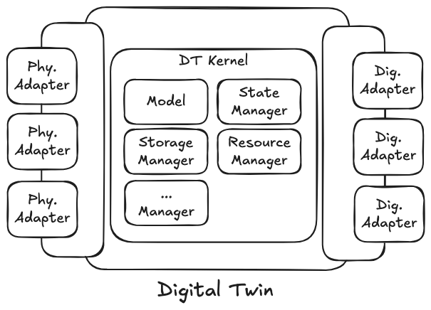

# WLDT - ChangeLog - 0.6.0

Version 0.6.0 introduces a major architectural refactoring of the WLDT core framework alongside critical bug fixes and functional enhancements. This release focuses on improving semantic clarity, fixing data accessibility issues, and enhancing adapter capabilities.

Key Updates:

- **Core Architecture Refactoring**: Comprehensive reorganization of Digital Twin components with clearer naming (`DigitalTwinKernel` and `DigitalTwinModel`) that accurately distinguishes orchestration from behavioral logic
- **Bug Fixes & Enhancements**: Resolved storage query limitations, added Physical Adapter lifecycle callbacks, and implemented automatic source identification for multi-adapter configurations

## Digital Twin Refactoring

This release introduces a significant architectural refactoring of the WLDT core framework to improve clarity, modularity, and semantic accuracy. The changes reorganize the internal structure of a Digital Twin instance while maintaining **full backward compatibility** for developers.

As illustrated in the updated architecture diagram below, the Digital Twin now has a clearer hierarchical structure with the **DT Kernel** serving as the central orchestrator managing core components including the **Model** (behavioral logic), **State Manager**, **Storage Manager**, **Resource Manager**, and optional extension managers.



The key architectural changes are:

1. **`DigitalTwinModel` → `DigitalTwinKernel`**: The core orchestrator has been renamed to accurately reflect its role as the fundamental nucleus coordinating all DT components
2. **`ShadowingFunction` → `DigitalTwinModel`**: The behavioral definition component now properly claims the "Model" terminology, representing the actual logic that defines how the Digital Twin behaves

The following subsections detail each architectural change, explaining the rationale, implementation specifics, and developer-facing implications.
### From Digital Twin Model to Kernel

The previous class `DigitalTwinModel` has been **renamed** to `DigitalTwinKernel` to better reflect its actual architectural role and responsibilities.
#### Rationale

The former name "Model" was **misleading**, as this class does not represent the Digital Twin's behavioral model but rather serves as the **central orchestrator** of the DT's core functionalities. The new name accurately conveys its role as the **fundamental nucleus** of the Digital Twin architecture.
#### Responsibilities

The `DigitalTwinKernel` is an internal class that coordinates and manages references to the central components shared across different Digital Twin modules:

- **`DigitalTwinStateManager`**: Manages the canonical state representation of the Digital Twin
- **`DigitalTwinModel`** (formerly `ShadowingFunction`): Defines the behavioral model and shadowing logic of the Digital Twin
- **`StorageManager`**: Handles persistence and retrieval of DT state, events, and lifecycle data
- **`ResourceManager`**: Manages DT resources and their lifecycles
- **`AugmentationManager`** (optional): Orchestrates augmentation functions to extend DT capabilities

### From Shadowing Function to Digital Twin Model

As part of this architectural clarification, the **`ShadowingFunction`** class has been refactored and renamed to **`DigitalTwinModel`** properly claiming both the "Model" terminology for the component that actually defines the Digital Twin's behaviour through the implementation of **Shadowing Function(s)** to react to physical and digital events.

From the Developer point of view the main change is the naming convention but from a method implementation nothing is changed. The definition of a `DigitalTwinModel` class is the same of the previous called `ShadowingFunction` as illustrated below:

```java  
import it.wldt.adapter.digital.event.DigitalActionWldtEvent;  
import it.wldt.adapter.physical.PhysicalAssetDescription;  
import it.wldt.adapter.physical.event.PhysicalAssetEventWldtEvent;  
import it.wldt.adapter.physical.event.PhysicalAssetPropertyWldtEvent;  
import it.wldt.adapter.physical.event.PhysicalAssetRelationshipInstanceCreatedWldtEvent;  
import it.wldt.adapter.physical.event.PhysicalAssetRelationshipInstanceDeletedWldtEvent;  
import it.wldt.core.model.DigitalTwinModel;  
import java.util.Map;  
  
public class TestDigitalTwinModel extends DigitalTwinModel {  
  
    public TestDigitalTwinModel(String id) {        super(id);    }  
    //// Shadowing Function Management Callbacks ////  
    @Override    protected void onCreate() {  
    }  
    @Override    protected void onStart() {  
    }  
    @Override    protected void onStop() {  
    }  
	
	// ========================================  
	// Digital Twin LifeCycle CALLBACKS  
	// ========================================  
	// The following abstract methods allow the Digital Twin Model to shape its behaviour with respect to the evolution of the instance life cycle through its different phases.
	
    //// Bound LifeCycle State Management Callbacks ////  
    @Override    protected void onDigitalTwinBound(Map<String, PhysicalAssetDescription> adaptersPhysicalAssetDescriptionMap) {  
    }  
    @Override    protected void onDigitalTwinUnBound(Map<String, PhysicalAssetDescription> map, String s) {  
    }  
    @Override    protected void onPhysicalAdapterBidingUpdate(String s, PhysicalAssetDescription physicalAssetDescription) {  
    }  
    
    // ========================================  
	// SHADOWING FUNCTION CALLBACKS  
	// ========================================  
	// The following methods define the shadowing behavior of the Digital Twin.  
    
    //// Physical Property Variation Callback ////  
    @Override    protected void onPhysicalAssetPropertyVariation(PhysicalAssetPropertyWldtEvent<?> physicalAssetPropertyWldtEvent) {  
    }  
    //// Physical Event Notification Callback ////  
    @Override    protected void onPhysicalAssetEventNotification(PhysicalAssetEventWldtEvent<?> physicalAssetEventWldtEvent) {  
    }  
    //// Physical Relationships Notification Callbacks ////  
    @Override    protected void onPhysicalAssetRelationshipEstablished(PhysicalAssetRelationshipInstanceCreatedWldtEvent<?> physicalAssetRelationshipInstanceCreatedWldtEvent) {  
    }  
    @Override    protected void onPhysicalAssetRelationshipDeleted(PhysicalAssetRelationshipInstanceDeletedWldtEvent<?> physicalAssetRelationshipInstanceDeletedWldtEvent) {  
    }  
    //// Digital Action Received Callbacks ////  
    @Override    protected void onDigitalActionEvent(DigitalActionWldtEvent<?> digitalActionWldtEvent) {  
    }}  
```

After defining the DigitalTwinModel, you can instantiate the Digital Twin with a clearer constructor signature that emphasizes 
the Model as the core behavioral component, with shadowing functions implemented internally through dedicated callback methods:

```java
// Create the new Digital Twin with its Shadowing Function  
DigitalTwin digitalTwin = new DigitalTwin("dt-demo-001", new TestDigitalTwinModel("my-dt-model"));  
  
// Physical Adapter with Configuration  
digitalTwin.addPhysicalAdapter(  
        new DemoPhysicalAdapter(  
                String.format("%s-%s", digitalTwinId, "test-physical-adapter"),  
                new DemoPhysicalAdapterConfiguration(),  
                true));  
  
// Digital Adapter with Configuration  
digitalTwin.addDigitalAdapter(  
        new DemoDigitalAdapter(  
                String.format("%s-%s", digitalTwinId, "test-digital-adapter"),  
                new DemoDigitalAdapterConfiguration())  
);
```

Then we can add the Digital Twin to the Engine for the execution:

```java
// Create the Digital Twin Engine
DigitalTwinEngine digitalTwinEngine = new DigitalTwinEngine();  

// Add the Digital Twin to the Engine
digitalTwinEngine.addDigitalTwin(digitalTwin);

// Start all the DTs registered on the engine
digitalTwinEngine.startAll();
```

#### Shadowing Function Formal Metadata

Introduced formal annotations for Digital Twin Shadowing Function methods to provide machine-readable metadata and enable advanced tooling capabilities.

**New Components:**
- `@ShadowingFunction` annotation - Marks methods as shadowing function callbacks with type categorization
- `ShadowingType` enum - Defines shadowing operation categories (physical variations, digital actions)

**Benefits:**
- **Formal Documentation**: Machine-readable metadata for shadowing behavior
- **Tool Integration**: Enables runtime introspection, metrics collection, and code generation
- **IDE Support**: Enhanced code navigation and documentation display
- **Future-Proof**: Foundation for observability and validation

**Developer Impact:**
- Zero breaking changes - annotations are transparent to DT implementations
- Existing implementations continue to work without modification
- Optional metadata available for advanced use cases

**Example:**

```java
@ShadowingFunction(
    value = ShadowingType.PHYSICAL_PROPERTY_VARIATION,
    description = "Updates temperature state when sensor reports new values"
)
protected void onPhysicalAssetPropertyVariation(PhysicalAssetPropertyWldtEvent<?> event) {
    // Implementation
}
```

---

## Bug Fixing & Improvements

### DT State Notification Events & WLDT Storage

Digital Twin State Event Notifications were correctly **persisted** to the WLDT Storage layer but were **inaccessible through the Query System** in previous versions. 
This gap prevented users from querying historical state event notifications, significantly limiting:

- **Traceability**: Inability to trace Digital Twin state evolution over time
- **Debugging**: Difficulty diagnosing past synchronization issues or state transitions
- **Analytics**: No programmatic access to historical state event patterns
- **Auditing**: Incomplete audit trails for compliance and monitoring use cases

The Query System now fully supports retrieval of Digital Twin State Event Notifications with comprehensive query capabilities.
Modified Components includes

#### 1. `QueryResourceType` Enum
- **Added**: New `DIGITAL_TWIN_STATE_EVENT_NOTIFICATION` resource type
- **Purpose**: Enables the query system to recognize and route state event notification queries
#### 2. `QueryManager` Interface
- **Added**: New abstract method `handleStateEventNotificationQuery()`
- **Purpose**: Defines the contract for implementing state event notification query logic across different QueryManager implementations
#### 3. `DefaultQueryManager` Implementation
- **Added**: Complete implementation of `handleStateEventNotificationQuery()`
- **Purpose**: Provides the core query execution logic, interacting with the Storage layer to retrieve state event notification data based on query parameters
#### 4. `StorageQueryTester` Test Class
- **Added**: New test method `testSyncStateEventNotificationRangeQueries()`
- **Purpose**: Validates all supported query types for Digital Twin State Event Notifications

Digital Twin State Event Notifications can now be queried using three query strategies:

| Query Type     | Description                                                |
| -------------- | ---------------------------------------------------------- |
| `TIME_RANGE`   | Retrieve notifications within a specified time window      |
| `SAMPLE_RANGE` | Retrieve a specific range of notification samples by index |
| `COUNT`        | Retrieve the most recent N notifications                   |

No breaking changes. Existing code continues to work unchanged. Applications can immediately begin querying historical state event notifications using the new `DIGITAL_TWIN_STATE_EVENT_NOTIFICATION` resource type. Markdown documentation has been also updated to be aligned with the new release.

### Physical Adapter Callbacks


Physical Adapters can now receive and react to Digital Twin lifecycle events, enabling adaptive behavior based on synchronization state changes.
While **Digital Adapters** have always received lifecycle updates to notify external observers and implement protocol-specific behavior, this capability was **missing on the Physical side** of the Digital Twin architecture.
Physical Adapters can benefit from lifecycle awareness to:

- Trigger reconnection logic when synchronization is lost
- Adjust communication parameters based on DT state
- Optimize polling frequencies or resource usage
- Implement adaptive fault-tolerance strategies

The base `PhysicalAdapter` class now implements the `LifeCycleListener` interface, receiving notifications about Digital Twin lifecycle evolution.

Since Physical Adapters are **not interested in all lifecycle variations**, the `PhysicalAdapter` base class internally manages the full `LifeCycleListener` callback set and exposes only two relevant methods for developer override:

```java
public void onDigitalTwinSync() {
    // Method intentionally left blank
    // Override in subclasses to handle synchronization events
}

public void onDigitalTwinUnSync() {
    // Method intentionally left blank
    // Override in subclasses to handle out-of-sync events
}
```

The **Digital Twin State** is intentionally **excluded** from both method signatures. Physical Adapters should remain decoupled from the DT's computed state representation, maintaining clear architectural boundaries.

Other `LifeCycleListener` callbacks are **not exposed** to Physical Adapters because:

1. **Self-Awareness**: Physical Adapters inherently know their own internal status through their implementation logic
2. **Adapter Isolation**: Physical Adapters should operate independently, remaining unaware of other Physical Adapters' states to prevent tight coupling
3. **Separation of Concerns**: Physical Adapters should be completely unaware of the Digital Twin's compute state, as managing or reacting to DT-level state is outside their responsibility domain

Existing Physical Adapter implementations require **no changes**—the new callbacks have empty default implementations. Developers can opt-in by overriding `onDigitalTwinSync()` and/or `onDigitalTwinUnSync()` when lifecycle-aware behavior is needed.
### Missing adapter ID in PhysicalAssetWldtEvent

This enhancement resolves **Issue #25** ([GitHub Link](https://github.com/wldt/wldt-core-java/issues/25)), which addresses a critical ambiguity problem in multi-adapter Digital Twin configurations.
#### Problem Statement

When multiple Physical Adapters publish variations to the physical world using identical keys (e.g., two adapters both reporting a `temperature` property), the **`DigitalTwinModel`** cannot distinguish the source adapter of each variation. This ambiguity prevents:

- **Accurate data routing**: Unable to determine which adapter produced which value
- **Context-aware processing**: Cannot apply adapter-specific logic or transformations
- **Source-based filtering**: Subscribers cannot differentiate between properties sharing the same key but originating from different adapters

**Example Scenario:**

```
Physical Adapter A (Internal Sensor) → temperature: 22.5°C
Physical Adapter B (External Sensor) → temperature: 18.3°C

Problem: Both variations have key "temperature" - which is which?
```

**Solution**

Physical asset events now include **automatic source identification** through the originating Physical Adapter ID.

The `PhysicalAssetWldtEvent` class has been enhanced with a new `physicalAdapterId` field that identifies the source adapter for every event. This field is automatically populated by the framework—**no developer action required**.

**Mechanism:**

1. Physical Adapters publish events using internal methods: `publishPhysicalAssetPropertyWldtEvent()`, `publishPhysicalAssetEventWldtEvent()`, `publishPhysicalAssetRelationshipCreatedWldtEvent()`, `publishPhysicalAssetRelationshipDeletedWldtEvent()`
2. These methods automatically inject the adapter's ID via `setPhysicalAdapterId(String physicalAdapterId)` before event propagation
3. The `DigitalTwinModel` and in generale physical events subscribers receive events with full source context