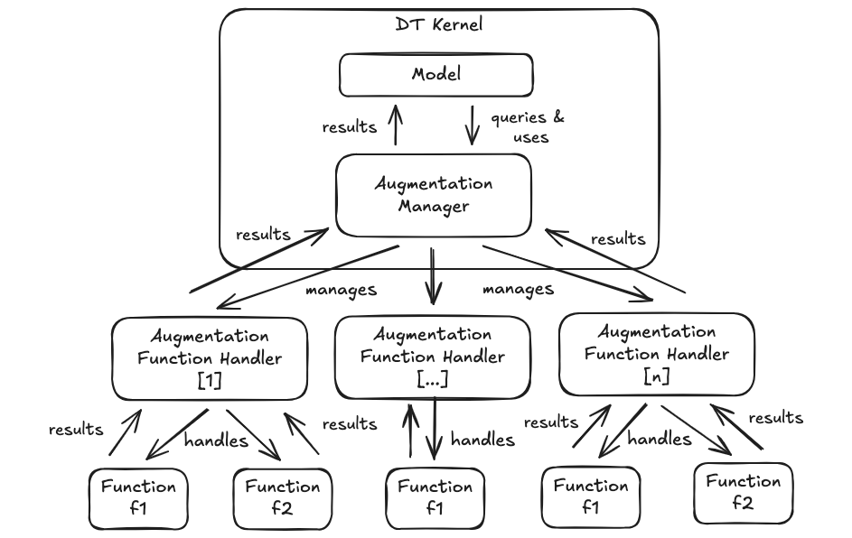

# WLDT - ChangeLog - 0.7.0

Version 0.7.0 introduces the **Augmentation Function** framework, a major feature addition that extends Digital Twin capabilities beyond basic shadowing. This release adds a fully event-driven augmentation layer, comprehensive storage support for augmentation data, new event types on the WLDT Event Bus, and native augmentation-aware callbacks inside the `DigitalTwinModel`.

Key Updates:

- **Augmentation Function Framework**: A hierarchical, modular architecture enabling Stateless and Stateful augmentation functions to be registered, executed, and managed independently from the core shadowing logic
- **Storage Layer Extension**: `WldtStorage` now defines a full set of abstract methods to persist and query augmentation function requests, results, errors, registrations, and unregistrations
- **WLDT Event Bus — Augmentation Events**: Eight new event types added to `WldtEventTypes` covering the complete augmentation lifecycle (registration, execution, result, error)
- **`DigitalTwinModel` Augmentation Integration**: The `DigitalTwinModel` now subscribes to augmentation events automatically and exposes optional callback methods and invocation helpers for both Stateless and Stateful functions

---

## Augmentation Function Framework

This release introduces the **Augmentation Function** framework, a first-class mechanism for extending Digital Twin behaviour with external computation units that operate independently from the shadowing logic.



The augmentation architecture is organized in four tiers:

| Tier | Component | Role |
|------|-----------|------|
| 1 | **DT Kernel** | Hosts the `DigitalTwinModel` and the `AugmentationManager` |
| 2 | **AugmentationManager** | Central orchestrator; manages handlers, propagates lifecycle events, caps concurrent handlers at **5** |
| 3 | **AugmentationFunctionHandler** | Manages a group of functions; handles execution, context provisioning, and result forwarding |
| 4 | **AugmentationFunction** | Performs actual computation (stateless or stateful) |

### Function Types

#### Stateless Functions

A **Stateless Function** does not maintain internal state between invocations. Each `execute` call is fully independent.

- Triggered via `executeAugmentationFunction(...)` from the `DigitalTwinModel`
- Context is built automatically from the function's `AugmentationFunctionContextRequest`
- Results are returned synchronously to the handler and forwarded to the DTM

**Typical use cases**: threshold checks, unit conversions, data validation, instantaneous calculations.

#### Stateful Functions

A **Stateful Function** maintains internal state across a continuous execution lifecycle managed through `start` / `stop` operations.

- Started via `startAugmentationFunction(...)`, stopped via `stopAugmentationFunction(...)`
- Receives automatic updates with new `DigitalTwinState` and event notifications while running
- Produces results asynchronously; can request storage query refreshes via `onStatefulAugmentationFunctionQueryResultRefresh`

**Typical use cases**: pattern recognition, trend analysis, running averages, adaptive AI models.

### AugmentationFunctionHandler

`AugmentationFunctionHandler` is the abstract base class for all handlers. The ready-to-use concrete implementation is `DefaultAugmentationFunctionHandler`:

```java
// Create the handler
DefaultAugmentationFunctionHandler handler = new DefaultAugmentationFunctionHandler("sensor-handler");

// Register functions
handler.registerAugmentationFunction(new MyStatelessFunction());
handler.registerAugmentationFunction(new MyStatefulFunction());

// Attach to the AugmentationManager
DigitalTwin digitalTwin = new DigitalTwin("my-dt-id", new MyDigitalTwinModel());
digitalTwin.getAugmentationManager().addAugmentationFunctionHandler(handler);
```

Functions can be unregistered at runtime without stopping the handler:

```java
handler.unRegisterAugmentationFunction(MyStatelessFunction.FUNCTION_ID);
```

Handlers can be removed from the manager entirely:

```java
digitalTwin.getAugmentationManager().removeAugmentationFunctionHandler("sensor-handler");
```

### Registration and Lifecycle

The augmentation lifecycle follows an event-driven, loosely coupled flow:

1. **Pre-Start Registration**: Functions are registered on a handler before the DT starts. Registration events are published on the Event Bus but not yet consumed.
2. **DT Initialization**: On start, the `DigitalTwinModel` subscribes to registration and result events.
3. **Catch-Up at Sync**: When the DT reaches the **Synchronized** state, the DTM queries the `AugmentationManager` to discover already-registered functions and fires the appropriate callbacks.
4. **Dynamic Registration**: New functions can be registered at any time. If the DT is already synchronized, the DTM receives the event immediately.
5. **Dynamic Unregistration**: Functions removed at runtime fire an unregistration event that the DTM handles to update its internal state.

### AugmentationManager

The `AugmentationManager` is created automatically for each `DigitalTwin` instance and is accessible via:

```java
AugmentationManager augmentationManager = digitalTwin.getAugmentationManager();
```

> **⚠️ Warning**: The `AugmentationManager` limits concurrent handlers to **5**. Exceeding this limit throws an `AugmentationFunctionException`.

### Listener Interfaces

Three listener interfaces decouple functions from their handlers:

| Interface | Implemented By | Purpose |
|-----------|---------------|---------|
| `AugmentationLifeCycleListener` | `AugmentationFunctionHandler` | Receives relevant DT lifecycle events |
| `StatelessAugmentationListener` | `AugmentationFunctionHandler` | Receives error notifications from stateless functions |
| `StatefulAugmentationListener` | `AugmentationFunctionHandler` | Receives results, errors, and query refresh requests from stateful functions |

### Result and Error Structures

- **`AugmentationFunctionResult<?>`**: Carries the output of a function execution together with type metadata (`AugmentationFunctionResultType`) and optional performance metrics (`AugmentationFunctionResultMetrics`)
- **`AugmentationFunctionError`**: Carries error information with an associated `AugmentationFunctionErrorType`, used by both stateless and stateful functions to report failures

---

## Context & Context Request

### AugmentationFunctionContext

`AugmentationFunctionContext` encapsulates the runtime data provided to a function during execution.

```java
public class AugmentationFunctionContext {
    private DigitalTwinState digitalTwinState;
    private QueryResult<?> queryResult;
}
```

| Field | Type | Description |
|-------|------|-------------|
| `digitalTwinState` | `DigitalTwinState` | Current DT state at the time of invocation |
| `queryResult` | `QueryResult<?>` | Results from storage queries defined in the `AugmentationFunctionContextRequest` (optional) |

The context is built automatically by the framework and injected into `run()` (stateless) or `start()` (stateful) — developers never create it directly.

---

### AugmentationFunctionContextRequest

`AugmentationFunctionContextRequest` is the **configuration** that each augmentation function declares to tell the framework what data it needs at runtime. It is typically set once in the function's constructor.

```java
public class AugmentationFunctionContextRequest {
    private boolean observeState;               // default: true
    private boolean observeEventNotifications;  // default: true
    private List<String> propertyNameFilter;    // null = observe all
    private List<String> eventNameFilter;       // null = observe all
    private List<String> relationshipNameFilter;// null = observe all
    private QueryRequest queryRequest;          // null = no storage query
}
```

> **⚠️ Note**: `propertyNameFilter`, `eventNameFilter`, and `relationshipNameFilter` are declared but **currently not enforced by the framework**. Use `observeState: false` or `observeEventNotifications: false` to fully suppress the corresponding data stream.

**Constructors:**

```java
// Default: observes state and events, no storage query
new AugmentationFunctionContextRequest()

// With a storage query only
new AugmentationFunctionContextRequest(QueryRequest queryRequest)

// With explicit observation flags and optional query
new AugmentationFunctionContextRequest(boolean observeState,
                                       boolean observeEventNotifications,
                                       QueryRequest queryRequest)
```

**Example — function that queries the last 10 minutes of DT state history:**

```java
public MyStatelessFunction() {
    super("my-fn", "My Function", "Analyzes history", "1.0.0",
          new AugmentationFunctionContextRequest(
              new QueryRequest()
                  .setResourceType(QueryResourceType.DIGITAL_TWIN_STATE)
                  .setRequestType(QueryRequestType.TIME_RANGE)
                  .setStartTimestampMs(System.currentTimeMillis() - 600_000)
                  .setEndTimestampMs(System.currentTimeMillis())
          ));
}
```

> **⚠️ Note**: timestamps are computed once at construction time. For a truly sliding time window, build and pass a fresh `QueryRequest` at each invocation instead.

---

### AugmentationFunctionRequest

`AugmentationFunctionRequest` is the runtime object passed to every lifecycle method (`run()`, `start()`, `stop()`). It bundles the context with invocation metadata.

```java
public class AugmentationFunctionRequest {
    private final String requestId;                // Auto-generated or developer-provided UUID
    private final AugmentationFunctionContext context;
    private final AugmentationFunctionRequestType type; // EXECUTE | START | STOP
    private final Long timestamp;                  // Milliseconds since epoch
}
```

```java
// Inside run() / start() / stop()
AugmentationFunctionContext ctx  = request.getContext();
DigitalTwinState            state = ctx.getDigitalTwinState();
QueryResult<?>              query = ctx.getQueryResult();
AugmentationFunctionRequestType requestType = request.getType();
```

**`AugmentationFunctionRequestType` enum:**

| Value | Triggered by | Target |
|-------|-------------|--------|
| `EXECUTE` | `executeAugmentationFunction(...)` | Stateless functions |
| `START` | `startAugmentationFunction(...)` | Stateful functions |
| `STOP` | `stopAugmentationFunction(...)` | Stateful functions |

---

### Context Lifecycle: Stateless vs Stateful

| Aspect | Stateless | Stateful |
|--------|-----------|----------|
| Context frequency | Once per `execute()` call | Initial context at `start()` + runtime updates |
| State updates | Not applicable | Via `onStateUpdate()` if `observeState = true` |
| Event notifications | Not applicable | Via `onEventNotificationReceived()` if `observeEventNotifications = true` |
| Context refresh | Not possible | Automatic (push) or explicit (polling via `refreshQueryResult()`) |
| Query execution | Once per execution | Initial + re-triggered on demand |

---

## Augmentation Function Results

### AugmentationFunctionResult\<T\>

Every augmentation function produces zero or more results wrapped in `AugmentationFunctionResult<T>`:

```java
public class AugmentationFunctionResult<T> {
    private AugmentationFunctionResultType type;
    private String key;
    private T value;
    private AugmentationFunctionResultMetrics augmentationFunctionResultMetrics; // optional
    private Map<String, Object> metadata;                                        // optional
    private AugmentationFunctionRequest request;   // set automatically by the handler
    private final Long timestamp;                  // set automatically
}
```

**Constructor:**

```java
new AugmentationFunctionResult<>(
    AugmentationFunctionResultType type,
    String key,
    T value,
    AugmentationFunctionResultMetrics metrics,  // null if not needed
    Map<String, Object> metadata                // null if not needed
)
```

---

### AugmentationFunctionResultType

Five result types map to specific Digital Twin components:

| Type | Digital Twin Component | Typical Use Case |
|------|------------------------|-----------------|
| `PROPERTY_RESULT` | DT State Properties | Predicted temperature, derived efficiency metric |
| `EVENT_RESULT` | DT State Events | Anomaly detected, threshold exceeded |
| `RELATIONSHIP_RESULT` | DT State Relationship declarations | New relationship type discovered |
| `RELATIONSHIP_INSTANCE_RESULT` | DT State Relationship instances | Concrete connection to another DT |
| `GENERIC_RESULT` | Model-defined handling | Custom analytics, recommendations |

**Example — multi-result production:**

```java
List<AugmentationFunctionResult<?>> results = new ArrayList<>();

// Predicted property value
results.add(new AugmentationFunctionResult<>(
    AugmentationFunctionResultType.PROPERTY_RESULT,
    "predicted_failure_probability",
    0.78,
    null,
    Map.of("confidence", 0.92, "horizon_hours", 48)
));

// Event notification
results.add(new AugmentationFunctionResult<>(
    AugmentationFunctionResultType.EVENT_RESULT,
    "maintenance_required",
    Map.of("urgency", "HIGH"),
    null,
    Map.of("timestamp", System.currentTimeMillis())
));

// Generic analytics
results.add(new AugmentationFunctionResult<>(
    AugmentationFunctionResultType.GENERIC_RESULT,
    "degradation_analysis",
    Map.of("trend", "increasing", "rate", 0.05),
    null,
    null
));
```

---

### AugmentationFunctionResultMetrics

Optional companion object for observability. Attach it to any result to record execution performance:

```java
public class AugmentationFunctionResultMetrics {
    private Long totalExecutionTimeMs;
    private Long startTimestamp;
    private Long endTimestamp;
    private Integer recordsProcessed;
    private Integer recordsGenerated;
    private String executionId;
    private String nodeId;
}
```

**Constructors:**

```java
// From total execution time
new AugmentationFunctionResultMetrics(Long totalExecutionTimeMs)

// From start/end timestamps — total time is auto-calculated
new AugmentationFunctionResultMetrics(Long startTimestamp, Long endTimestamp)
```

**Usage example:**

```java
long start = System.currentTimeMillis();
// ... perform computation ...
AugmentationFunctionResultMetrics metrics = new AugmentationFunctionResultMetrics(start, System.currentTimeMillis());
metrics.setRecordsProcessed(1440);
metrics.setExecutionId(UUID.randomUUID().toString());

AugmentationFunctionResult<Double> result = new AugmentationFunctionResult<>(
    AugmentationFunctionResultType.PROPERTY_RESULT,
    "predicted_value", 85.5, metrics, null
);
```

---

### Processing Results in the Digital Twin Model

```java
@Override
protected void onAugmentationFunctionResultEvent(String handlerId,
                                                  String functionId,
                                                  List<AugmentationFunctionResult<?>> results) {
    for (AugmentationFunctionResult<?> result : results) {
        switch (result.getType()) {
            case PROPERTY_RESULT:
                // e.g., update a DT state property
                break;
            case EVENT_RESULT:
                // e.g., notify a DT state event
                break;
            case GENERIC_RESULT:
                // custom handling
                break;
        }
    }
}
```

The Digital Twin Model retains **full autonomy** over whether and how to apply any result to the DT state — the framework never applies results automatically.

---

## Augmentation Function Error Handling

### AugmentationFunctionErrorType

```java
public enum AugmentationFunctionErrorType {
    INFO,     // Informational — not a problem
    WARNING,  // Non-blocking condition worth monitoring
    ERROR,    // Recoverable execution error
    CRITICAL  // Severe failure that may compromise the function
}
```

### AugmentationFunctionError

```java
public class AugmentationFunctionError {
    private final String errorId;                           // Auto-generated UUID
    private final Long timestamp;                           // Milliseconds since epoch
    private String augmentationFunctionRequestId;           // Set automatically by notifyError()
    private final AugmentationFunctionErrorType errorType;
    private final String message;
    private HashMap<String, Object> metadata;               // Optional extra context
}
```

**Constructors:**

```java
new AugmentationFunctionError(AugmentationFunctionErrorType type, String message)
new AugmentationFunctionError(AugmentationFunctionErrorType type, String message, Long timestamp)
new AugmentationFunctionError(AugmentationFunctionErrorType type, String message,
                              Long timestamp, HashMap<String, Object> metadata)
```

Both `StatelessAugmentationFunction` and `StatefulAugmentationFunction` expose `notifyError()` — the current request ID is attached automatically:

```java
// From a stateless function
notifyError(new AugmentationFunctionError(
    AugmentationFunctionErrorType.WARNING,
    "Failed to retrieve sensor data: " + e.getMessage()
));

// From a stateful function with metadata
HashMap<String, Object> meta = new HashMap<>();
meta.put("state_snapshot", digitalTwinState.toString());
notifyError(new AugmentationFunctionError(
    AugmentationFunctionErrorType.CRITICAL,
    "State processing failed: " + e.getMessage(),
    System.currentTimeMillis(), meta
));
```

Errors are forwarded to the DTM via the `onAugmentationFunctionError()` callback and persisted by the storage layer if `observeAugmentationFunctionEvents` is enabled.

---

## Augmentation Function Implementation Guide

### Base Classes

| Class | Type | Method to implement |
|-------|------|-------------------|
| `StatelessAugmentationFunction` | `STATELESS` | `run(AugmentationFunctionRequest)` |
| `StatefulAugmentationFunction` | `STATEFUL` | `start()`, `stop()`, `onStateUpdate()`, `onEventNotificationReceived()`, `onQueryResultRefresh()` |

Both classes set `AugmentationFunctionType` automatically — developers never set it manually.

---

### Implementing a Stateless Function

```java
public class TemperatureThresholdFunction extends StatelessAugmentationFunction {

    public static final String FUNCTION_ID = "temperature-threshold-check";

    public TemperatureThresholdFunction() {
        super(FUNCTION_ID, "Temperature Threshold Check",
              "Checks if the temperature exceeds the configured threshold", "1.0.0");
    }

    @Override
    protected List<AugmentationFunctionResult<?>> run(AugmentationFunctionRequest request)
            throws AugmentationFunctionException {

        DigitalTwinState state = request.getContext().getDigitalTwinState();

        if (state == null) {
            notifyError(new AugmentationFunctionError(
                AugmentationFunctionErrorType.WARNING, "DT state not available"));
            return Collections.emptyList();
        }

        Optional<DigitalTwinStateProperty<?>> tempProp = state.getProperty("temperature");
        if (!tempProp.isPresent()) return Collections.emptyList();

        double temperature = (Double) tempProp.get().getValue();
        boolean exceeded = temperature > 50.0;

        return Collections.singletonList(new AugmentationFunctionResult<>(
            AugmentationFunctionResultType.PROPERTY_RESULT,
            "threshold_exceeded",
            exceeded,
            null,
            Map.of("temperature", temperature, "threshold", 50.0)
        ));
    }
}
```

---

### Implementing a Stateful Function — Push Mode

In **push mode** the function reacts to DT state updates received automatically via `onStateUpdate()`:

```java
public class AnomalyDetectorFunction extends StatefulAugmentationFunction {

    public static final String FUNCTION_ID = "anomaly-detector";
    private final List<Double> history = new ArrayList<>();

    public AnomalyDetectorFunction() {
        super(FUNCTION_ID, "Anomaly Detector",
              "Detects temperature anomalies using a rolling window", "1.0.0",
              new AugmentationFunctionContextRequest(true, false, null));
    }

    @Override
    public void start(AugmentationFunctionRequest request) throws AugmentationFunctionException {
        DigitalTwinState initial = request.getContext().getDigitalTwinState();
        if (initial != null)
            initial.getProperty("temperature")
                   .ifPresent(p -> history.add((Double) p.getValue()));
    }

    @Override
    public void onStateUpdate(DigitalTwinState newState) throws AugmentationFunctionException {
        newState.getProperty("temperature").ifPresent(p -> {
            double temp = (Double) p.getValue();
            history.add(temp);
            if (history.size() > 100) history.remove(0); // keep last 100 readings

            if (isAnomaly(temp)) {
                notifyResult(Collections.singletonList(new AugmentationFunctionResult<>(
                    AugmentationFunctionResultType.EVENT_RESULT,
                    "anomaly_detected",
                    Map.of("temperature", temp, "severity", "HIGH"),
                    null, null
                )));
            }
        });
    }

    @Override
    public void stop(AugmentationFunctionRequest request) throws AugmentationFunctionException {
        history.clear();
    }

    @Override
    public void onEventNotificationReceived(DigitalTwinStateEventNotification<?> notification)
            throws AugmentationFunctionException { /* not used */ }

    private boolean isAnomaly(double temp) { return temp > 80.0; }
}
```

---

### Implementing a Stateful Function — Polling Mode

In **polling mode** the function drives its own data retrieval rhythm via a `Timer` and `refreshQueryResult()`:

```java
public class HistoryPollingFunction extends StatefulAugmentationFunction {

    public static final String FUNCTION_ID = "history-polling";
    private static final long POLLING_INTERVAL_MS = 5_000;
    private Timer pollingTimer;

    public HistoryPollingFunction() {
        super(FUNCTION_ID, "History Polling Function",
              "Periodically queries DT storage for state history", "1.0.0",
              new AugmentationFunctionContextRequest(
                  new QueryRequest()
                      .setResourceType(QueryResourceType.DIGITAL_TWIN_STATE)
                      .setRequestType(QueryRequestType.TIME_RANGE)
                      .setStartTimestampMs(System.currentTimeMillis() - 60_000)
                      .setEndTimestampMs(System.currentTimeMillis())
              ));
    }

    @Override
    public void start(AugmentationFunctionRequest request) throws AugmentationFunctionException {
        pollingTimer = new Timer(true);
        pollingTimer.scheduleAtFixedRate(new TimerTask() {
            @Override public void run() { refreshQueryResult(); }
        }, 0, POLLING_INTERVAL_MS);
    }

    @Override
    public void onQueryResultRefresh(QueryRequest queryRequest, QueryResult<?> queryResult)
            throws AugmentationFunctionException {
        if (queryResult == null || queryResult.isEmpty()) return;

        notifyResult(Collections.singletonList(new AugmentationFunctionResult<>(
            AugmentationFunctionResultType.GENERIC_RESULT,
            "history_record_count",
            queryResult.size(),
            null, Map.of("query_timestamp", System.currentTimeMillis())
        )));
    }

    @Override
    public void stop(AugmentationFunctionRequest request) throws AugmentationFunctionException {
        if (pollingTimer != null) { pollingTimer.cancel(); pollingTimer = null; }
    }

    @Override
    public void onStateUpdate(DigitalTwinState s) throws AugmentationFunctionException { /* not used */ }

    @Override
    public void onEventNotificationReceived(DigitalTwinStateEventNotification<?> n)
            throws AugmentationFunctionException { /* not used */ }
}
```

---

## Storage Layer — Augmentation Support

`WldtStorage` has been extended with a complete set of abstract methods dedicated to augmentation data, grouped in five categories. All methods follow the same `TIME_RANGE` / `SAMPLE_RANGE` / `COUNT` query pattern already established for other storage types.

### New `WldtStorage` Abstract Methods

#### 1. Errors

```java
void saveAugmentationFunctionError(String augmentationFunctionId,
                                   String augmentationFunctionHandlerId,
                                   AugmentationFunctionError error) throws StorageException;

int getAugmentationFunctionErrorCount() throws StorageException;

List<AugmentationFunctionErrorRecord> getAugmentationFunctionErrorsInTimeRange(
    long startTimestampMs, long endTimestampMs) throws StorageException, IllegalArgumentException;

List<AugmentationFunctionErrorRecord> getAugmentationFunctionErrorsInRange(
    int startIndex, int endIndex) throws StorageException, IndexOutOfBoundsException, IllegalArgumentException;
```

#### 2. Requests

```java
void saveAugmentationFunctionRequest(String augmentationFunctionId,
                                     String augmentationFunctionHandlerId,
                                     AugmentationFunctionRequest request) throws StorageException;

int getAugmentationFunctionRequestCount() throws StorageException;

List<AugmentationFunctionRequestRecord> getAugmentationFunctionRequestInTimeRange(
    long startTimestampMs, long endTimestampMs) throws StorageException, IllegalArgumentException;

List<AugmentationFunctionRequestRecord> getAugmentationFunctionRequestInRange(
    int startIndex, int endIndex) throws StorageException, IndexOutOfBoundsException, IllegalArgumentException;
```

#### 3. Results

```java
void saveAugmentationFunctionResult(String augmentationFunctionId,
                                    String augmentationFunctionHandlerId,
                                    AugmentationFunctionResult<?> result) throws StorageException;

int getAugmentationFunctionResultCount() throws StorageException;

List<AugmentationFunctionResultRecord> getAugmentationFunctionResultInTimeRange(
    long startTimestampMs, long endTimestampMs) throws StorageException, IllegalArgumentException;

List<AugmentationFunctionResultRecord> getAugmentationFunctionResultInRange(
    int startIndex, int endIndex) throws StorageException, IndexOutOfBoundsException, IllegalArgumentException;
```

#### 4. Registrations

```java
void saveAugmentationFunctionRegistration(String augmentationFunctionId,
                                          String augmentationFunctionHandlerId,
                                          AugmentationFunctionType type) throws StorageException;

int getAugmentationFunctionRegistrationCount() throws StorageException;

List<AugmentationFunctionRegistrationRecord> getAugmentationFunctionRegistrationInTimeRange(
    long startTimestampMs, long endTimestampMs) throws StorageException, IllegalArgumentException;

List<AugmentationFunctionRegistrationRecord> getAugmentationFunctionRegistrationInRange(
    int startIndex, int endIndex) throws StorageException, IndexOutOfBoundsException, IllegalArgumentException;
```

#### 5. Unregistrations

```java
void saveAugmentationFunctionUnregistration(String augmentationFunctionId,
                                            String augmentationFunctionHandlerId,
                                            AugmentationFunctionType type) throws StorageException;

int getAugmentationFunctionUnregistrationCount() throws StorageException;

List<AugmentationFunctionUnregistrationRecord> getAugmentationFunctionUnregistrationInTimeRange(
    long startTimestampMs, long endTimestampMs) throws StorageException, IllegalArgumentException;

List<AugmentationFunctionUnregistrationRecord> getAugmentationFunctionUnregistrationInRange(
    int startIndex, int endIndex) throws StorageException, IndexOutOfBoundsException, IllegalArgumentException;
```

### New Storage Record Classes

Five new record classes have been added under `it.wldt.storage.model.augmentation`:

| Class | Description |
|-------|-------------|
| `AugmentationFunctionErrorRecord` | Stores a function error with timestamp and handler/function IDs |
| `AugmentationFunctionRequestRecord` | Stores an execution request with type and context metadata |
| `AugmentationFunctionResultRecord` | Stores a function result with type and optional metrics |
| `AugmentationFunctionRegistrationRecord` | Stores a registration event with function type |
| `AugmentationFunctionUnregistrationRecord` | Stores an unregistration event with function type |

### `WldtStorage` — `observeAugmentationFunctionEvents` Flag

A new boolean flag `observeAugmentationFunctionEvents` has been added to `WldtStorage` to opt-in to automatic persistence of augmentation events. It follows the same pattern as the existing flags for state, physical, and lifecycle events:

```java
// Enable augmentation event observation in the full constructor
new MyStorage("storage-id",
    true,   // observeStateEvents
    true,   // observerPhysicalAssetEvents
    true,   // observerPhysicalAssetActionEvents
    true,   // observePhysicalAssetDescriptionEvents
    true,   // observerDigitalActionEvents
    true,   // observeLifeCycleEvents
    true    // observeAugmentationFunctionEvents  ← new
);

// Or set it individually
storage.setObserveAugmentationFunctionEvents(true);
```

---

## WLDT Event Bus — New Augmentation Event Types

Eight new constants have been added to `WldtEventTypes` to support the full augmentation event lifecycle:

| Constant | Event Type String | Description |
|----------|-------------------|-------------|
| `AUGMENTATION_FUNCTION_EVENT_BASE_TYPE` | `dt.augmentation.function` | Root namespace for all augmentation events |
| `AUGMENTATION_FUNCTION_EXECUTION_EVENT_BASE_TYPE` | `dt.augmentation.function.execution` | Base for execution sub-events |
| `ALL_AUGMENTATION_FUNCTION_EVENT_TYPE` | `dt.augmentation.function.*` | Wildcard subscription for all augmentation events |
| `AUGMENTATION_FUNCTION_START_BASE_TYPE` | `dt.augmentation.function.execution.start` | Stateful function start signal |
| `AUGMENTATION_FUNCTION_STOP_BASE_TYPE` | `dt.augmentation.function.execution.stop` | Stateful function stop signal |
| `AUGMENTATION_FUNCTION_EXECUTE_BASE_TYPE` | `dt.augmentation.function.execution.execute` | Stateless function execution trigger |
| `AUGMENTATION_FUNCTION_QUERY_EXECUTION_BASE_TYPE` | `dt.augmentation.function.execution.query` | Query result refresh request |
| `AUGMENTATION_FUNCTION_RESULT_BASE_TYPE` | `dt.augmentation.function.result` | Result publication channel |
| `AUGMENTATION_FUNCTION_REGISTERED_EVENT_TYPE` | `dt.augmentation.function.registered` | Handler published a new function registration |
| `AUGMENTATION_FUNCTION_UNREGISTERED_EVENT_TYPE` | `dt.augmentation.function.unregistered` | Handler published a function unregistration |
| `AUGMENTATION_FUNCTION_ERROR_EVENT_TYPE` | `dt.augmentation.function.error` | A function reported an error |

Result events use a compound topic that embeds handler and function identifiers for precise routing:

```
dt.augmentation.function.result.<handlerId>.<functionId>
```

The `DigitalTwinModel` subscribes to `dt.augmentation.function.result.*` to receive results from all handlers and functions simultaneously.

---

## `DigitalTwinModel` — Augmentation Integration

The `DigitalTwinModel` class has been extended with native augmentation support. All new methods have non-abstract default implementations, so **existing Digital Twin Model implementations require no changes**.

### Automatic Event Subscriptions

On `start()`, the DTM automatically subscribes to three event categories:

| Subscription | Purpose |
|-------------|---------|
| `dt.augmentation.function.registered` / `.unregistered` | Track function availability |
| `dt.augmentation.function.result.*` | Receive results from any handler/function pair |
| `dt.augmentation.function.error` | Receive error notifications |

On `stop()` all subscriptions are automatically cancelled.

### Discovery Callbacks

These optional methods can be overridden in custom `DigitalTwinModel` implementations to react to augmentation function availability changes:

```java
// Called when a new augmentation function is registered and the DT is synchronized
protected void onAugmentationNewFunctionAvailable(String handlerId,
                                                  AugmentationFunction augmentationFunction)

// Called when an augmentation function is unregistered
protected void onAugmentationFunctionUnAvailable(String handlerId,
                                                 AugmentationFunction augmentationFunction)

// Called at synchronization time with the full list of already-registered functions for a handler
protected void onAugmentationFunctionListAvailable(String handlerId,
                                                   List<AugmentationFunction> augmentationFunctionList)
```

> **Important**: Availability notifications are only delivered when the Digital Twin is in the **Synchronized** state. Functions registered before the DT starts are discovered at the first synchronization through the catch-up procedure, so developers should handle the possibility of receiving the same function notified multiple times across lifecycle transitions.

### Result and Error Callbacks

```java
// Invoked when one or more results are received from an augmentation function execution
protected void onAugmentationFunctionResultEvent(String augmentationFunctionHandlerId,
                                                 String augmentationFunctionId,
                                                 List<AugmentationFunctionResult<?>> results)

// Invoked when an augmentation function reports an error
protected void onAugmentationFunctionError(String handlerId,
                                           String functionId,
                                           AugmentationFunctionError error)
```

### Invocation API

The DTM exposes overloaded methods to invoke both stateless and stateful functions. All methods resolve the target handler automatically when only the function ID is provided.

#### Stateless — `executeAugmentationFunction`

```java
// Resolve handler automatically, generate a random request ID
protected void executeAugmentationFunction(String augmentationFunctionId)

// Resolve handler automatically, use a custom request ID
protected void executeAugmentationFunction(String augmentationFunctionId,
                                           String augmentationFunctionRequestId)

// Explicit handler ID + custom request ID
protected void executeAugmentationFunction(String augmentationFunctionHandlerId,
                                           String augmentationFunctionId,
                                           String augmentationFunctionRequestId)
```

#### Stateful — `startAugmentationFunction` / `stopAugmentationFunction`

```java
// Start — resolve handler automatically
protected void startAugmentationFunction(String augmentationFunctionId)
protected void startAugmentationFunction(String augmentationFunctionId, String requestId)
protected void startAugmentationFunction(String handlerId, String functionId, String requestId)

// Stop — resolve handler automatically
protected void stopAugmentationFunction(String augmentationFunctionId)
protected void stopAugmentationFunction(String augmentationFunctionId, String requestId)
protected void stopAugmentationFunction(String handlerId, String functionId, String requestId)
```

#### Query Result Refresh — `refreshAugmentationFunctionQueryResult`

Used to trigger a manual context refresh for a running stateful function from DT storage:

```java
// Resolve handler automatically
protected void refreshAugmentationFunctionQueryResult(String augmentationFunctionId)

// Explicit handler ID
protected void refreshAugmentationFunctionQueryResult(String handlerId, String functionId)
```

### Example: Using Augmentation Functions Inside a Digital Twin Model

```java
public class MyDigitalTwinModel extends DigitalTwinModel {

    public MyDigitalTwinModel(String id) {
        super(id);
    }

    @Override
    protected void onDigitalTwinBound(Map<String, PhysicalAssetDescription> map) {
        // ... observe physical properties and events ...
    }

    @Override
    protected void onAugmentationNewFunctionAvailable(String handlerId,
                                                      AugmentationFunction function) {
        // Start a stateful function as soon as it becomes available
        if (function.getId().equals(MyStatefulFunction.FUNCTION_ID)) {
            try {
                startAugmentationFunction(function.getId());
            } catch (Exception e) {
                // handle exception
            }
        }
    }

    @Override
    protected void onAugmentationFunctionResultEvent(String handlerId,
                                                     String functionId,
                                                     List<AugmentationFunctionResult<?>> results) {
        // Process results and update DT state if needed
        results.forEach(r -> System.out.println("Result from " + functionId + ": " + r.getResult()));
    }

    @Override
    protected void onAugmentationFunctionError(String handlerId,
                                               String functionId,
                                               AugmentationFunctionError error) {
        System.err.println("Error in function " + functionId + ": " + error.getMessage());
    }

    // ... other shadowing callbacks ...
}
```

---

## Breaking Changes

None. All new methods on `DigitalTwinModel` have default (non-abstract) implementations. Existing `DigitalTwinModel` subclasses, `WldtStorage` implementations (if any) will need to add the new augmentation abstract methods, and adapter code continues to work without modification.

> **Note for `WldtStorage` implementors**: The new augmentation abstract methods must be implemented in any concrete `WldtStorage` subclass. Developers extending `WldtStorage` directly will need to add implementations for all 20 new abstract methods listed in the [Storage Layer](#storage-layer--augmentation-support) section.


