# WLDT Event Bus — Architecture and Strategy Evaluation

## 1. Event Bus Concept

`WldtEventBus` is the internal publish-subscribe backbone of the WLDT framework. Every component — `PhysicalAdapter`, `DigitalTwinModel`, `DigitalAdapter` — communicates exclusively through it, without holding direct references to one another. This decoupling lets the runtime swap, pause, or restart any component independently.

Events are scoped to a **Digital Twin ID**: a publisher announces which DT an event belongs to, and subscribers receive only events from DTs they have registered interest in. A single bus instance services the entire engine.

### WldtEvent

```java
WldtEvent<T>
  id          // unique event identifier
  type        // topic string (e.g. "physical.property.update")
  body        // typed payload T
  metadata    // Map<String,String> — arbitrary key/value pairs
  timestamp   // wall-clock time at creation
```

### Main API Methods

| Method | Description |
|--------|-------------|
| `WldtEventBus.getInstance()` | Returns the process-wide singleton (double-checked locking with `volatile`). |
| `publishEvent(dtId, pubId, event)` | Dispatches `event` to all subscribers registered for `dtId` whose filter matches `event.getType()`. |
| `subscribe(dtId, subId, filter, listener)` | Registers `listener` to receive events matching `filter` for the given `dtId`. |
| `unSubscribe(dtId, subId, filter, listener)` | Removes a previously registered subscription. |
| `setStrategy(strategy)` | Swaps the active dispatch strategy at runtime; calls `shutdown()` on the replaced strategy. |
| `matchWildCardType(eventType, filterType)` | Utility — delegates to `WldtEventFilter.matchWildCardType`. |

---

## 2. Strategy Pattern

`WldtEventBus` is a **facade**: it holds a reference to a `WldtEventBusStrategy` and forwards every operation to it. The bus itself contains no dispatch logic.

```java
public interface WldtEventBusStrategy {
    void publishEvent(String dtId, String pubId, WldtEvent<?> event, IWldtEventLogger log)
        throws EventBusException;

    void subscribe(String dtId, String subId, WldtEventFilter filter,
                   WldtEventListener listener, IWldtEventLogger log)
        throws EventBusException;

    void unSubscribe(String dtId, String subId, WldtEventFilter filter,
                     WldtEventListener listener, IWldtEventLogger log)
        throws EventBusException;

    default void shutdown() {}   // release threads / queues
}
```

Swapping strategies at runtime:

```java
WldtEventBus.getInstance().setStrategy(new PerDtAsyncStrategy());
```

The old strategy's `shutdown()` is called automatically. No caller code changes.

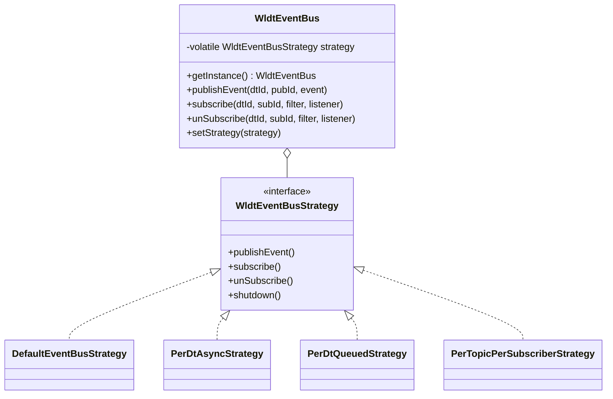

---

## 3. Wildcard Topic Management

`WldtEventFilter` is an `ArrayList<String>` that holds topic names or wildcard patterns. Two match modes:

**Exact match** — `filter.contains(eventType)` checks list membership directly.

**Wildcard match** — a filter entry ending in `.*` is a prefix wildcard. `matchWildCardType` strips the trailing `.*` and tests whether the incoming event type contains the prefix:

```java
// WldtEventFilter.java
public static boolean matchWildCardType(String eventType, String filterType) {
    if (isWildCardType(filterType)) {
        String targetType = filterType.replace("." + MULTI_LEVEL_WILDCARD_VALUE, "");
        return eventType.contains(targetType);   // ⚠ uses contains(), not startsWith()
    }
    return false;
}
```

> **Known limitation:** `contains()` matches anywhere in the string, not just at the start of the namespace hierarchy. A filter `physical.*` would incorrectly match `my.physical.property` in addition to `physical.temperature`. A correct implementation would use `eventType.startsWith(prefix + ".")` where `prefix` is the stripped filter.

`matchEventType` applies both checks in sequence: exact first, then iterates all wildcard entries if no exact match is found.

---

## 4. Strategy Implementations

### 4.1 DefaultEventBusStrategy

#### Idea

The original, simplest implementation. A single Java `synchronized` lock serializes all three operations (`publishEvent`, `subscribe`, `unSubscribe`). When an event is published, the publisher's thread acquires the lock, iterates all matching subscribers, and calls `onEvent()` on each — still holding the lock.

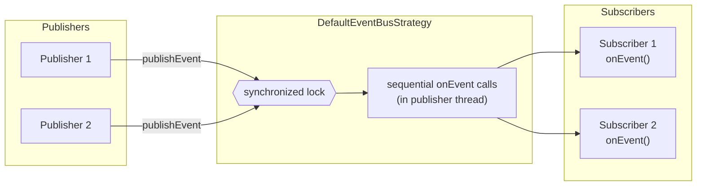

#### Features

- Zero additional threads — no executor or queue overhead.
- Strict global ordering across all publishers and subscribers for a given DT.
- Minimal memory footprint (`HashMap` of `ArrayList`).
- Correct for all standard WLDT use cases where event rates are low and subscriber processing is fast.

#### Negative Aspects

- **Publisher blocking:** `publishEvent()` does not return until every subscriber has finished processing. If a subscriber sleeps 200 ms, the publisher is delayed by 200 ms × number-of-subscribers.
- **No concurrency:** the single lock prevents any parallel publish operations, even for unrelated DTs.
- **Throughput ceiling:** effective publish rate is bounded by `1 / (numSubscribers × subscriberProcessingTime)` when the subscriber is slower than the publish rate.
- **Lock contention:** with multiple concurrent publisher threads, all threads queue up on the same monitor, adding serialization overhead proportional to subscriber execution time.

---

### 4.2 PerDtAsyncStrategy

#### Idea

Each Digital Twin gets its own **single-threaded executor** (`ExecutorService`). `publishEvent()` returns immediately after snapshotting the subscriber list (from `CopyOnWriteArrayList`) and submitting a dispatch task to the DT's executor. The consumer thread delivers events to subscribers sequentially in FIFO order.

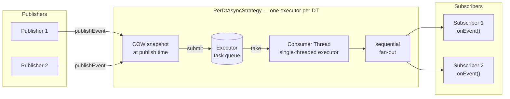

#### Features

- Publisher is never blocked by subscriber processing.
- Strict FIFO ordering per DT (guaranteed by the single consumer thread).
- DTs are fully parallel — different DTs dispatch concurrently.
- Subscriber list is read at publish time (snapshot), giving a consistent view even if subscriptions change concurrently.
- Low resource overhead: one thread per active DT.

#### Negative Aspects

- **Sequential fan-out:** all subscribers for a DT share one consumer thread. A slow subscriber delays all subsequent events and all other subscribers — similar to the Default strategy, but the publisher is not blocked.
- **Queue accumulation:** if the subscriber processes events slower than they arrive (`processingMs > inter_arrival_ms`), the queue grows unboundedly and E2E latency increases proportionally to `N × (processingMs − inter_arrival_ms)` for the N-th event.
- **Stale snapshot:** subscriber state captured at publish time; a subscriber added after `publishEvent()` but before the consumer picks up the task will not receive that event.
- **No backpressure:** the internal executor queue is unbounded; memory can grow without limit under sustained overload.

---

### 4.3 PerDtQueuedStrategy

#### Idea

Each Digital Twin owns an explicit **`LinkedBlockingQueue<DeliveryTask>`** and a configurable thread pool of consumer threads. Publishers call `queue.put()` and return immediately. Consumer threads call `queue.take()` and read subscriber state at **delivery time**, not at publish time. Queue capacity and thread pool size are constructor parameters.

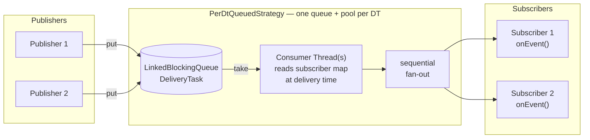

#### Features

- Publisher never blocks (unless bounded queue is full — backpressure path).
- Subscriber state resolved at delivery time: a subscriber registered after `publishEvent()` but before the consumer picks up the event will receive it.
- Configurable bounded queue capacity for explicit backpressure control.
- Configurable thread pool size: `threadPoolSize=1` → strict FIFO; `threadPoolSize>1` → concurrent dispatch with no ordering guarantee.
- DTs are fully independent — different DTs use different queues and pools.

#### Negative Aspects

- **Sequential fan-out (default config):** same as PerDtAsync — with one consumer thread, subscribers are called sequentially; a slow subscriber delays all others and all subsequent events.
- **Queue saturation:** identical unbounded growth risk as PerDtAsync when the subscriber is slower than the publisher.
- **No subscriber isolation:** subscribers share the DT consumer thread(s); one slow subscriber blocks all others for that DT.
- **Ordering not guaranteed** with `threadPoolSize > 1`.

---

### 4.4 PerTopicPerSubscriberStrategy

#### Idea

The most granular strategy. Each topic and each subscriber get their own dedicated thread:

- One **topic-reader thread** per (DT, topic) pair — reads from a `LinkedBlockingQueue<EnqueuedEvent>` and fans out to subscriber queues.
- One **subscriber-processor thread** per subscriber ID — drains that subscriber's `PriorityBlockingQueue<TimestampedDelivery>` (ordered by publish-time nanoseconds + monotonic sequence).

A `Set<String> dispatched` inside each topic-reader dispatch prevents double-delivery when a subscriber matches both an exact topic and a wildcard filter.

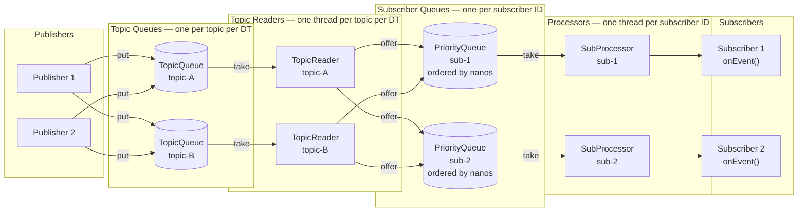

#### Features

- **Publisher isolation:** `publishEvent()` returns immediately after `queue.put()`, never blocked by subscriber processing.
- **Subscriber isolation:** each subscriber runs in its own thread — a slow subscriber cannot delay delivery to any other subscriber (O(1) latency per subscriber regardless of fan-out count).
- **Temporal ordering:** within a topic, events arrive at each subscriber's priority queue in strict publish-time order. Events from different topics are merged by publish-time nanos + sequence number.
- **Wildcard laziness:** topic queues for wildcard-only subscribers are created on first publish, avoiding upfront thread creation for topics that may never be used.
- **Double-delivery prevention:** `dispatched` set ensures a subscriber matched by both exact and wildcard entries receives the event exactly once.
- **Maximum throughput** with many subscribers: fan-out is parallel, not sequential.

#### Negative Aspects

- **Thread count:** O(topics × DTs) topic-reader threads + O(subscribers) subscriber-processor threads. For 100 topics × 10 DTs + 50 subscribers, that is ~1050 daemon threads — feasible for JVM but non-trivial.
- **Queue saturation still possible:** if a subscriber processes events slower than they arrive, its `PriorityBlockingQueue` grows unboundedly. The priority queue also has O(log n) insertion vs. O(1) for `LinkedBlockingQueue`, adding overhead under high load.
- **Wildcard resolution at publish time:** wildcard subscriber lookup happens in the topic-reader thread on every event delivery — O(subscribers) scan.
- **Cross-topic ordering is best-effort:** events from different topics dispatched by different topic-reader threads may arrive in subscriber queues with clock skew when two publishers publish within the same nanosecond window.
- **Higher cold-start cost:** subscribe() eagerly creates per-topic queues and threads for non-wildcard filters.
- **Complex shutdown:** must drain and stop O(topics × DTs + subscribers) thread pools.

---

## 5. Strategy Comparison

### Qualitative Summary

| Property | Default (Sync) | PerDtAsync | PerDtQueued | PerTopicPerSub |
|----------|:--------------:|:----------:|:-----------:|:--------------:|
| Publisher blocked by subscriber | Yes | No | No | No |
| Subscriber isolated from others | No | No | No | **Yes** |
| FIFO ordering guaranteed | Yes (global lock) | Yes (per DT) | Yes (1 consumer) | Yes (per topic) |
| Cross-topic ordering | Yes (global) | Yes (per DT) | Yes (per DT) | Best-effort |
| Backpressure support | N/A | No | **Yes** (bounded queue) | No |
| Subscriber state at deliver time | At publish time | At publish time | **At delivery time** | **At delivery time** |
| Thread overhead | None | 1 per DT | N per DT | O(topics×DTs + subs) |
| Memory overhead | Minimal | Low | Low | Moderate |
| Wildcard double-delivery safe | Yes | Yes | Yes | **Yes** (dispatched set) |

### Performance Characteristics (Empirical)

All scenarios used 4 publishers, 4 subscribers, 20 msg/s baseline, 100-byte payload unless stated. Results are approximate representative values from the experiment suite.

**Scenario: Subscriber processing time variation (1–200 ms)**

| Processing time | Default p50 | PerDtAsync p50 | PerDtQueued p50 | PerTopicPerSub p50 |
|-----------------|:-----------:|:--------------:|:---------------:|:------------------:|
| 1 ms | ~0.01 ms | ~0.3 ms | ~0.3 ms | ~0.3 ms |
| 10 ms | ~10 ms | ~0.3 ms | ~0.3 ms | ~0.3 ms |
| 100 ms | ~100 ms | queued | queued | ~1 ms |
| 200 ms | ~200 ms | saturated | saturated | saturated |

*Default p50 equals subscriber processing time because the publisher blocks. Async/Queued decouple the publisher but queue builds up. PerTopicPerSub absorbs multi-subscriber fan-out in parallel — at 10 ms processing with 4 subscribers, p50 remains ~10 ms regardless of subscriber count.*

**Scenario: Subscriber count variation (1–10, 4 publishers)**

| Subscribers | Default p50 | PerDtAsync p50 | PerDtQueued p50 | PerTopicPerSub p50 |
|-------------|:-----------:|:--------------:|:---------------:|:------------------:|
| 1 | ~10 ms | ~10 ms | ~10 ms | ~10 ms |
| 4 | ~40 ms | ~40 ms | ~40 ms | ~10 ms |
| 10 | ~100 ms | ~100 ms | ~100 ms | ~10 ms |

*PerTopicPerSub is the only strategy where fan-out latency is O(1) per subscriber rather than O(N).*

**Scenario: Topic count variation (2–100, 4 pub × 4 sub, 200 KB, 100 msg/s)**

All four strategies show flat latency as topic count scales from 2 to 100. The routing layer is not the bottleneck — subscriber processing capacity is. PerTopicPerSub maintains its ~4× advantage over Async/Queued at all topic counts due to parallel subscriber threads.

### Selection Guide

| Use Case | Recommended Strategy |
|----------|----------------------|
| Low event rate, simple DT, correctness first | `DefaultEventBusStrategy` |
| Moderate rate, want publisher decoupling, few subscribers | `PerDtAsyncStrategy` |
| Need bounded queue / backpressure, late-subscription delivery | `PerDtQueuedStrategy` |
| High fan-out, many subscribers, subscriber isolation required | `PerTopicPerSubscriberStrategy` |
| Need to tune at runtime without changing callers | Any — swap via `setStrategy()` |

---

## 6. Subscriber Execution Models

### 6.1 Overview

The bus strategy controls **how events reach subscribers** — but once `onEvent()` is invoked, the strategy's job is done. What happens inside `onEvent()` is entirely the subscriber's responsibility, and this choice has a direct impact on the throughput and latency visible to the rest of the system.

WLDT supports two subscriber execution models, each implemented as a `WldtEventListener`. They can be assigned independently to each subscriber — there is no requirement that all subscribers in the same DT use the same model. A single DT can mix sequential and parallel subscribers on different topics based on their processing requirements.

| Model | `onEvent()` behavior | Dispatch thread impact |
|-------|----------------------|------------------------|
| **Sequential** | Processes inline; returns only after work is done | Blocked for the full `processingMs` |
| **Parallel** | Submits work to a fixed thread pool; returns immediately | Returns in microseconds regardless of `processingMs` |

> **Important:** E2E delivery latency (measured from `publishEvent()` to entry of `onEvent()`) is unaffected by the subscriber model. The model only affects how long the dispatch thread is held and how much concurrent processing capacity a subscriber can absorb.

---

### 6.2 Sequential Subscriber

#### Concept

The simplest model. The `onEvent()` callback runs all processing inline in whatever thread the bus strategy dispatched on — the publisher thread (Default), the DT consumer thread (Async/Queued), or the per-subscriber processor thread (PerTopicPerSub). The next event for this subscriber cannot begin until the current one's processing is fully complete.

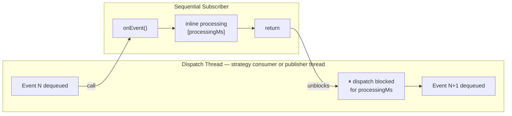

#### Characteristics

- Zero additional threads or memory allocation per event.
- Strict per-subscriber ordering: events are always processed in the order they arrived.
- Simple error handling — exceptions propagate naturally to the caller.
- Best choice when processing is fast (sub-millisecond in-memory operations) or when strict ordering is a correctness requirement (e.g., DT state machine transitions).
- Becomes the bottleneck when `processingMs > inter_arrival_ms`: the dispatch thread saturates and queue depth grows unboundedly.

---

### 6.3 Parallel Subscriber

#### Concept

`onEvent()` submits the actual processing work to a per-subscriber `ExecutorService` (fixed thread pool of N threads) and returns immediately. The dispatch thread is released after a microsecond-scale handoff, regardless of how long processing takes. Up to N events per subscriber can be processed concurrently.

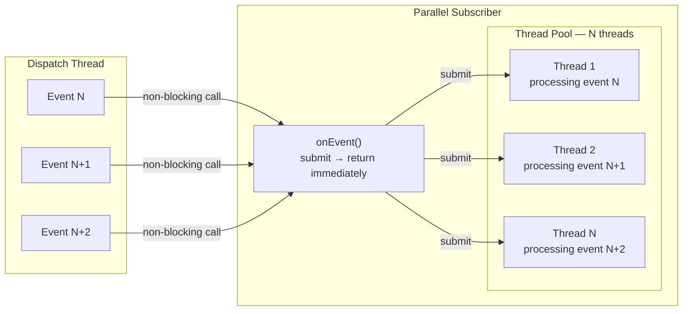

#### Characteristics

- Dispatch thread overhead per event is O(1) — queue submission only.
- Throughput scales linearly with pool size up to the publish rate: `max_throughput = pool_size / processingMs`.
- Saturation point: pool size must satisfy `pool_size ≥ ceil(arrival_rate × processingMs)` to avoid queue buildup.
- Processing order within the subscriber is **not guaranteed** — pool threads race. Use when events are independent (analytics, logging, storage writes, external notifications).
- Requires careful shutdown: the pool must be explicitly terminated after the last event is processed.

---

### 6.4 Mixed-Subscriber Topologies in a Digital Twin

In a production Digital Twin, different components consume events for fundamentally different reasons. There is no requirement that all subscribers use the same execution model — the bus treats them identically. The execution model is chosen per subscriber based on the role that subscriber plays in the DT lifecycle.

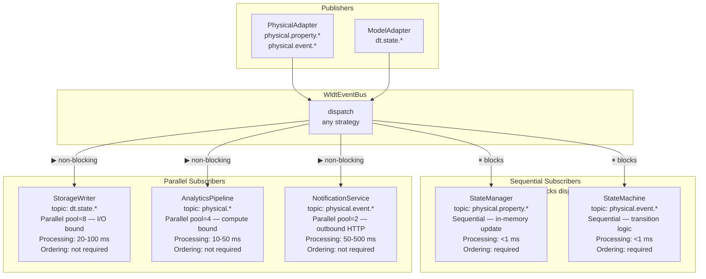

#### Design Rationale

**Sequential subscribers should be used when:**
- Processing is fast enough that blocking the dispatch thread has negligible impact (`processingMs` ≪ `1 / arrival_rate`).
- Event ordering is a correctness invariant — e.g., a DT state machine that must process property updates in arrival order to remain consistent.
- The subscriber is the sole consumer for its topic and will never become the throughput bottleneck.

**Parallel subscribers should be used when:**
- Processing is slow relative to the event arrival rate (I/O, HTTP calls, database writes, heavy computation).
- Events are independent of one another — ordering violations are acceptable or the subscriber handles deduplication internally.
- The subscriber needs to absorb bursts without stalling the bus dispatch thread.

> **Interaction with PerTopicPerSubscriberStrategy:** with this strategy each subscriber already runs in its own dedicated thread, so a sequential subscriber only blocks its own processor thread — not other subscribers. This makes the sequential/parallel choice less critical for fan-out scenarios: you can use sequential everywhere and still achieve per-subscriber parallelism at the bus level.

#### Subscriber Model Selection Per DT Role

| DT Component | Typical Role | Recommended Model | Pool Size |
|---|---|---|---|
| `DigitalTwinModel` (shadow function) | In-memory state update | Sequential | — |
| State machine / event handler | Transition logic | Sequential | — |
| `StorageManager` / persistence | DB / file write | Parallel | 4–16 (I/O bound) |
| Analytics / aggregation | Compute-heavy pipeline | Parallel | CPU count |
| External notification | HTTP / MQTT outbound | Parallel | 2–8 |
| Audit / debug logger | Low-priority logging | Sequential | — |

---

### 6.5 Interaction with Bus Strategies

The subscriber execution model interacts differently with each bus strategy:

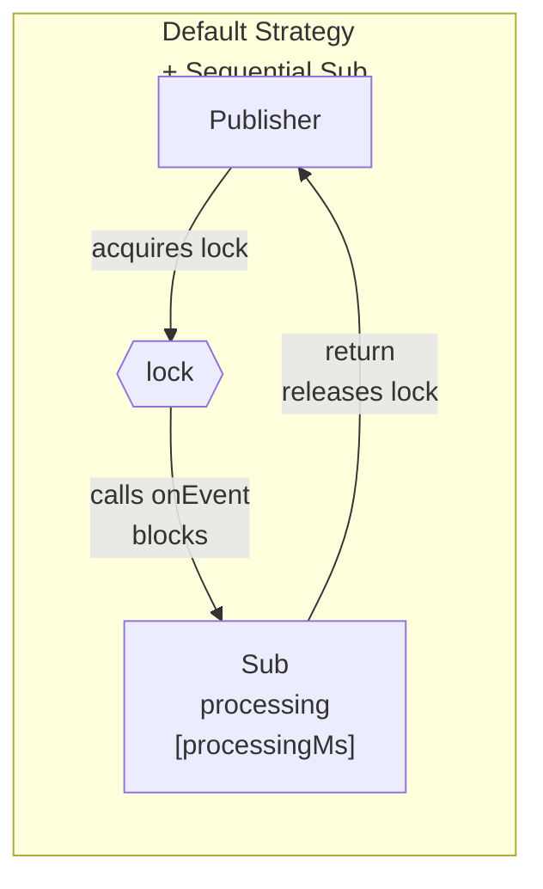

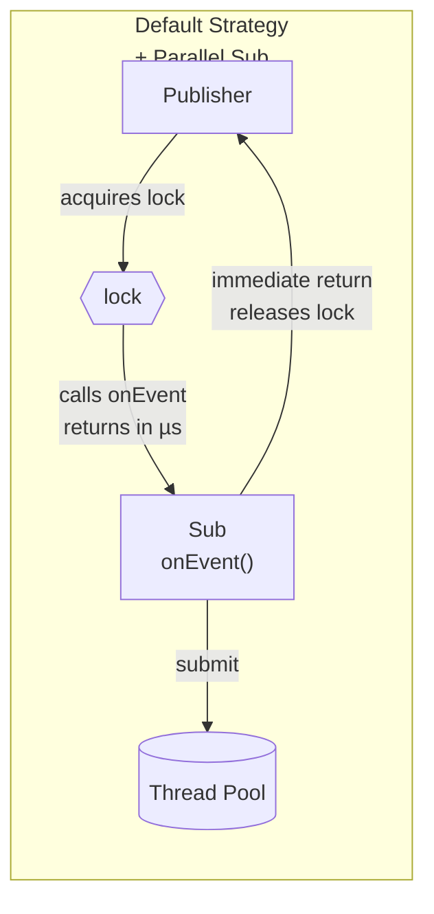

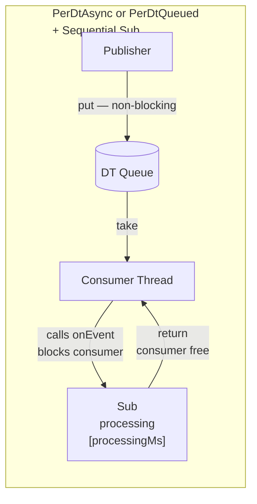

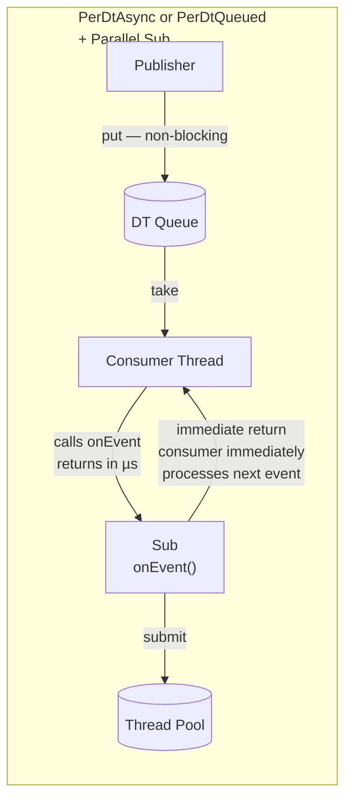

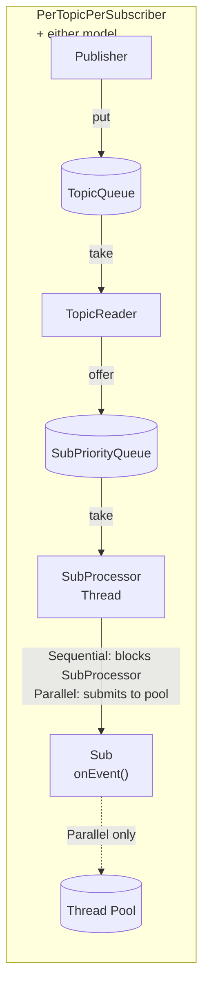

**Summary of interactions:**

| Strategy | Sequential subscriber effect | Parallel subscriber effect |
|---|---|---|
| Default | Publisher thread blocks for `processingMs`; lock held the entire time | Publisher releases lock in µs; processing runs concurrently with next publish |
| PerDtAsync | Consumer thread stalls; queue grows if rate > 1/processingMs | Consumer thread drains queue continuously; pool absorbs processing backlog |
| PerDtQueued | Same as Async | Same as Async |
| PerTopicPerSub | SubProcessor thread stalls for this subscriber only; other subs unaffected | SubProcessor submits to pool and immediately pulls next event; highest possible throughput |

---

### 6.6 Empirical Results — Scenario 9

**Setup:** 4 publishers × 4 subscribers, 100 msg/s per publisher, 500 KB payload, 10 ms processing per event. All four bus strategies tested. X-axis: subscriber thread pool size [2, 4, 8, 10, 14, 16, 18, 20].

| Pool size | Throughput (all strategies) | E2E p50 | Notes |
|:---------:|:---------------------------:|:-------:|-------|
| 2 | ~550 msg/s | ~0.01–0.08 ms | Pool under-provisioned: 2 threads × 100 events/s = 200 cap < 400 input |
| 4 | ~1 111 msg/s | ~0.01–0.07 ms | Pool matched: 4 × 100 = 400 = input rate |
| 8 | ~1 592 msg/s | ~0.04–0.05 ms | Pool surplus: 8 × 100 = 800 > 400; wall time = publish window |
| 10–20 | ~1 590–1 600 msg/s | ~0.01–0.08 ms | Hard plateau — publish rate is the bottleneck |

**Key observations:**

1. **All bus strategies converge completely** with parallel subscriber — the dispatch model becomes irrelevant because `onEvent()` returns in microseconds regardless of strategy.

2. **Linear throughput scaling** from pool=2 to pool=4: doubling threads doubles capacity when the pool is the bottleneck.

3. **Plateau at pool≥8** — the ceiling is set by the publisher side (`4 pubs × 100 msg/s × 4 subs = 1 600 msg/s`), not by the subscriber pool. Adding threads beyond the saturation point yields no benefit.

4. **E2E p50 drops to sub-millisecond** for all strategies — from tens of seconds (sequential at 10 ms proc) to 0.01–0.08 ms — because the metric captures arrival time at `onEvent()` entry, before pool submission. The bus delivers events immediately; only processing is deferred.

The saturation formula for pool sizing:
```
pool_size_min = ceil(arrival_rate_per_sub × processingMs / 1000)
             = ceil(400 msg/s × 10 ms / 1000)
             = ceil(4) = 4 threads
```
