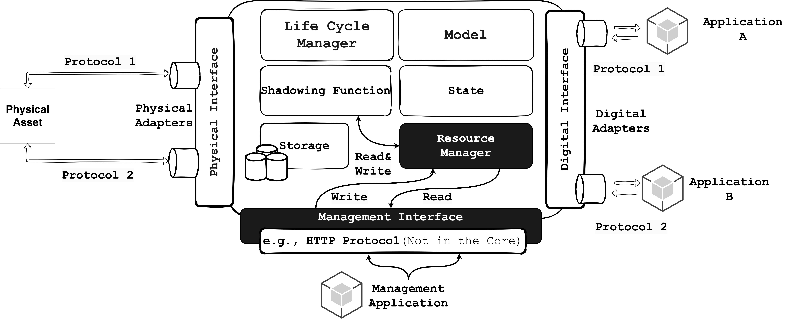
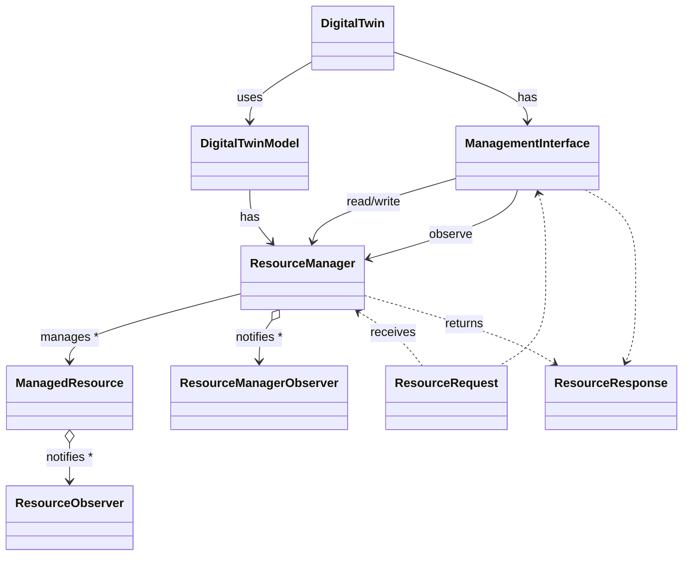

# 🧩 Digital Twin Resources & Management Interface

In the Digital Twin framework, introducing the concepts of resources, resource management, 
and a management interface provides a structured and extensible way to configure, 
monitor, and control the behavior of a Digital Twin at runtime (as schematically represented in the following Figure). 
Resources represent configurable parameters or entities—such as 
thresholds, operational limits, or mappings—that directly 
influence the Digital Twin’s logic and interactions. 
The resource management layer, typically handled by a 
ResourceManager, centralizes the lifecycle and access control o
f these resources, ensuring consistency and safe concurrent operations. 
The management interface acts as a bridge between the internal resource
model and external systems, enabling secure and dynamic interaction with 
resources through standardized operations (create, read, update, delete). 
This architecture promotes modularity, flexibility, and interoperability, a
llowing both internal logic and external applications to adapt the Digital Twin’s 
behavior in real time without modifying its core implementation.

<div align="center">
  
</div>

## Digital Twin Resources & Management Interface

Since WLDT `v0.5.0` new classes have been introduced to enable 
a **flexible, runtime-manageable resource model** within each 
instance of a **Digital Twin**. 
These abstractions are designed to 
support **extensibility, configurability**, and **interoperability** across both 
internal DT logic and external applications.

### ✨ Key Features

- **Unified Resource Model**: Resources represent configurable parameters or entities that influence DT behavior.
- **Internal and External Access**: Resources can be used by DT logic, and accessed or modified externally via a dedicated **Management Interface**.
- **Runtime Management**: Values can be configured at startup and dynamically updated at runtime.

### 🏗️ Design Principles

- Resources are **user-defined** and customizable.
- They are integrated into various parts of the **DT** (e.g., shadowing functions).
- DT behavior adapts dynamically based on resource states.

⚠️ **Developer Notice:**  The **core of the Digital Twin library** only provides an **abstract interface for the Management Interface**. It is the responsibility of the developer to implement the actual logic for exposing and interacting with resources through this interface (e.g., via REST, MQTT, gRPC, etc.).  
This design ensures **modularity** and **flexibility**, allowing integration with various protocols and platforms tailored to specific application requirements, without increasing the size or complexity of the core library or introducing strong dependencies on external libraries.

### 📚 Example 1: Temperature Threshold Event Triggering

A Digital Twin that monitors a physical asset with temperature sensors may need to **detect thermal anomalies** based on configurable thresholds.

#### 🛠️ Resources Used

| Resource Name  | Type     | Purpose                                                               |
| -------------- | -------- | --------------------------------------------------------------------- |
| `target_value` | `double` | Maximum allowed temperature before triggering an alert                |
| `n`            | `int`    | Number of consecutive samples required for anomaly detection          |
| `time_window`  | `long`   | Time duration (e.g., in seconds) over which `n` samples are evaluated |

#### 🔁  Shadowing Function Usage

- DT receives periodic temperature samples from the physical device.
- If `n` samples in the last `time_window` exceed `target_value`, a `temperature-alert-event` is generated.
- The DT Resource Manager holds and manages these three parameters.
- External applications can read or update the threshold values at:
    - **Startup time**: for initialization.
    - **Runtime**: via the DT Management Interface that the developer can implement supporting for example  RESTful or Pub/Sub interaction pattern.

### 📚 Example 2: Motor Speed Regulation with Safety Limit

In a Digital Twin for an industrial motor, speed regulation may depend on a **maximum speed constraint** that can vary based on maintenance schedules or environmental conditions.

#### 🛠️ Resources Used

| Resource Name          | Type     | Purpose                                                    |
| ---------------------- | -------- | ---------------------------------------------------------- |
| `max_speed_rpm`        | `int`    | Maximum allowed speed in RPM                               |
| `emergency_stop_delay` | `long`   | Delay before activating safety shutdown after a violation  |
| `speed_adjust_factor`  | `double` | Modifier applied to current speed under certain conditions |

#### 🔁 Shadowing Function Usage

- DT continuously mirrors the motor’s operational speed.
- If `max_speed_rpm` is exceeded, and speed is not reduced within `emergency_stop_delay`, the DT issues a `safety-shutdown-command`.
- `speed_adjust_factor` is used during load balancing or environmental compensation.
- All parameters are exposed via the DT’s Resource Manager and can be tuned in real-time by an operator or maintenance AI.

### 🧱 Resources & Management Interface Main Classes

The following classes define the foundation of the Digital Twin resource management framework. They support runtime configuration, monitoring, and control of internal and external components through a consistent and extensible model. These abstractions are designed to support both the internal logic of the Digital Twin and external applications interacting through a Management Interface.



The schematic description of the new introduced classes is structured as follows:

- **ManagedResource**: The `ManagedResource` class represents an abstract, generic resource that can be configured and managed at runtime. Each resource is uniquely identified and carries a type and name. It encapsulates the actual resource object, such as a configuration parameter or operational constraint. This class provides a standard interface for **Create, Read, Update, and Delete (CRUD)** operations. Additionally, it supports the registration of observers, allowing other components or systems to receive notifications when the resource is modified. Designed to be extended, `ManagedResource` allows developers to implement specific resource types suited to their application. It can be used directly by the Digital Twin's internal logic or accessed externally via the Management Interface. The developer can internally define sub-resource of the original resource (e.g., a specific key-value mapping in a dictionary) and the access of sub-resources can be handled by the `ResourceRequest` and the associated `ResourceResponse`.
- **ResourceManager**: The `ResourceManager` serves as the central registry and orchestrator for all managed resources in a Digital Twin instance. It is responsible for managing the entire resource lifecycle, including creation, lookup, update, and removal. This class provides an API through which both the internal logic of the Digital Twin and external clients (via the Management Interface) can consistently interact with resources. It ensures that resource access is coordinated and properly controlled, supporting integrity and safe concurrent operations. The `ResourceManager` plays a key role in decoupling the internal components from external systems, simplifying integration and improving maintainability. The `ResourceManager` has been added to the core `DigitalTwin` and `DigitalTwinModel` classes in order to be properly initialized and the make is usable through the DT instance and in particular in the `shadowingFunction` and it is accessible on a `DigitalTwin` instance through the method `digitalTwin.getResourceManager()`.
- **ResourceRequest:** The `ResourceRequest` class encapsulates the details required to perform an operation on a managed resource. It typically includes a target resource identifier, **optional sub-resource identifiers** (useful for hierarchical or composite resources), and a payload carrying the specific data for the operation. By abstracting the invocation of resource operations from their implementation, this class enables flexible and extensible workflows that support different transport or protocol layers, such as REST or Pub/Sub. The library currently supports requests targeting a specific resource and one level of sub-resources. To handle deeper hierarchies of sub-resources, developers will need to extend the existing library functionalities with custom implementations.
- **ResourceResponse:** The `ResourceResponse` class represents the result of a resource operation. It contains the outcome of the requested action, including any output data and status information. If an error occurred during the operation, relevant error details are also included. This class ensures a consistent way to communicate results, whether the request originates from internal Digital Twin components or external systems.
- **ManagementInterface:** The `ManagementInterface` defines the external API through which runtime resource operations can be performed by remote applications or tools. It exposes methods or endpoints for creating, reading, updating, and deleting resources, as well as querying their current status and subscribing to events. This interface acts as a bridge between the Digital Twin’s internal resource model and external systems, enabling dynamic and secure interaction with configurable parameters and operational data. The core library only defines the abstract contract for this interface. Developers must provide a concrete implementation, which can be based on any desired communication protocol such as REST, MQTT, or gRPC, depending on system requirements. The `ManagementInterface` can be set on the DT through the method `setManagementInterface(managementInterface)` on the `DigitalTwin`  instance.

These core classes establish a robust and extensible architecture for runtime resource management. They provide a unified model that supports internal orchestration and external integration. By promoting clear separation of concerns, consistency in interactions, and modular design, they make the Digital Twin framework more adaptable, maintainable, and suitable for a wide range of IoT and IIoT applications.

### 🔧 Using the Management Interface in Your Digital Twin

This section demonstrates how to set up a `DigitalTwin` with `ResourceManager` custom `ManagedResource`(s) and a dedicated testing `ManagementInterface` to register a resource, and perform read operations using `ResourceRequest` and `ResourceResponse`.

#### 1. Create a Custom Managed Resource

Start by creating a Custom `ManagedResource` called as `DictionaryManagedResource` to handle DT's configuration as a basic key-value dictionary:

```java  
import java.util.HashMap;  
import java.util.Map;  
  
public class DictionaryManagedResource extends ManagedResource<Map<String, Object>, Object, Object> {  
  
    public DictionaryManagedResource(String id, String type, String name, Map<String, Object> dictionary) {  
        super(id, type, name, dictionary);  
    }  
  
    public DictionaryManagedResource(String id, String type, String name) {  
        super(id, type, name, new HashMap<>());  
    }  
  
    @Override  
    protected ResourceResponse<Object> onCreate(ResourceRequest<Object> resourceRequest) {  
        // In this case the creation means adding a new key-value pair to the dictionary  
        // so we have to take the sub-resource ID as the key and the content as the value since        
        // the resource ID is the ID of the dictionary itself.  
        if (resourceRequest == null ||  
                resourceRequest.getResourceId() == null ||  
                resourceRequest.getContent() == null ||  
                resourceRequest.getSubResourceId().isEmpty())  
            return new ResourceResponse<Object>(400, "Invalid Resource Request!");  
  
        String key = resourceRequest.getSubResourceId();  
        Object value = resourceRequest.getContent();  
        resource.put(key, value);  
        return new ResourceResponse<Object>(resourceRequest.getResourceId(), key, value, null);  
    }  
  
    @Override  
    protected ResourceResponse<Object> onRead(ResourceRequest<Object> resourceRequest) {  
  
        // Validate the resource request  
        if(resourceRequest == null || resourceRequest.getResourceId() == null)  
            return new ResourceResponse<Object>(400, "Invalid Resource Request!");  
  
        // Validate resource id to ensure it is not empty and matches the managed resource ID  
        if(resourceRequest.getResourceId().isEmpty() || !resourceRequest.getResourceId().equals(this.getId()))  
            return new ResourceResponse<Object>(400, "Resource ID cannot be empty or does not match the managed resource ID!");  
  
        // Check if the request is for a sub-resource associated to a key in the dictionary  
        if (resourceRequest.getSubResourceId() != null && !resourceRequest.getSubResourceId().isEmpty()) {  
            String subResourceKey = resourceRequest.getSubResourceId();  
            Object subResourceValue = resource.get(subResourceKey);  
            return new ResourceResponse<Object>(this.getId(), subResourceKey, subResourceValue, null);  
        }  
        // If no sub-resource is specified, return the entire dictionary  
        else {  
            return new ResourceResponse<Object>(this.getId(), resource, null);  
        }  
  
    }  
  
    @Override  
    protected ResourceResponse<Object> onUpdate(ResourceRequest<Object> resourceRequest) {  
        // The key is the sub-resource ID and the value is the content of the request.  
        String key = resourceRequest.getSubResourceId();  
        Object value = resourceRequest.getContent();  
        resource.put(key, value);  
        return new ResourceResponse<Object>(resourceRequest.getResourceId(), value, null);  
    }  
  
    @Override  
    protected ResourceResponse<Object> onDelete(ResourceRequest<Object> resourceRequest) {  
        // The key is the sub-resource ID and the value is the content of the request.  
        String key = resourceRequest.getSubResourceId();  
        Object value = resource.remove(key);  
        return new ResourceResponse<Object>(resourceRequest.getResourceId(), value, null);  
    }  
}
```

In this case, the resource is represented by a dictionary implemented using a `HashMap`. The main resource corresponds to the map itself, while sub-resources refer to the individual first-level entries within the map. Each sub-resource can be accessed using a `ResourceRequest` by specifying the appropriate string key.  The library currently supports requests for a specific resource and a single level of sub-resources. To manage deeper hierarchical structures, developers will need to extend the library with custom implementations.
#### 2. Create and Configure the Digital Twin

Create the `DigitalTwinEngine` and your `DigitalTwin`. You also need to register physical and digital adapters, and configure your custom `DictionaryManagedResource` instance previously created.

> ⚠️ The following code is just an example to make the overall example readable but it should be customized according to your Digital Twin implementation and available physical and digital adapters.

```java
// Create the Digital Twin Engine
DigitalTwinEngine digitalTwinEngine = new DigitalTwinEngine();  

// Create the new Digital Twin with our Shadowing Function
DigitalTwin digitalTwin = new DigitalTwin(TEST_DIGITAL_TWIN_ID, new DemoShadowingFunction());  
  
// Physical Adapter with Configuration  
digitalTwin.addPhysicalAdapter(  
        new DemoPhysicalAdapter(  
                "test-physical-adapter",  
                new DemoPhysicalAdapterConfiguration()
                ));  
  
// Digital Adapter with Configuration  
digitalTwin.addDigitalAdapter(  
        new DemoDigitalAdapter(  
                "test-digital-adapter",  
                new DemoDigitalAdapterConfiguration())  
);  
```

Now we can initialize our custom `ManagedResource` called as `DictionaryManagedResource` to handle DT's configuration as a basic key-value dictionary:

```java  
// Create our test resource as a Map with configuration properties  
Map<String, Object> configurationProperties = new HashMap<>();  
configurationProperties.put(PROPERTY_NAME_1, PROPERTY_VALUE_1);  
configurationProperties.put(PROPERTY_NAME_2, PROPERTY_VALUE_2);  
configurationProperties.put(PROPERTY_NAME_3, PROPERTY_VALUE_3);  
  
// Create a new Managed Resource to be used by the Digital Twin and managed by the Management Interface  
DictionaryManagedResource dictionaryManagedResource = new DictionaryManagedResource(  
        RESOURCE_ID,  
        RESOURCE_TYPE,  
        RESOURCE_NAME,  
        configurationProperties);
```

Once we have a resource we can the following methods provided by the `ResourceManager`:

- `void addResource(ManagedResource<?, ?, ?> resource): `Adds a resource to the manager and notifies observers.
- `void removeResource(ManagedResource<?, ?, ?> resource):` Removes a resource by instance and notifies observers.
- `void removeResource(String resourceId): `Removes a resource by its ID and notifies observers.
- `void updateResource(ManagedResource<?, ?, ?> resource):` Updates an existing resource and notifies observers.
- `void clearResourceList(): `Removes all resources and notifies observers.
- `Optional<ManagedResource<?, ?, ?>> getResourceById(String resourceId):` Retrieves a resource by its ID.
- `List<ManagedResource<?, ?, ?>> getResourceList():` Returns a list of all managed resources.
- `boolean containsResource(String resourceId):` Checks if a resource with the given ID exists

To add a new resource to the we can use the following code:

```java
// Add a Managed Resource to the Digital Twin  
digitalTwin.getResourceManager().addResource(dictionaryManagedResource);
```

When the resource has been added to the ResourceManager it can be accessed for example from the `ShadowingFunction`to be used within the digitalization processes of the Digital Twin:

```java
// Check if the ResourceManager is initialized and contains the expected resource  
if (this.resourceManager != null && this.resourceManager.containsResource(RESOURCE_ID)) {  
  
    // Retrieve the resource by ID  
    Optional<ManagedResource<?, ?, ?>> optionalResource = this.resourceManager.getResourceById(RESOURCE_ID);  
  
    // Check if the resource is present and is an instance of DictionaryManagedResource  
    if (optionalResource.isPresent() && optionalResource.get() instanceof DictionaryManagedResource) {  
  
        // Cast the resource to DictionaryManagedResource  
        DictionaryManagedResource dictionaryResource = (DictionaryManagedResource) optionalResource.get();  
  
        // Access the value of the 'test' property in the resource  
        Object testPropertyValue = dictionaryResource.getResource().get("test");  
  
        // Log the retrieved value  
        System.out.println("ShadowingFunction - Resource Property 'test' Value: " + testPropertyValue);  
    }  
} else   
	logger.error("ResourceManager is null or empty. Cannot read the Resource {}.", ManagementInterfaceTester.RESOURCE_ID);
```

At this stage the resource will be available within the DT instance (e.g., in the Shadowing function) but not to external application since no `ManagementInterface` has been adde to the DT instance.

#### 3. Create the Management Interface

To expose the configurable resource managed by the Digital Twin (DT), we define a custom implementation of the `ManagementInterface`—called `DemoManagementInterface`. This implementation is designed for demonstration and explanation purposes, and deliberately avoids dependencies on specific networking libraries. Instead, it **emulates** the behavior of a network interface, allowing developers to test the logic behind `ResourceRequest` and `ResourceResponse`.

In a real deployment, it is up to the developer to create a concrete implementation of the `ManagementInterface`, using the preferred communication protocol—such as HTTP for RESTful APIs, or publish/subscribe mechanisms like MQTT.

The demo interface will be as following:

```java
import it.wldt.exception.WldtManagedResourceException;  
import it.wldt.exception.WldtManagementInterfaceException;  
import org.slf4j.Logger;  
import org.slf4j.LoggerFactory;  
import java.util.List;  
import java.util.Optional;  
  
public class DemoManagementInterface extends ManagementInterface {  
  
    private static final Logger logger = LoggerFactory.getLogger(DemoManagementInterface.class);  
  
    // Flag to indicate if the management interface has been started  
    private boolean isStarted = false;  
  
    // Constants for request types  
    public static final String READ_REQUEST = "READ";  
    public static final String CREATE_REQUEST = "CREATE";  
    public static final String UPDATE_REQUEST = "UPDATE";  
    public static final String DELETE_REQUEST = "DELETE";  
  
    @Override  
    protected void onStart(List<ManagedResource<?, ?, ?>> resources) {  
  
        // Set the started flag to true  
        this.isStarted = true;  
  
        logger.info("DemoManagementInterface started with {} resources:", resources.size());  
  
        for (ManagedResource<?, ?, ?> resource : resources) {  
            logger.info("Managed Resource: {}", resource.getId());  
        }  
    }  
  
    @Override  
    protected void onStop() {  
        logger.info("DemoManagementInterface stopped.");  
    }  
  
    @Override  
    protected void onResourceAdded(ManagedResource<?, ?, ?> resource) {  
        logger.info("Resource added: {}", resource.getId());  
    }  
  
    @Override  
    protected void onResourceUpdated(ManagedResource<?, ?, ?> resource) {  
        logger.info("Resource updated: {}", resource.getId());  
    }  
  
    @Override  
    protected void onResourceRemoved(ManagedResource<?, ?, ?> resource) {  
        logger.info("Resource removed: {}", resource.getId());  
    }  
  
    /**  
     * Validates the ResourceRequest and retrieves the associated ManagedResource     
     * form the ResourceManager.     
     *     
     * @param resourceRequest the resource request  
     * @return an Optional containing the ManagedResource if found, or empty if not found  
     * @throws WldtManagementInterfaceException if the management interface is not started or the request is invalid  
     * @throws WldtManagedResourceException if the resource is not found  
     */    private Optional<DictionaryManagedResource> validateAndLoadRequest(ResourceRequest<?> resourceRequest) throws WldtManagementInterfaceException, WldtManagedResourceException {  
  
        if (!this.isStarted) {  
            logger.error("DemoManagementInterface is not started. Cannot access resource.");  
            throw new WldtManagementInterfaceException("Management interface not started.");  
        }  
        if (resourceRequest == null || resourceRequest.getResourceId() == null || resourceRequest.getResourceId().isEmpty()) {  
            logger.error("Error handling Null Request! Received request: {}", resourceRequest);  
            throw new WldtManagedResourceException("Invalid resource request.");  
        }  
  
        // Get the resource ID from the ResourceRequest  
        String resourceId = resourceRequest.getResourceId();  
        logger.info("Accessing resource with ID: {}", resourceId);  
  
        // Retrieve the ManagedResource from the ResourceManager using the resource ID  
        Optional<ManagedResource<?, ?, ?>> resourceOpt = this.resourceManager.getResourceById(resourceId);  
  
        // Check if the ManagedResource is present  
        if(resourceOpt.isPresent()) {  
  
            // Retrieve the ManagedResource from the Optional  
            ManagedResource<?, ?, ?> retrievedManagedResource = resourceOpt.get();  
  
            // Check the instance of ManagedResource to ensure it is compatible with the request  
            if (!(retrievedManagedResource instanceof DictionaryManagedResource))  
                throw new WldtManagedResourceException("Loaded resource has a wrong type: " + retrievedManagedResource.getClass().getName());  
  
            // Cast and return the ManagedResource to DictionaryManagedResource  
            return Optional.of((DictionaryManagedResource) retrievedManagedResource);  
        }  
        else  
            // Resource not found, return an empty Optional  
            return Optional.empty();  
    }  
  
    /**  
     * Emulates an incoming request to the management interface.     
     * This method validates the request, retrieves the ManagedResource, and performs the requested operation (read, create, update, delete).     
     * It returns an Optional containing the ResourceResponse if successful, or an error response if the request fails or the resource is not found.    
	 * @param requestType the type of request (READ, CREATE, UPDATE, DELETE)  
     * @param resourceRequest the resource request containing the resource ID and sub-resource ID  
     * @return an Optional containing the ResourceResponse if successful, or an error response if the request fails or the resource is not found  
     */    public Optional<ResourceResponse<?>> emulateIncomingRequest(String requestType, ResourceRequest<?> resourceRequest) {  
  
        try{  
  
            // Validate the ResourceRequest and retrieve the ManagedResource  
            Optional<DictionaryManagedResource> optionalManagedResource = validateAndLoadRequest(resourceRequest);  
  
            // Check if the ManagedResource is present  
            if(optionalManagedResource.isPresent()) {  
  
                // Cast the ManagedResource to DictionaryManagedResource  
                DictionaryManagedResource managedResource = optionalManagedResource.get();  
  
                // Prepare the request  
                ResourceRequest<Object> newRequest = new ResourceRequest<>(  
                        resourceRequest.getResourceId(),  
                        resourceRequest.getSubResourceId(),  
                        resourceRequest.getContent(),  
                        resourceRequest.getMetadata());  
  
                if(requestType.equals(READ_REQUEST))  
                    // Read the resource using the ManagedResource's read method and return the response  
                    return Optional.ofNullable(managedResource.read(newRequest));  
                else if(requestType.equals(CREATE_REQUEST))  
                    // Create the resource using the ManagedResource's create method and return the response  
                    return Optional.ofNullable(managedResource.create(newRequest)); // Assuming getData() returns the resource data  
                else if(requestType.equals(UPDATE_REQUEST))  
                    // Update the resource using the ManagedResource's update method and return the response  
                    return Optional.ofNullable(managedResource.update(newRequest));  
                else if(requestType.equals(DELETE_REQUEST))  
                    // Delete the resource using the ManagedResource's delete method and return the response  
                    return Optional.ofNullable(managedResource.delete(newRequest));  
                else {  
                    logger.error("Unknown request type: {}", requestType);  
                    return Optional.of(new ResourceResponse<>(400, "Unknown request type: " + requestType));  
                }  
  
            } else {  
                // Resource not found, return a 404 response  
                return Optional.of(new ResourceResponse<>(404, "Resource not found with ID: " + resourceRequest.getResourceId()));  
            }  
  
        }catch (Exception e){  
            e.printStackTrace();  
            logger.error("Error reading resource: {}", e.getMessage());  
            return Optional.of(new ResourceResponse<>(400, "Error Managing the Resource Request: " + e.getMessage()));  
        }  
    }  
  
}
```

At this point, only the read resource method has been implemented. However, we can define and add additional methods to the interface later. In the meantime, we can integrate the interface into the Digital Twin and test its core functionalities.

#### 3. Setup the Management Interface

Now that we’ve defined and implemented our `ManagementInterface`—named `DemoManagementInterface`—we can initialize it, attach it to the Digital Twin, and then start the Twin within the Digital Twin Engine.

Initialize and attach the `DemoManagementInterface`:

```java
// Create a new Management Interface  
managementInterface = new DemoManagementInterface();  
  
// Add the Management Interface to the Digital Twin  
digitalTwin.setManagementInterface(managementInterface);
```

Register the Digital Twin with the engine and start it:

```java
// Add the Twin to the Engine  
digitalTwinEngine.addDigitalTwin(digitalTwin);  
  
// Start the Digital Twin  
digitalTwinEngine.startDigitalTwin(TEST_DIGITAL_TWIN_ID);
```

#### 4. Resource Request & Response

Now we can test the `DemoManagementInterface` that we have created to **read** a target resource (the `DictionaryManagedResource` instance) managed by the DT creating a  `ResourceRequest` and accessing the `ResourceResponse`.

The `ResourceRequest<T>` class is a generic container used to encapsulate all the information needed to perform an operation on a managed resource within the Digital Twin framework. It is designed to be flexible and extensible, supporting a wide range of resource types and operations.

Key Features:
- **Generic Content:** The `content` field can hold any type of object relevant to the resource operation, making the request adaptable to different use cases.
- **Resource Identification:** The `resourceId` and optional `subResourceId` fields uniquely identify the target resource and, if needed, a sub-resource.
- **Metadata Support:** The `metadata` map allows attaching additional contextual information to the request, such as operation parameters or user data.

On the other hand, the `ResourceResponse<T>` class is a generic container used to encapsulate the result of an operation performed on a managed resource in the Digital Twin framework. It standardizes how responses, including both successful results and errors, are communicated back to callers.


Key Features:
- **Generic Content:** The `resource` field can hold any type of object representing the result of the operation.
- **Resource Identification:** The `resourceId` and optional `subResourceId` fields identify the resource and sub-resource related to the response.
- **Metadata Support:** The `metadata` map allows attaching additional contextual information to the response.
- **Error Handling:** The `isError`, `errorCode`, and `errorMessage` fields provide a uniform way to report errors.

Now we try the interaction with the defined `DemoManagementInterface` to access a target resource:

```java
// Create the Resource Request to read the Resource from the Interface  
ResourceRequest<String> resourceRequest = new ResourceRequest<>(RESOURCE_ID);  
  
// Test reading a resource from the Management Interface  
Optional<ResourceResponse<?>> resourceResponse = managementInterface.emulateReadResource(resourceRequest);

// Check if the Resource Response is present  
if (resourceResponse.isPresent()) {  
    ResourceResponse<?> response = resourceResponse.get();  
    logger.info("Resource Response: {}", response);   
    logger.info("Resource Content: {}", response.getResource());
} else {  
    logger.error("Resource Response is not present");  
}
```

To access the value of an individual sub-resource within a `DictionaryManagedResource`, you can use the same `ResourceRequest` type, including an additional parameter that specifies the sub-resource's ID.

```java
// Create the Resource Request to read the Resource from the Interface  
ResourceRequest<String> resourceRequest = new ResourceRequest<>(RESOURCE_ID, PROPERTY_NAME_1);  
  
// Test reading a resource from the Management Interface  
Optional<ResourceResponse<?>> resourceResponse = managementInterface.emulateReadResource(resourceRequest);  
  
// Check if the Resource Response is present  
if (resourceResponse.isPresent()) {  
    ResourceResponse<?> response = resourceResponse.get();  
    logger.info("Resource Response: {}", response);  
    logger.info("Sub-Resource Content: {}", response.getResource());    
} else {  
    logger.error("Resource Response is not present");  
}
```

Considering the target demo resource `DictionaryManagedResource` we can also add the `DemoManagementInterface` to create a new resource. In this case since it is a resource mapping a Dictionary the creation will be associated to the creation of a new sub-resource to the dictionary.

In this configuration the associated code to emulate the create operation on the `DemoManagementInterface` is:

```java
// Create the Resource Request to create a Resource from the Interface  
// Since the main resource is a Map and we want to create a new property we have to set the sub-resource ID as  
// the new property name that we want to add or update  
ResourceRequest<String> resourceRequest = new ResourceRequest<>(RESOURCE_ID, PROPERTY_NAME_4);  
  
// Now we set the content of the request to the new value we want to set for the new property  
resourceRequest.setContent(PROPERTY_VALUE_4);  
  
// Test reading a resource from the Management Interface  
Optional<ResourceResponse<?>> resourceResponseOptional = managementInterface.emulateIncomingRequest(DemoManagementInterface.CREATE_REQUEST, resourceRequest);  
  
// Check if the Resource Response is present  
if (resourceResponseOptional.isPresent()) {  
    ResourceResponse<?> response = resourceResponseOptional.get();  
    logger.info("Resource Response: {}", response);  
    logger.info("Resource Content: {}", response.getResource());    
} else {  
    logger.error("Resource Response is not present");  
}
```

The same approach can be applied to `Update` and `Delete` operations through the `DemoManagementInterface`. However, it's important to note that these actions only affect the dictionary values (i.e., the sub-resources), not the main resource (the dictionary) itself. This behavior reflects a design choice where the main resource is considered non-deletable via the management interface, representing a resource managed directly by the Digital Twin. Developers can implement alternative behaviors based on their specific requirements.

#### 4. Resource Manager Observation

The `ResourceManager` supports an observation mechanism that allows external components to be notified about *changes in the managed resources*. This is achieved through the `IResourceManagerObserver` interface and the observer management methods in the `ResourceManager` class.

The `IResourceManagerObserver` interface defines the contract for observers that wish to receive notifications about resource events in the `ResourceManager`. Implementers of this interface can react to resource additions, removals, updates, and when the resource list is cleared through the following methods:

- `onManagerResourceAdded(String resourceId): `This method is called when a new resource is added to the management interface.
- `onManagerResourceRemoved(String resourceId):` This method is called when a resource is removed from the management interface.
- `onManagerResourceUpdated(String resourceId):` This method is called when a resource is updated on the resource manager
- `onManagerResourceListCleared():` This method is called when the resource list is cleared.

By implementing this interface, external modules can subscribe to resource lifecycle events and synchronize their state or trigger custom logic accordingly. The `ResourceManager` class provides methods to manage observers:

- `addObserver(IResourceManagerObserver observer):` Registers an observer to receive notifications about resource changes. Observers are stored in an internal list and will be notified on relevant events.
- `removeObserver(IResourceManagerObserver observer): `Unregisters an observer, stopping further notifications to it.

Usage Example:

```java
// Add an Observer to the Resource Manager  
digitalTwin.getResourceManager().addObserver(new IResourceManagerObserver() {  
    @Override  
    public void onManagerResourceAdded(String resourceId) {  
        System.out.println("Resource added: " + resourceId);
    }  
  
    @Override  
    public void onManagerResourceRemoved(String resourceId) {  
	    System.out.println("Resource removed: " + resourceId);
    }  
  
    @Override  
    public void onManagerResourceUpdated(String resourceId) {  
		System.out.println("Resource updated: " + resourceId);
    }  
  
    @Override  
    public void onManagerResourceListCleared() {  
		System.out.println("Resource list cleared ...");
    }  
});
```

> **Note:** This observation mechanism is internal to the Digital Twin and operates at the `ResourceManager` level, not on individual resource changes. Observations and callbacks for actions originating from the `ManagementInterface` directly on single `ManagedResource` are handled separately, as described in the next section.
#### 5. Single Managed Resource Observation

To monitor changes or actions on a specific `ManagedResource`, you can implement the `IResourceObserver` interface and use the `addObserver()` and `removeObserver()` methods available in the `ManagedResource` class. This enables you to receive notifications for create, read, update, and delete operations performed on that resource.

Method provided by the interface `IResourceObserver` are:

- `void onCreate(String resourceId, String subResourceId)`: Called when a resource or subresource is **created**.
    - **`resourceId`**:  The unique identifier of the main resource.
    - **`subResourceId`**:  The unique identifier of the subresource created under the main resource.  Can be `null` or empty if the event refers to the main resource itself.
- `void onUpdate(String resourceId, String subResourceId)`: Called when a resource or subresource is **updated**.
    - **`resourceId`**:  The unique identifier of the main resource.
    - **`subResourceId`**:  The unique identifier of the subresource updated.  Can be `null` or empty if the event refers to the main resource itself.
- `void onDelete(String resourceId, String subResourceId)`: Called when a resource or subresource is **deleted**.
    - **`resourceId`**:  The unique identifier of the main resource.
    - **`subResourceId`**:  The unique identifier of the subresource deleted.  Can be `null` or empty if the event refers to the main resource itself.


> Note: The `resourceId` **always** refers to the main or parent resource while the `subResourceId` refers to a nested subresource inside the main resource. If the operation targets the main resource directly, `subResourceId` may be `null` or an empty string.

The example below demonstrates how to register an observer for a target resource and handle callbacks triggered by changes initiated through the `ManagementInterface`. This mechanism allows Digital Twin developers to react to resource updates and synchronize behavior accordingly.

```java
// Read the resource from the Resource Manager  
Optional<ManagedResource<?, ?, ?>> resourceOptional = digitalTwin.getResourceManager().getResourceById(RESOURCE_ID);  
  
// Check with instance of if the Resource is of type DictionaryManagedResource  
if (resourceOptional.isPresent() && resourceOptional.get() instanceof DictionaryManagedResource) {  
    // Cast the Resource to DictionaryManagedResource  
    DictionaryManagedResource dictionaryManagedResource = (DictionaryManagedResource) resourceOptional.get();  
  
    // Add a callback to the Managed Resource  
    dictionaryManagedResource.addObserver(new IResourceObserver() {  
        @Override  
        public void onCreate(String resourceId, String subResourceId) {  
           System.out.println("Create Callback on Resource: " + resourceId + ", SubResource: " + subResourceId);  
        }  
  
        @Override  
        public void onUpdate(String resourceId, String subResourceId) {  
            System.out.println("Update Callback on Resource: " + resourceId + ", SubResource: " + subResourceId);  
        }  
  
        @Override  
        public void onDelete(String resourceId, String subResourceId) {  
            System.out.println("Delete Callback on Resource: " + resourceId + ", SubResource: " + subResourceId);  
        }  
    });  
}  
else  
    logger.error("Resource is not of type DictionaryManagedResource");
